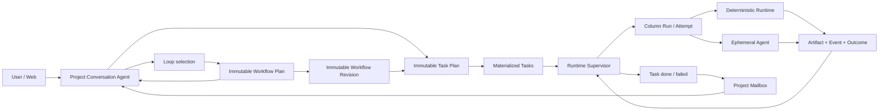

# DevWerk V1 Service

This directory contains the standalone DevWerk Version 1 service. It is a conversation-led, Column-based multi-agent workflow runtime backed by one SQLite database and Project-scoped files.

## Design Authority

- [`docs/generic-conversation-agent-and-declarative-column-runtime.md`](docs/generic-conversation-agent-and-declarative-column-runtime.md)
- [`docs/conversation-agent-design-v1.md`](docs/conversation-agent-design-v1.md)
- [`docs/kanban-workflow-design-v1.md`](docs/kanban-workflow-design-v1.md)
- [`docs/conversation-agent-orchestration-soul-p0-design.md`](docs/conversation-agent-orchestration-soul-p0-design.md)
- [`docs/loop-runtime-v1.md`](docs/loop-runtime-v1.md)
- [`docs/loop-task-plan-decoupling-v1.md`](docs/loop-task-plan-decoupling-v1.md)
- [`docs/novel-loop-assets-v1.md`](docs/novel-loop-assets-v1.md)
- [`docs/kanban-recovering-runtime-v1.md`](docs/kanban-recovering-runtime-v1.md)
- [`docs/agent-tool-rejection-recovery-v1.md`](docs/agent-tool-rejection-recovery-v1.md)
- [`docs/conversation-session-gateway-v1.md`](docs/conversation-session-gateway-v1.md)
- [`docs/v1-test-contract.md`](docs/v1-test-contract.md)

The first four documents are locked architecture facts for the general Agent and Kanban Runtime. `loop-task-plan-decoupling-v1.md` is the approved authority for planning ownership and naming. Loop Runtime, Kanban recovery, rejected-tool recovery, and test-contract documents describe implemented V1 extensions. The full `tests` directory protects the current V1 implementation and does not provide a compatibility contract for older designs.

## Runtime Shape



## Active Modules

```text
app/main.py
app/core/config.py
app/core/logging.py
app/core/debug_trace.py
app/v1/domain.py
app/v1/policy.py
app/v1/store.py
app/v1/storage_support.py
app/v1/repositories/base.py
app/v1/repositories/schema_repository.py
app/v1/repositories/project_repository.py
app/v1/repositories/planning_repository.py
app/v1/repositories/artifact_repository.py
app/v1/repositories/event_repository.py
app/v1/services/scheduler.py
app/v1/services/recovery_manager.py
app/v1/files.py
app/v1/contracts.py
app/v1/capabilities.py
app/v1/agent.py
app/v1/conversation.py
app/v1/runtime.py
app/v1/llm.py
app/v1/api.py
app/services/anthropic_client.py
app/services/openai_client.py
app/services/ollama_client.py
app/services/llm_factory.py
app/services/provider_errors.py
app/services/usage.py
app/web/
```

Anything outside this list must have a current, explicit reason to exist before it is added to the service.

## Core Contracts

### Project and Conversation Agent

Project is the isolation boundary. Each Project persists exactly one logical Conversation Agent identity, a canonical and unique `base_dir`, its conversation, Workflow revisions, Tasks, Runs, Events, Artifacts, and mailbox notifications.

The Conversation Agent is a general-purpose tool-using Agent with Project-manager, Agile-coach, Kanban and recovery responsibilities. Every Project has one stable Conversation Session identified by the Agent's `logical_id`; each user or supervision Turn is a short-lived background Agent Run under that Session. Every governance Run preloads the versioned `DEVWERK.md` platform policy, restores the persisted dialogue and tool evidence, and refreshes current Workflow/Task facts. It has no task-type classifier. It may answer or directly execute bounded work, select a Loop, persist a Task Plan for the current objective, and materialize formal Tasks through capabilities. Same-Project turns are serialized, while a failed Turn leaves the Session available for the next durable Job.

### Workflow and Task

A valid Workflow Revision is bound to an immutable Workflow Plan and:

- has unique Column keys;
- reserves `done` and `failed` as non-executable terminal sentinels;
- has no unreachable Columns;
- gives every non-terminal Column an explicit transition path to a terminal;
- rejects duplicate outcomes and unknown transition targets.

The Workflow Plan describes the reusable method and Task Contract but contains no concrete Task list. Loop bindings own Project-wide facts and are exposed to every Column as `project.loop`; Task input owns only facts that vary between Tasks. A Loop is rejected when the two schemas claim the same field. A Task Plan binds one user objective to an immutable Workflow Revision and owns concrete Task inputs, dependencies, conflict domains, readiness, and Agent policy. `task.create` starts the immutable plan: it accepts only a Task Plan ID and requested item reference, preflights the complete graph, atomically materializes every planned Task exactly once, and returns the requested Task. A failed preflight or transaction exposes zero runnable Tasks. Provider calls cannot restate or drift plan facts, and Kanban owns all later dependency/WIP admission. Publishing a new Workflow Revision never rewrites an existing Task or Task Plan.

### Runtime and Evidence

Every Column visit creates a Column Run; each retry creates a new immutable Attempt under the same Run. `capability_sequence` Columns execute declared capability steps without an LLM. `agent` Columns create an ephemeral Agent Run that shares the same iterative AgentCore as the Conversation Agent, but receives selected Project + Task + Column context and a declared tool allowlist. Declared artifact context is UTF-8 text only, deduplicated, and bounded by the shared V1 file/character policy; broad software-repository discovery is performed on demand through file list/search/read capabilities.

Python source contains no business Workflow factory, task-type route, domain prompt, directory layout rule, or Column-name executor branch. Reusable domain knowledge is stored under `loops/<name>/` as a human-readable `loop.meta` card, declarative `loop.json`, and optional read-only `assets/`. Asset content participates in the Loop digest and is exposed to Column Agents as `project.loop.assets`. SQLite stores only materialized Workflow Plans, Workflow Revisions, Task Plans, Tasks, and source provenance.

The Novel Production Loop keeps reusable writing methods in its versioned assets, derives only chapter-independent story facts into the Project `baseline/`, and leaves recap, scene, pacing, emotional movement, draft, and review feedback to each chapter Task. Task Plan `queue` means dependency/WIP-managed automatic waiting; explicit human or operational waiting uses scheduling `hold`.

The first Workflow revision for a Project can only be created by applying a selected Loop. After materialization, the Conversation Agent may publish validated immutable revisions; it cannot create an unrelated initial graph through `workflow.publish`.

Failed attempts remain immutable evidence. Non-recoverable runtime failures preserve their original exception details and set an explicit failed terminal. Structured temporary provider failures move the original Task to non-terminal `recovering`; after `next_retry_at`, Kanban reclaims the same Task and Column under the normal dependency, WIP, and conflict rules. Terminal and recovery events create durable Project mailbox entries for Conversation Agent observation.

Conversation and Column execution have no platform-defined model-iteration, tool-call, wall-clock, retry, or continuation budgets in V1. Provider, tool-contract, and runtime failures are recorded with their original details and surface directly instead of being converted into budget exhaustion or fallback results.

Execution leases are renewable ownership coordination. An expired lease atomically fences its former Worker, interrupts the active Attempt and re-enters the same Task through `recovering`; a late result cannot overwrite the replacement owner. Await terminal failure settles the Handle, execution receipt, Column Run, Attempt and Task together. Recoverable failure creates a new immutable Attempt, while permanent failure reaches the explicit failed terminal. A waiting Task cannot be retried while its pending Await Handle owns the execution path.

### SQLite and Files

SQLite uses WAL, `busy_timeout`, short explicit transactions, Project-scoped query indexes, and no network/LLM/file work inside transactions. Project files use canonical containment checks and atomic replace writes. Artifact records contain path, type, size, and SHA-256 rather than large file bodies.

`V1Store` is a compatibility facade and SQLite transaction owner. Schema migration, Project, Artifact, and Event persistence live in explicit repositories; scheduling and recovery decisions live in domain services. Existing callers keep the Store API while further data families migrate incrementally. See `docs/store-decomposition-v1.md`.

## Run

Use only the checked-in virtual environment launcher:

```powershell
cd D:\workspace\DevWerk\DevWerk
.\startup.bat
```

Default endpoints:

- `/v1/health`
- `/v1/projects`
- `/v1/projects/{project_id}/conversation`
- `/v1/projects/{project_id}/conversation-jobs/{job_id}`
- `/v1/loops`
- `/v1/loops/{loop_key}`
- `/v1/projects/{project_id}/automation/loop`
- `/v1/projects/{project_id}/capabilities`
- `/v1/projects/{project_id}/workflow`
- `/v1/projects/{project_id}/workflow-plans`
- `/v1/projects/{project_id}/task-plans`
- `/v1/projects/{project_id}/quiescence`
- `/v1/projects/{project_id}/board`
- `/v1/projects/{project_id}/projection`
- `/v1/projects/{project_id}/stream`
- `/v1/projects/{project_id}/tasks`
- `/v1/projects/{project_id}/tasks/{task_id}`
- `/v1/projects/{project_id}/tasks/{task_id}/runs`
- `/v1/projects/{project_id}/tasks/{task_id}/events`
- `/v1/projects/{project_id}/tasks/{task_id}/artifacts`
- `/v1/projects/{project_id}/events`
- `/v1/projects/{project_id}/agent-runs`
- `/v1/projects/{project_id}/tasks/{task_id}/agent-runs`
- `/v1/projects/{project_id}/agent-runs/{agent_run_id}`
- `/v1/projects/{project_id}/governance`

V1 automation applies the initial Loop at `/v1/projects/{project_id}/automation/loop`, persists reusable Workflow Plans at `/v1/projects/{project_id}/automation/workflow-plans`, publishes Workflow Revisions at `/v1/projects/{project_id}/automation/workflow-revisions`, persists objective-specific Task Plans at `/v1/projects/{project_id}/automation/task-plans`, and materializes their Tasks at `/v1/projects/{project_id}/automation/tasks`. Loop application itself creates no Tasks. This is an explicit low-cost V1 boundary; the customer Web Kanban remains read-only and does not expose mutation controls. Authentication and approval are deferred until after V1.

User Conversation turns receive the complete planning view. Task-terminal, mailbox, and scheduled supervision turns receive a compact projection of the active Workflow, Task summaries, and the current trigger, then inspect additional evidence on demand. Diagnostic capability results expose state and audit metadata without replaying persisted Runtime Context into every supervision turn.

## Web Workbench

- `/` and `/workbench`: Project overview
- `/dashboard`: Project Conversation Agent workspace
- `/kanban`: read-only Column/Task projection
- `/tasks`: Task, Column Run, Artifact, and Event evidence
- `/events`: Project event timeline

The native ES-module client is split into `core`, `ui`, `pages`, and `styles`. It loads a compact Kanban projection once, then follows the Project event cursor over SSE. Human conversation uses persisted messages with stable IDs, timestamps, and separate user/Agent turns; execution status is rendered outside conversation bubbles. Detailed model/tool progress remains available as ordered events and Task/Agent audit evidence. Task pages expose Column contracts, clear failure summaries, artifacts, Agent messages, and tool invocations without periodic full-board polling.

## V1 Full Debug Trace

Before the V1 release, functionality and diagnosability take priority over security hardening. DevWerk therefore writes complete, unredacted Agent, provider, capability, Column Runtime, error, and usage inputs/outputs to `data/logs/devwerk.log` at DEBUG level. `TimedRotatingFileHandler` keeps the active file named `devwerk.log` and archives it daily as `devwerk.YYYYMMDD.log`. Related records share a `trace_id` where applicable.

The primary trace event names are `web.conversation_input`, `web.conversation_output`, `llm.agent_input`, `llm.provider_request`, `llm.provider_response`, `llm.agent_output`, `agent.model_input`, `agent.model_output`, `capability.input`, `capability.output`, `runtime.column_input`, `runtime.column_output`, and their corresponding error events. This is the intentional V1 development baseline; redaction, secret filtering, and log minimization are post-V1 work.

## LLM Configuration

Copy `config/llm.example.json` to the ignored `config/llm.json`, or set `DEVWERK_LLM_CONFIG_JSON`. The strict configuration schema has four top-level sections: `providers`, `models`, `routes`, and `runtime`. Runtime routes are `conversation`, `column`, and `default`. Request timeouts belong to model entries as `request_timeout_seconds`; unknown or legacy fields fail startup validation instead of being ignored. Supported protocols are Anthropic-compatible Messages, OpenAI-compatible Chat Completions, and Ollama Chat.

Do not commit provider credentials.

## Global Settings

Repository-wide Runtime behavior is configured in `config/global-settings.yaml`. The file is strictly validated during startup. By default, `workflow.auto_resume_previous_tasks` is `false`: Tasks already executing or admitted to the execution frontier become startup-paused `pending` Tasks. Dependency-queued downstream Tasks remain active, and resuming or reopening one Task releases the startup gate for its Task Plan so the Scheduler can drive the dependency graph without per-Task user or Conversation Agent intervention. Workflow revisions, current Columns, dependencies, scheduling policy, and terminal history are preserved.

See `docs/global-settings-v1.md` for the startup state contract.

## Test Gate

```powershell
.\venv\Scripts\python.exe -m pytest tests -q
.\venv\Scripts\python.exe -m compileall app tests
```

Every file in `tests` belongs to the current V1 contract. Do not add skipped historical tests or compatibility fixtures. Provider tests exercise native tool-call normalization without network access; real-provider validation remains an explicit external preflight.
