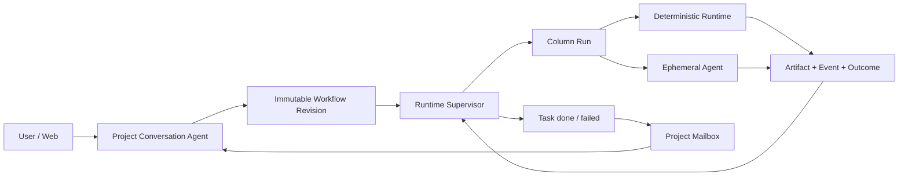

# DevWerk V1 Service

This directory contains the standalone DevWerk Version 1 service. It is a conversation-led, Column-based multi-agent workflow runtime backed by one SQLite database and Project-scoped files.

## Design Authority

- [`docs/generic-conversation-agent-and-declarative-column-runtime.md`](docs/generic-conversation-agent-and-declarative-column-runtime.md) — normative implementation source of truth
- [`docs/conversation-agent-design-v1.md`](docs/conversation-agent-design-v1.md)
- [`docs/kanban-workflow-design-v1.md`](docs/kanban-workflow-design-v1.md)
- [`docs/v1-test-contract.md`](docs/v1-test-contract.md)

The generic Agent/Column Runtime document governs implementation details. The two earlier design records preserve confirmed product intent; any old schema examples in them are superseded by the normative document. The full `tests` directory protects only the current contract.

## Runtime Shape



## Active Modules

```text
app/main.py
app/core/config.py
app/core/logging.py
app/v1/domain.py
app/v1/store.py
app/v1/files.py
app/v1/contracts.py
app/v1/capabilities.py
app/v1/agent.py
app/v1/conversation.py
app/v1/runtime.py
app/v1/llm.py
app/v1/api.py
app/services/anthropic_client.py
app/services/openai_client.py
app/services/ollama_client.py
app/services/llm_factory.py
app/services/provider_errors.py
app/services/usage.py
app/web/
```

Anything outside this list must have a current, explicit reason to exist before it is added to the service.

## Core Contracts

### Project and Conversation Agent

Project is the isolation boundary. Each Project persists exactly one logical Conversation Agent identity, a canonical and unique `base_dir`, its conversation, Workflow revisions, Tasks, Runs, Events, Artifacts, and mailbox notifications.

The Conversation Agent is a general-purpose tool-using Agent with Project-manager, Agile-coach, Kanban and recovery responsibilities. It has no task-type classifier. It may answer or directly execute bounded work, or publish a conversation-generated Workflow revision and create formal Tasks through capabilities. Same-Project turns are serialized.

### Workflow and Task

A valid Workflow:

- has unique Column keys;
- has exactly one `done` terminal and one `failed` terminal;
- has no transitions leaving a terminal;
- has no unreachable Columns;
- gives every non-terminal Column an explicit transition path to a terminal;
- rejects duplicate outcomes and unknown transition targets.

Task creation pins the active revision. Publishing a new revision never rewrites an existing Task.

### Runtime and Evidence

Every Column entry creates a Column Run. `capability_sequence` Columns execute declared capability steps without an LLM. `agent` Columns create an ephemeral Agent Run that shares the same iterative AgentCore as the Conversation Agent, but receives bounded Project + Task + Column context and a declared tool allowlist.

Source code contains no business Workflow factory, task-type route, domain prompt, directory layout rule, or Column-name executor branch. Instructions, contracts, capabilities and transitions are immutable Workflow revision data generated and updated through conversation or the system API.

Failed attempts remain immutable evidence. Retry exhaustion routes the Task through the explicit failed terminal instead of silently setting a terminal state. Terminal events also create durable Project mailbox entries for Conversation Agent observation.

Execution leases are renewable. Expired running Tasks become `recovering`, produce an event, and enter the Project mailbox so the supervisor can drive them again.

### SQLite and Files

SQLite uses WAL, `busy_timeout`, short explicit transactions, Project-scoped query indexes, and no network/LLM/file work inside transactions. Project files use canonical containment checks and atomic replace writes. Artifact records contain path, type, size, and SHA-256 rather than large file bodies.

## Run

Use only the checked-in virtual environment launcher:

```powershell
cd D:\workspace\DevWerk\DevWerk
.\startup.bat
```

Default endpoints:

- `/v1/health`
- `/v1/projects`
- `/v1/projects/{project_id}/conversation`
- `/v1/projects/{project_id}/conversation-jobs/{job_id}`
- `/v1/projects/{project_id}/workflow`
- `/v1/projects/{project_id}/board`
- `/v1/projects/{project_id}/projection`
- `/v1/projects/{project_id}/stream`
- `/v1/projects/{project_id}/tasks`
- `/v1/projects/{project_id}/tasks/{task_id}`
- `/v1/projects/{project_id}/tasks/{task_id}/runs`
- `/v1/projects/{project_id}/tasks/{task_id}/events`
- `/v1/projects/{project_id}/tasks/{task_id}/artifacts`
- `/v1/projects/{project_id}/events`
- `/v1/projects/{project_id}/agent-runs`
- `/v1/projects/{project_id}/tasks/{task_id}/agent-runs`
- `/v1/projects/{project_id}/agent-runs/{agent_run_id}`
- `/v1/projects/{project_id}/governance`

Trusted automation publishes Workflows at `/v1/projects/{project_id}/automation/workflow` and creates readiness-approved Tasks at `/v1/projects/{project_id}/automation/tasks`. Both require `X-DevWerk-Control-Token`; the read-only Web UI never exposes this control plane.

## Web Workbench

- `/` and `/workbench`: Project overview
- `/dashboard`: Project Conversation Agent workspace
- `/kanban`: read-only Column/Task projection
- `/tasks`: Task, Column Run, Artifact, and Event evidence
- `/events`: Project event timeline

The native ES-module client is split into `core`, `ui`, `pages`, and `styles`. It loads a compact Kanban projection once, then follows the Project event cursor over SSE. Task pages expose Column contracts plus complete Agent message/tool audit drill-down without periodic full-board polling.

## LLM Configuration

Copy `config/llm.example.json` to the ignored `config/llm.json`, or set `DEVWERK_LLM_CONFIG_JSON`. Routing keys used by the V1 runtime are `conversation` and `column`, with `default` as fallback. Supported protocols are Anthropic-compatible Messages, OpenAI-compatible Chat Completions, and Ollama Chat.

Do not commit provider credentials.

## Test Gate

```powershell
.\venv\Scripts\python.exe -m pytest tests -q
.\venv\Scripts\python.exe -m compileall app tests
```

Every file in `tests` belongs to the current V1 contract. Do not add skipped historical tests or compatibility fixtures. Provider tests exercise native tool-call normalization without network access; real-provider validation remains an explicit external preflight.
