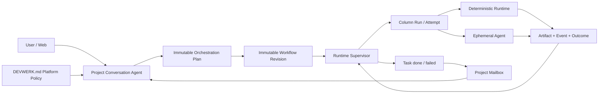

# DevWerk V1 Service

This directory contains the standalone DevWerk Version 1 service. It is a conversation-led, Column-based multi-agent workflow runtime backed by one SQLite database and Project-scoped files.

## Design Authority

- [`docs/generic-conversation-agent-and-declarative-column-runtime.md`](docs/generic-conversation-agent-and-declarative-column-runtime.md)
- [`docs/conversation-agent-design-v1.md`](docs/conversation-agent-design-v1.md)
- [`docs/kanban-workflow-design-v1.md`](docs/kanban-workflow-design-v1.md)
- [`docs/conversation-agent-orchestration-soul-p0-design.md`](docs/conversation-agent-orchestration-soul-p0-design.md)
- [`docs/workflow-template-runtime-v1.md`](docs/workflow-template-runtime-v1.md)
- [`docs/kanban-recovering-runtime-v1.md`](docs/kanban-recovering-runtime-v1.md)
- [`docs/agent-tool-rejection-recovery-v1.md`](docs/agent-tool-rejection-recovery-v1.md)
- [`docs/v1-test-contract.md`](docs/v1-test-contract.md)

The first four documents are locked architecture facts. Workflow Template, Kanban recovery, rejected-tool recovery, and test-contract documents describe implemented V1 extensions that must remain consistent with those facts. The full `tests` directory protects the current V1 implementation and does not provide a compatibility contract for older designs.

## Runtime Shape



## Active Modules

```text
app/main.py
app/core/config.py
app/core/logging.py
app/core/debug_trace.py
app/v1/domain.py
app/v1/policy.py
app/v1/store.py
app/v1/files.py
app/v1/contracts.py
app/v1/capabilities.py
app/v1/agent.py
app/v1/conversation.py
app/v1/runtime.py
app/v1/llm.py
app/v1/api.py
app/services/anthropic_client.py
app/services/openai_client.py
app/services/ollama_client.py
app/services/llm_factory.py
app/services/provider_errors.py
app/services/usage.py
app/web/
```

Anything outside this list must have a current, explicit reason to exist before it is added to the service.

## Core Contracts

### Project and Conversation Agent

Project is the isolation boundary. Each Project persists exactly one logical Conversation Agent identity, a canonical and unique `base_dir`, its conversation, Workflow revisions, Tasks, Runs, Events, Artifacts, and mailbox notifications.

The Conversation Agent is a general-purpose tool-using Agent with Project-manager, Agile-coach, Kanban and recovery responsibilities. Every governance Run preloads the versioned `DEVWERK.md` platform policy. It has no task-type classifier. It may answer or directly execute bounded work, or persist an OrchestrationPlan, publish its Workflow revision and create formal Tasks through capabilities. Same-Project turns are serialized.

### Workflow and Task

A valid Workflow is bound to an immutable OrchestrationPlan and:

- has unique Column keys;
- reserves `done` and `failed` as non-executable terminal sentinels;
- has no unreachable Columns;
- gives every non-terminal Column an explicit transition path to a terminal;
- rejects duplicate outcomes and unknown transition targets.

Task creation pins the active revision and its OrchestrationPlan task reference. Publishing a new revision never rewrites an existing Task. Dependencies and conflict domains are declared in the plan and rechecked atomically before dispatch.

### Runtime and Evidence

Every Column visit creates a Column Run; each retry creates a new immutable Attempt under the same Run. `capability_sequence` Columns execute declared capability steps without an LLM. `agent` Columns create an ephemeral Agent Run that shares the same iterative AgentCore as the Conversation Agent, but receives selected Project + Task + Column context and a declared tool allowlist.

Python source contains no business Workflow factory, task-type route, domain prompt, directory layout rule, or Column-name executor branch. Reusable domain knowledge is stored as version-controlled declarative JSON under `config/workflow-templates`, seeded into SQLite, selected by metadata, and materialized as ordinary immutable OrchestrationPlan, Workflow revision, and Task data.

Failed attempts remain immutable evidence. Non-recoverable runtime failures preserve their original exception details and set an explicit failed terminal. Structured temporary provider failures move the original Task to non-terminal `recovering`; after `next_retry_at`, Kanban reclaims the same Task and Column under the normal dependency, WIP, and conflict rules. Terminal and recovery events create durable Project mailbox entries for Conversation Agent observation.

Conversation and Column execution have no platform-defined model-iteration, tool-call, wall-clock, retry, or continuation budgets in V1. Provider, tool-contract, and runtime failures are recorded with their original details and surface directly instead of being converted into budget exhaustion or fallback results.

Execution leases are renewable ownership coordination. They do not substitute results. Kanban recovery is authorized only by structured recoverable provider classification and creates a new immutable Column Run/Attempt for the same Task and Column.

### SQLite and Files

SQLite uses WAL, `busy_timeout`, short explicit transactions, Project-scoped query indexes, and no network/LLM/file work inside transactions. Project files use canonical containment checks and atomic replace writes. Artifact records contain path, type, size, and SHA-256 rather than large file bodies.

## Run

Use only the checked-in virtual environment launcher:

```powershell
cd D:\workspace\DevWerk\DevWerk
.\startup.bat
```

Default endpoints:

- `/v1/health`
- `/v1/projects`
- `/v1/projects/{project_id}/conversation`
- `/v1/projects/{project_id}/conversation-jobs/{job_id}`
- `/v1/workflow-templates`
- `/v1/workflow-templates/{template_key}`
- `/v1/projects/{project_id}/automation/workflow-template`
- `/v1/projects/{project_id}/capabilities`
- `/v1/projects/{project_id}/workflow`
- `/v1/projects/{project_id}/orchestration-plans`
- `/v1/projects/{project_id}/quiescence`
- `/v1/projects/{project_id}/board`
- `/v1/projects/{project_id}/projection`
- `/v1/projects/{project_id}/stream`
- `/v1/projects/{project_id}/tasks`
- `/v1/projects/{project_id}/tasks/{task_id}`
- `/v1/projects/{project_id}/tasks/{task_id}/runs`
- `/v1/projects/{project_id}/tasks/{task_id}/events`
- `/v1/projects/{project_id}/tasks/{task_id}/artifacts`
- `/v1/projects/{project_id}/events`
- `/v1/projects/{project_id}/agent-runs`
- `/v1/projects/{project_id}/tasks/{task_id}/agent-runs`
- `/v1/projects/{project_id}/agent-runs/{agent_run_id}`
- `/v1/projects/{project_id}/governance`

V1 automation persists OrchestrationPlans at `/v1/projects/{project_id}/automation/orchestration-plans`, publishes Workflows at `/v1/projects/{project_id}/automation/workflow`, and creates readiness-approved Tasks at `/v1/projects/{project_id}/automation/tasks` without an authentication gate. This is an explicit low-cost V1 boundary; the customer Web Kanban remains read-only and does not expose mutation controls. Authentication and approval are deferred until after V1.

## Web Workbench

- `/` and `/workbench`: Project overview
- `/dashboard`: Project Conversation Agent workspace
- `/kanban`: read-only Column/Task projection
- `/tasks`: Task, Column Run, Artifact, and Event evidence
- `/events`: Project event timeline

The native ES-module client is split into `core`, `ui`, `pages`, and `styles`. It loads a compact Kanban projection once, then follows the Project event cursor over SSE. Human conversation uses persisted messages with stable IDs, timestamps, and separate user/Agent turns; execution status is rendered outside conversation bubbles. Detailed model/tool progress remains available as ordered events and Task/Agent audit evidence. Task pages expose Column contracts, clear failure summaries, artifacts, Agent messages, and tool invocations without periodic full-board polling.

## V1 Full Debug Trace

Before the V1 release, functionality and diagnosability take priority over security hardening. DevWerk therefore writes complete, unredacted Agent, provider, capability, Column Runtime, error, and usage inputs/outputs to `data/logs/devwerk.log` at DEBUG level. `TimedRotatingFileHandler` keeps the active file named `devwerk.log` and archives it daily as `devwerk.YYYYMMDD.log`. Related records share a `trace_id` where applicable.

The primary trace event names are `web.conversation_input`, `web.conversation_output`, `llm.agent_input`, `llm.provider_request`, `llm.provider_response`, `llm.agent_output`, `agent.model_input`, `agent.model_output`, `capability.input`, `capability.output`, `runtime.column_input`, `runtime.column_output`, and their corresponding error events. This is the intentional V1 development baseline; redaction, secret filtering, and log minimization are post-V1 work.

## LLM Configuration

Copy `config/llm.example.json` to the ignored `config/llm.json`, or set `DEVWERK_LLM_CONFIG_JSON`. Routing keys used by the V1 runtime are `conversation` and `column`; `default` is the route used when a specific route is not configured. Supported protocols are Anthropic-compatible Messages, OpenAI-compatible Chat Completions, and Ollama Chat.

Do not commit provider credentials.

## Test Gate

```powershell
.\venv\Scripts\python.exe -m pytest tests -q
.\venv\Scripts\python.exe -m compileall app tests
```

Every file in `tests` belongs to the current V1 contract. Do not add skipped historical tests or compatibility fixtures. Provider tests exercise native tool-call normalization without network access; real-provider validation remains an explicit external preflight.
