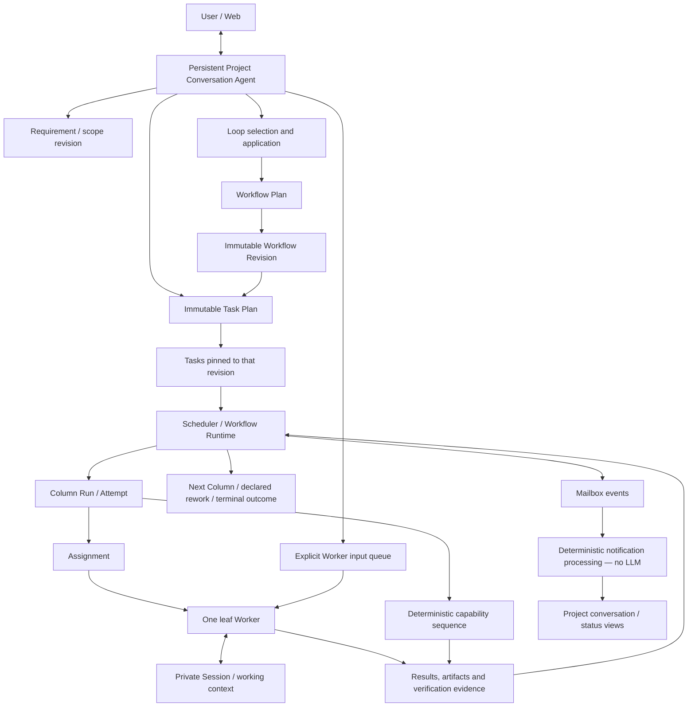

# DevWerk V1 Runtime

This directory contains the standalone implementation of DevWerk: a general-purpose multi-agent framework that uses explicit workflows and independently managed agent contexts to complete long-running tasks.

The Project Conversation Agent is the sole main agent. An agent Column runs one leaf Worker. Runtime coordinates execution and verification; Mailbox provides passive notifications. For the product motivation and context-management goals, see the [repository README](../README.md).

This guide describes the current development tree, including context and acceptance changes still undergoing real-provider validation. It does not imply that an earlier release package contains all of these changes.

## Runtime Structure


```mermaid
flowchart TD
    U["User / Web"] <--> CA["Persistent Project Conversation Agent"]
    CA --> REQ["Requirement / scope revision"]
    CA --> LOOP["Loop selection and application"]
    LOOP --> WP["Workflow Plan"]
    WP --> WR["Immutable Workflow Revision"]
    CA --> TP["Immutable Task Plan"]
    WR --> TP
    TP --> T["Tasks pinned to that revision"]
    T --> RT["Scheduler / Workflow Runtime"]
    RT --> CR["Column Run / Attempt"]
    CR --> AS["Assignment"]
    AS --> W["One leaf Worker"]
    W <--> S["Private Session / working context"]
    CR --> CS["Deterministic capability sequence"]
    W --> E["Results, artifacts and verification evidence"]
    CS --> E
    E --> RT
    RT --> NEXT["Next Column / declared rework / terminal outcome"]
    CA --> WI["Explicit Worker input queue"]
    WI --> W
    RT --> MB["Mailbox events"]
    MB --> NR["Deterministic notification processing — no LLM"]
    NR --> UI["Project conversation / status views"]
```

The two Column execution branches are alternatives. The agent branch uses an Assignment and one Worker; the deterministic branch runs capabilities directly.

## Domain Objects and Ownership

| Object | Responsibility |
| --- | --- |
| Project | Project identity, canonical workspace, conversation, plans, tasks, memory and evidence |
| Conversation Agent | The Project's persistent main agent for user interaction and coordination |
| Requirement | An explicit objective/scope with revisions; bounds related planning and Worker reuse |
| Workflow Plan | Reusable process and Task Contract, without a concrete Task inventory |
| Workflow Revision | Immutable executable Columns, outcomes, transitions and acceptance obligations |
| Task Plan | Concrete proposed Tasks, inputs, dependencies, conflicts and readiness bound to a Workflow Revision |
| Task | One independently accepted delivery unit moving through the Workflow |
| Column | One repeatable execution responsibility and context boundary |
| Column Run / Attempt | Durable visit and execution/recovery evidence |
| Worker | A persistent logical leaf-agent identity with its own Session |
| Assignment | The current binding of work, Worker, Session, contract and execution ownership |
| Agent Run | One execution of the model–tool loop; it is not the agent's lifetime |

A Task traverses multiple Columns. Backend implementation, frontend implementation, review, and acceptance can be stages of one software Task; they are not automatically separate Tasks. Split Tasks when the accepted work has distinct delivery identities and acceptance boundaries.

Projects have one active Workflow with immutable revisions. The first revision is created by `loop.apply`. Later revisions do not mutate existing Tasks. `task.plan.save` persists a concrete plan; `task.plan.validate` only diagnoses it. `task.create` materializes the plan using its returned ID and a `proposed_task_ref`.

Completed work is not silently rewritten. A repeated execution using the original plan and a successor using a corrected plan are different operations: `task.rerun` and `task.successor`, respectively.

## Conversation and Worker Lifecycles

### Conversation Agent

Each Project has one logical Conversation Agent and one durable Conversation Session. User turns run through durable Jobs and short-lived Agent Runs. A failed turn leaves the logical agent available for later interaction.

The agent discusses requirements, records decisions, selects the applicable scope, plans work, and reports results. Discussion does not itself authorize Task creation. The durable turn contract distinguishes discussion, execution requests, scope extension, and targeted control actions.

There is no higher System Main Agent. Runtime admission and ownership checks enforce the current request and execution state; they are not a second agent or an extra human-facing authority tier.

### Leaf Workers

An `agent` Column has one Worker. It may perform multiple model–tool iterations to inspect, implement, verify, and correct its assigned work. It cannot create an internal team or nested collaboration graph.

By default, Worker reuse is scoped to the Task and Column. An explicit `AgentExecutor.worker_key` can reuse a Worker within the same Requirement. Reuse is deliberate: an agent's private history is not automatically shared with other Workers just because they have similar role names.

An Assignment binds the Worker to the current Column Run, inputs, contract, Session, and ownership generation. A Worker has one active writer. Completion releases its active Assignment while preserving identity and context. Lifecycle operations can suspend, resume, retire, or explicitly replace a Worker.

A logical agent need not retain a Python thread or model connection while idle. Session continuity also does not mean unrestricted execution: model calls, tools, resumes, elapsed time, and Column visits have runtime limits.

## Collaboration and Notifications

DevWerk separates three paths:

| Path | What it carries | What it means |
| --- | --- | --- |
| Workflow handoff and Task feedback | Declared outputs, artifact references, defects and verification obligations | Runtime can advance or route rework along declared edges |
| Explicit Worker input | A message addressed to a Worker, optionally bound to an Assignment | Durable acceptance and consumption are recorded separately; enqueueing does not start execution |
| Project Mailbox | Runtime events, delivery feedback and their source references | Notification/observation only; no model call or automatic planning authority |

A novel review, code test report, or other delivery feedback can appear in notification content. Mailbox does not interpret it into instructions, converse with the Conversation Agent, select a recipient Worker, or communicate on another agent's behalf.

Non-user notification Jobs are processed deterministically. Acknowledgement proves notification handling, not successful repair, test completion, or acceptance. The user-facing Conversation Agent may inspect the evidence during a subsequent authorized turn.

Cross-agent review and repair remain observable Workflow stages. Persistent Task feedback records the responsible Column and checks needed to resolve the issue. Verification must be newer than the relevant defect observation; old receipts cannot settle a new defect.

## Context, Memory, and Evidence

These are related but separate layers.

### Active context and private Sessions

The current Assignment receives its instructions, scoped inputs, selected memory and artifact references, relevant feedback, and its own continuation history. Shared project facts can be supplied to several agents without sharing their complete transcripts.

Artifact context distinguishes accepted dependency results, current working artifacts, and unverified reference material. Context manifests record selected references and provenance where applicable.

In the current development tree, `context_manager.py` prepares each provider request:

- includes messages and tool schemas in a conservative UTF-8-based estimate, calibrated upward from observed usage;
- reserves output space and a safety margin;
- projects large tool results into bounded views while retaining original records;
- compacts complete assistant/tool batches, including old code-writing arguments;
- persists Assignment checkpoints for continuation;
- attempts one smaller-context retry after an explicit provider context-overflow error, without replaying completed tool effects.

Maintenance summarization uses the same agent's model without tools or another Worker. Failure falls back to bounded source facts. Required inputs that still cannot fit produce an explicit block rather than an unbounded retry loop.

The estimator is not a model-specific tokenizer, and summaries are lossy references. Neither summaries nor remembered success claims constitute verification evidence. Archived tool results can be read through `agent.result.read`; Workers can inspect bounded pages of their own history through `agent.context.read`.

### File-first semantic memory

Semantic memory is stored under:

```text
{project.base_dir}/.devwerk/memory/
  PROJECT.md
  CURRENT.md
  DECISIONS.md
  CONSTRAINTS.md
  OPEN_ISSUES.md
  knowledge/
  records/{scope}/{scope_id}/{memory_id}.md
  snapshots/{scope}/{scope_id}/{content_hash}.json
```

Supported scopes are `project`, `conversation`, `workflow`, and `task`. Records carry provenance, revisions, and states such as active, stale, or superseded. Worker private Sessions and Assignment context checkpoints are separate runtime structures, not additional file-memory scopes.

The file-memory provider supports scoped retrieval and replacement of its provider boundary. Search indexes can be rebuilt from source memory; this is not a claim that a vector database is installed or required.

### Execution evidence

SQLite stores transactional facts and original execution records: plans, assignments, ownership, messages, tool invocations, feedback, verification results, events, and artifact metadata. Large deliverables remain project files; their artifacts carry paths, hashes, sizes, and relationships. Raw tool invocations may still contain large bodies even when their model-visible projection is short.

SQLite uses WAL, busy timeouts, and explicit transactions. Short transactions are a design goal; the implementation does not promise that every transaction is free of filesystem I/O.

## Acceptance and Recovery

Column completion validates declared outcomes, output contracts, tool evidence, and frozen acceptance checks before following a transition. An agent's text saying “done” is not sufficient.

The software delivery Loop in the current tree freezes scenario IDs and behavioral checks. Its checks require fresh structured reports containing observed assertions and test-source hashes. Building successfully, listing a directory, or finding a report file does not by itself demonstrate product behavior. Independent review is still necessary: a structured report is not a general proof that an arbitrary test measures the right requirement.

`workflow.acceptance.configure` changes checks against an explicit revision/hash without resending the graph. `task.plan.validate` returns admission diagnostics without saving a plan or executing future checks. Existing Tasks retain their frozen revision.

| Situation | Runtime behavior |
| --- | --- |
| Successful Column outcome | Validate evidence and follow the declared transition |
| Review or test defect | Record feedback and use declared Workflow rework edges |
| Recoverable provider/infrastructure error | Preserve the Task and return through non-terminal `recovering`, subject to retry policy |
| Unhandled execution or context-exhaustion error | Preserve the original cause and pause as `blocked_runtime`; this is not automatically business failure |
| Explicit Workflow terminal outcome | Reach `done` or `failed` with terminal evidence |
| Explicit cancellation | Record cancellation under the `failed` terminal with its own failure code |

A blocked Task may remain `recovering` or `waiting` with `control_state=paused`. These states are not terminals. Renewed leases and ownership generations fence stale workers; late results cannot overwrite the current owner.

Recovery preserves applicable Task, Assignment, and Session identity. A changed business contract instead requires an explicit scope/plan change and, where appropriate, a successor Task. Publishing a corrected Workflow does not silently repair a Task pinned to the old one.

## Loops

Reusable processes live in:

```text
loops/<name>/
  loop.meta
  loop.json
  assets/
```

Loops declare domain instructions, context selectors, capabilities, input/output contracts, acceptance obligations, and rework paths. Runtime implements the common execution model. Domain-specific roles such as writer, reviewer, backend developer, or tester are expressed in the workflow rather than nested agent teams.

## Run Locally

Run these commands from this service directory. For a fresh installation:

Linux/macOS:

```sh
sh ./install.sh
cp config/llm.example.json config/llm.json
```

Windows PowerShell:

```powershell
.\install.bat
Copy-Item .\config\llm.example.json .\config\llm.json
```

Complete the LLM configuration below, then run `sh ./startup.sh` or `.\startup.bat`. The launchers use the project `venv`. Stop the corresponding local service with `sh ./shutdown.sh` or `.\shutdown.bat`.

| Route | View |
| --- | --- |
| `/`, `/workbench` | Project overview |
| `/dashboard` | Project Conversation Agent workspace |
| `/kanban` | Read-only Workflow projection |
| `/tasks` | Task, Run, Artifact and evidence views |
| `/events` | Project event timeline |
| `/settings` | Supported global settings |
| `/docs` | API documentation |

The default address is [http://127.0.0.1:8000/workbench](http://127.0.0.1:8000/workbench).

## LLM Configuration

Use `config/llm.json`, copied from the checked-in example, or supply `DEVWERK_LLM_CONFIG_JSON`. The validated catalog has four sections:

- `providers`: protocol, endpoint, and credential configuration;
- `models`: provider binding, model name, timeout, generation settings, and context window;
- `routes`: `conversation`, `column`, and `default` model bindings;
- `runtime`: transport settings.

Adapters support Anthropic-compatible Messages, OpenAI-compatible Chat Completions, and Ollama Chat. Protocol compatibility does not establish every model's window size or generation limits.

Set the variable named by the selected provider's `api_key_env`. For the example's MiniMax route:

```sh
export DEVWERK_MINIMAX_API_KEY="your-key"
```

```powershell
$env:DEVWERK_MINIMAX_API_KEY = "your-key"
```

For the current context manager, set `models.<name>.context_window` to the window supported by the actual endpoint/model unless it has a recognized direct-provider default in [app/v1/llm.py](app/v1/llm.py). Also choose a supported `max_tokens` output limit that leaves room for inputs and safety margin.

Some alternative routes in the example omit `context_window`; complete their model settings before selecting them. An unknown window produces an explicit configuration error. Runtime does not infer an arbitrary provider's limits from its protocol.

Keep actual provider credentials out of source control. The example contains variable names, not keys.

## Docker

To run the implementation in this checkout, build it from the service directory:

```sh
docker build -t devwerk:local .
docker volume create devwerk-data
docker volume create devwerk-projects
```

Prepare the host `config/llm.json` and an environment file containing the referenced provider variable, then start the container:

```sh
docker run -d --name devwerk --restart unless-stopped \
  -p 8000:8000 \
  --env-file /absolute/path/to/.env \
  --mount type=bind,source=/absolute/path/to/llm.json,target=/opt/devwerk/config/llm.json,readonly \
  -v devwerk-data:/opt/devwerk/data \
  -v devwerk-projects:/workspace \
  devwerk:local
```

Use `/workspace/...` for generated project directories to keep them on the project volume. Mount only the configuration JSON so the image's other configuration files remain visible.

The image installs DevWerk's Python service dependencies. Toolchains needed by generated projects, such as Java/Maven, Node, or browser binaries, must also be available in the execution environment; the Dockerfile does not install them.

For published binaries or images, use the corresponding [release notes](https://github.com/zanghongtu2006/DevWerk/releases). This guide does not designate an unverified image tag as the latest release.

## Settings and Local Traces

`config/global-settings.yaml` is strictly validated. Its current `workflow.auto_resume_previous_tasks` setting defaults to `false`: previously executing/admitted work becomes startup-paused, while downstream dependency-queued work retains dependency-managed admission.

Scheduling, context limits, execution budgets, and related Runtime defaults are defined in [app/v1/policy.py](app/v1/policy.py). They are distinct from the global-settings YAML and the LLM catalog.

Development tracing records agent, provider, capability, Runtime, and usage details in `data/logs/devwerk.log`. Traces may include full prompts and tool outputs. V1 prioritizes functional delivery and diagnosis; the current logging/deployment model is not a production-hardening guarantee.

## Implementation Map

| Area | Main entry points |
| --- | --- |
| Application and Web | `app/main.py`, `app/v1/api.py`, `app/web/` |
| Conversation and turn intent | `conversation.py`, `conversation_intent.py` |
| Agent execution and provider requests | `agent.py`, `agent_runner.py`, `agent_provider.py` |
| Context and memory | `context_manager.py`, `session_replay.py`, `memory.py` |
| Requirements, Workers and Assignments | `repositories/scope_repository.py`, `repositories/agent_repository.py` |
| Planning and admission | `repositories/planning_repository.py`, `services/task_plan_compiler.py` |
| Workflow execution and recovery | `runtime.py`, `services/scheduler.py`, `services/recovery_manager.py` |
| Feedback and acceptance | `repositories/task_feedback_repository.py`, `services/acceptance_execution.py` |
| Tools and command execution | `capabilities.py`, `files.py`, `process_runner.py`, `command_resolution.py` |

Entries without an `app/` prefix are relative to `app/v1/`. Provider adapters and configuration live in `app/services/` and `app/core/`.

## Verification

From the service directory:

```powershell
.\venv\Scripts\python.exe -m pytest tests -q
.\venv\Scripts\python.exe -m compileall app tests
```

On Linux/macOS, use `./venv/bin/python`.

The suite covers Workflow validation, planning and admission, persistent Workers and Sessions, project-local memory, passive notifications, feedback, recovery, command ownership, context budgeting, and acceptance evidence. These are executable contracts, not proof that arbitrary projects will be delivered correctly.

The separate [software context evaluation script](scripts/eval_software_context.py) uses the configured real provider and an isolated database/workspace under a selected output directory. It consumes model quota. Its resume mode is restricted to matching projects under `data/evals/`. It does not replace independent inspection of generated tests, actual HTTP/browser behavior, or process cleanup.

Complete real-provider software delivery and subsequent user-requested repair have not yet passed the current validation sequence. The [implementation record](docs/bugs/2026-09-22-context-overflow-implementation.md) distinguishes local tests, interrupted real runs, and remaining work.

## Design References and Revisions

Read designs by topic and revision. Earlier documents contain superseded proposals; the existence of a design does not prove every item is implemented. In particular, older Workcell graphs, model-driven Mailbox governance, and unconditional failure-terminal descriptions do not define the current runtime.

| Topic | References and applicable refinement |
| --- | --- |
| Planning ownership | [Loop / Task Plan decoupling](docs/loop-task-plan-decoupling-v1.md) |
| Column boundary | [Single-agent Column decision](docs/single-agent-column-runtime-v0.1.0.md); its earlier Session-default description is refined by the lifecycle changes below |
| Persistent main/leaf agent structure | [Hermes architecture review](docs/DEVWERK_Hermes_Architecture_Review_2026-09-09.md), [lifecycle remediation plan](docs/DEVWERK_P0_Runtime_Remediation_Plan_2026-09-09.md) |
| Sole main agent and scope continuation | [Scope extension revision](docs/bugs/2026-09-10-conversation-scope-extension-review-and-plan.md) |
| Passive Mailbox, separate inputs and feedback | [Feedback/evidence revision](docs/DEVWERK_Repair_Evidence_Token_Fix_2026-09-21.md); supersedes the older proposal to use Mailbox for Worker inputs |
| Context lifecycle and current validation | [Context audit and plan](docs/bugs/2026-09-22-context-overflow-full-audit-and-fix-plan.md), [implementation record](docs/bugs/2026-09-22-context-overflow-implementation.md) |
| README alignment | [Architecture review and update record](docs/bugs/2026-09-27-readme-proposal-review.md) |

The current objective remains a working user conversation → scoped planning → multi-agent execution → verification → delivery loop, with explicit control over each agent's context and memory. Better precision and lower waste than a single long loop remain goals to evaluate, not established benchmark results.
