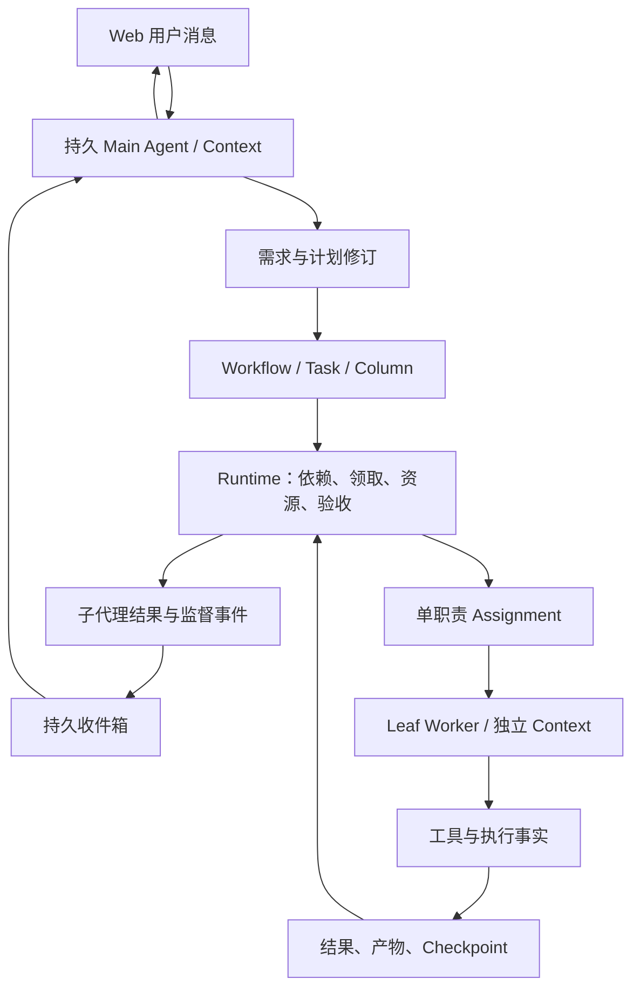

# DevWerk P0 修改方案：主 Agent + 持续子 Agent + 单职责 Column

版本：2026-09-09 / Hermes 源码审阅后修订。**状态：用户已授权逐项实施；代码、验证和实施差异见 [2026-09-10 实施记录](DEVWERK_P0_Runtime_Implementation_2026-09-10.md)。**

本版本替代 [上一版方案](DEVWERK_P0_Runtime_Remediation_Plan_2026-09-09_pre_Hermes.md)。依据：[Hermes 源码借鉴与架构差距](DEVWERK_Hermes_Architecture_Review_2026-09-09.md)、[Bug 登记簿](DEVWERK_P0_Runtime_Bug_Register_2026-09-09.md)、[原六项独立复现](DEVWERK_P0_Runtime_ReReview_2026-09-09.md)。

## 1. 本次必须遵守的架构方向

1. **Conversation Agent 是主 Agent。** 使用真实的模型—工具循环，持续理解需求、维护计划、选择/协调子代理、处理结果与纠偏，并向用户交付。
2. **workflow 是工作调度与验收状态机。** 它规定依赖、Column、输入/输出和完成条件，不替代主代理理解需求。
3. **业务执行由叶子 sub-agent 完成。** 子代理使用与主代理相同的 AgentCore，拥有独立身份、context、消息和执行记录。
4. **子代理逻辑生命周期可以长于一次 Task/Column/AgentRun。** 可以先完成工作，空闲后继续接收本需求下的新分配；不要求长期占用 Python 对象、线程或连接。
5. **一个 Column 一次只有一个明确职责和一个执行者。** 允许该子代理自己多次读文件、运行命令、修正并重试；不允许在内部再创建多个 Agent 讨论/评审/投票。
6. **跨代理协作放在主代理和 workflow 层。** implement、review、repair 等通过独立工作项和结果引用衔接。
7. **长任务靠持续分解的小工作闭环推进。** session 的延续不等于每次携带全部历史，也不等于给每个 Column 无限执行额度。

本轮不引入 Redis、独立 Agent 微服务、多机协调、复杂权限系统或通用多代理编排语言；继续使用现有 SQLite、AgentCore、WorkflowRuntime、CapabilityRegistry 与 mailbox。

## 2. 与上一版的明确差异

| 原方案选择 | 当前修订 | 原因 |
|---|---|---|
| 主要围绕 ColumnRun 修补可靠性 | 先明确 AgentInstance / Session / Assignment，再接入 R1–R6 | 身份与执行范围不能继续混用 |
| 沿用非用户回合不得扩展任务图 | 主代理可在有效需求内根据结果继续拆分/修复 | 真实主代理必须闭环；不应每一步都等用户消息 |
| 只允许相同原操作的受限重试，替代修复普遍走 rework | 保留普通 Agent 修正命令的能力；禁止模型任意清除必需验收失败 | 完成证据与探索过程要分开，不能为了防假完成废掉 Agent |
| 长期会话仅作为 run 历史恢复辅助 | 独立且可跨相关 Task 复用的子代理会话 | 用户要求持续交互调度和独立 context |
| R6 使用较重的活动时间分片预留 | 先实现 Assignment 持久计数、有限活跃期限与无进展收敛 | v1 不需要预算基础设施先于可交付架构 |
| 只处理 Conversation queued | 主/子代理所有待投递消息与调度分配都从 DB 再发现 | 长期子代理不能依赖进程内 future |
| lifecycle 只考虑一次 run 结束 | idle/suspended 可继续；retired 才结束逻辑寿命 | Turn/工作/Agent 三种结束含义不同 |

保留：稳定操作身份、结果不明不盲重放、receipt 当前事实、提交时 fencing、持久 queued 补扫、历史证据不伪造。

## 3. 名词、归属和寿命

| 对象 | 含义 | 归属 | 结束条件 |
|---|---|---|---|
| Project | 交付项目及工作空间 | 用户 | 项目关闭 |
| Requirement | 一次明确的需求/目标及 revision | Project | 交付、取消或被新版本取代 |
| Main AgentInstance | Project 的持续协调者 | Project | Project 关闭；普通 turn 结束不关闭 |
| Worker AgentInstance | 某需求下的叶子执行角色/专题 | Requirement | retire；完成一次工作通常仅 idle |
| ContextSession | 某 Agent 的独立对话、摘要和上下文版本 | AgentInstance | rotation/归档；新 session 保留 lineage |
| Task / Workflow | 业务工作图及已发布流程 | Requirement | 按工作状态终结 |
| ColumnRun | Task 对某阶段的一次逻辑访问 | Task | 阶段完成/失败/转移 |
| Assignment | 某 ColumnRun 委派给某子代理的工作契约 | ColumnRun + AgentInstance + Session | completed / failed / cancelled；可等待/阻塞 |
| AgentRun | 执行某次消息/恢复的物理运行 | Assignment 或 Main turn | 一次 turn 完成、让出、异常 |
| Operation / Receipt | 一次被接受的工具意图及其当前事实 | 当前 Assignment/Main turn | 效果明确结算或 unknown |
| AgentMessage | 可持久化投递的输入、引导、结果或控制请求 | 发送/接收 Agent + scope | 消费/拒绝/失效有明确记录 |

**映射建议**：

- 一个 Requirement 可有多个 workflow/Task；一个 Worker 可服务其中多个相关工作。
- 一个 ColumnRun 只有一个“当前逻辑 Assignment”。进程故障重试不新建业务 Assignment。
- 重新分配给别的 Worker 时沿用该逻辑工作身份并递增 assignment generation，保留旧 binding/event；不能让旧 Agent 的迟到结果完成新绑定。
- 同一个 Worker 同时只能运行一个会修改其 ContextSession 的 turn。并行工作使用不同 Worker；不让两个 Task 并发写一个 session。
- 同角色名不代表相同 Worker。复用必须显式绑定 agent_instance_id/上下文范围。
- 新需求默认新建 Worker。跨需求复用只通过明确交接，不把同名“developer”的全部过去自动带入。

## 4. 目标结构与运行案例



案例：需求 Q 是交付一个表单页面。

1. Main 与用户确认业务目标，创建 Q/r1，生成 implement → review → repair（需要时）→ acceptance 的工作图。
2. Runtime 将 implement 分配给 Worker D，使用 D 的独立 session S1。D 在 Column 内自己读写、测试，完成一项页面实现。
3. D 返回产物引用与结构化结果；Assignment 完成，D 转 idle，S1 保留，运行线程释放。
4. review 分配给 Reviewer R，session S2 只接收需求、产物版本与评审标准，不接收 D 的全量思考和所有命令日志。
5. R 给出问题；事件唤醒 Main。Main 在 Q 范围内创建 repair Task，不需要伪造一条“用户说继续”。
6. repair 仍交给 D。D 用 S1 的覆盖摘要、最近相关片段、当前新输入和评审反馈继续，不丢失相关上下文。
7. 用户期间补充需求时，Main 可以回应、更新 requirement revision、向 D 发送目标明确的引导消息；不得把新目标直接写进正在运行的旧验收版本。
8. 最终 acceptance 针对固定产物版本完成，Main 汇总真实结果交付。
9. Q 交付后 retire 对应 Worker，保留 session 和产物可查；Main 继续服务 Project 的后续需求。

整个过程没有任何 Column 在内部运行 developer/reviewer 多 Agent loop。

## 5. 主 Agent：从“仅用户回合能规划”改成需求驱动

### 5.1 能力与边界

Main 可讨论、读取项目/工作结果、保存计划、发布 workflow revision、创建/重排 Task、分配/唤醒 Worker、读取结果、要求返工、暂停/取消、交付。

它有完整单 Agent 工具循环，不限制成“只能输出 JSON 的规划函数”。项目业务交付任务通过 workflow 执行；小范围需求澄清、仓库检查等工具操作允许直接在 Main turn 完成。已有运行中的工作空间写入约束仍有效，Main 不能在 Worker 正在写同一资源时偷偷接管写入。

Worker 可观察/修改分配范围内产物、执行工具、上报结果/阻塞/需要澄清；不能创建 Worker、创建任意 Task 图、改 workflow 或直接调用别人的控制能力。

### 5.2 权限依据是角色与有效需求，而非消息来源

替换 `_require_user_planning_turn`：

```text
allow graph mutation when:
  caller role == main
  initiating turn owner still valid
  requirement is active and expected revision matches
  proposed work refers to current requirement and valid plan revision
```

- 用户、子代理结果、定时观察都可以触发 Main turn；事件本身不获得规划权。
- Worker 发来的消息是数据，不能伪装成 Main 的指令或系统消息。
- 新任务继承 requirement_id、原因事件与计划版本；能追踪为何创建，防止无来源任务蔓延。
- 已有需求内的修复与拆分继续执行。真正改变用户目标的范围变化记录新 revision；缺少必要业务信息时 Main 向用户澄清。
- cancelled/completed requirement 的迟到消息归档，不自动复活需求或创建新工作。
- 重复同一个反馈事件，不重复创建修复 Task；以 cause_event_id + plan operation 身份去重。

这属于工作语义和运行一致性，不新增一套用户安全授权审批。

## 6. 叶子 Worker 生命周期

### 6.1 状态分开保存

**AgentInstance 生命周期**：available → suspended → retired。available 可以接收工作，suspended 暂不接收，retired 不自动复活。

**执行占用**通过 active_assignment_id、turn claim、lease 表达：idle / running / waiting / blocked 可作为 UI 投影，避免另一个独立状态字段和 Assignment 状态相互矛盾。

**Assignment 状态**：

```text
queued -> running -> completed
                  -> waiting_external -> running
                  -> blocked -> running
                  -> failed / cancelled
```

运行进程失联先进入 recovering 投影，核对 receipt 和 lease 后决定继续/unknown；不能直接当成功或全量重启。

### 6.2 生命周期 API

统一服务 `AgentLifecycleService`，复用现有 store/repositories。对模型暴露尽量少的聚合能力，对内部代码提供明确方法：

| 行为 | 约束 |
|---|---|
| ensure_worker(requirement, role, reuse_binding) | 显式复用或创建；同名不自动共享 |
| assign(column_run, worker, context_contract) | 先持久化 Assignment，校验依赖/能力/资源后再派发 |
| send(worker, assignment, message) | durable accepted；返回 message_id，不宣称已执行 |
| inspect/list | 返回生命周期、当前工作、消息进度和最后 checkpoint |
| pause / resume | 影响接收和执行调度，不丢 session |
| cancel_assignment | 撤销本次工作权；核对在途效果后结算 |
| retire_worker | 有活跃工作则先停止/移交；不可仅删除 Python 对象 |
| recover | 重建运行载体，复用持久身份，恢复未处理输入与效果事实 |

需求结束可自动 retire；普通 Main turn 结束不能 cascade 取消 Worker。明确取消需求才触发关联 Assignment 的有记录取消。服务退出回收线程/进程，但不删除逻辑 Worker。

### 6.3 实例与资源不是同一个锁

- session turn lease：防止两个运行同时写同一 context。
- assignment generation：防止旧分配者提交结果。
- workspace/resource lease：防止不同 Worker 并发覆盖相同文件/产物。
- idle Worker 不持有工作空间写锁。等待外部命令时能否释放资源由该操作是否仍在写决定，不按 idle 标签猜测。
- 建议 v1 保留现有项目写入串行化，允许纯读取并行；后续再扩展细粒度 worktree 隔离。独立 context 不自动提供文件隔离。

## 7. Context：可持续，但每次输入仍聚焦

### 7.1 四层内容

1. **固定角色上下文**：Main/leaf 身份、职责、允许工具、稳定操作规则；随明确 revision 切换，不每回合把所有动态事实塞进 system。
2. **需求/项目共享事实**：需求版本、约束、artifact 引用、已接受决策。按需选择。
3. **Worker 私有 context**：自己的消息/工具历史、决策、待办、错误、覆盖摘要及游标。
4. **当前 Assignment 输入**：一个目标、scope、指定输入产物版本、验收条件、新反馈与当前 Await 状态。

Main 接收 Worker 的结构化交付摘要和证据引用，按需展开工具历史；兄弟 Worker 只接收必要交付内容。模型私有历史不能自动成为全局记忆。

### 7.2 持久化与重建

沿用 `v1_agent_messages` 原始调用历史，建立 session 有序 message 引用/游标。摘要必须有：

```text
session_id, context_revision, covers_through_sequence,
summary, unresolved_items, artifact_refs, source_hash
```

- 保存摘要是增加派生记录，不删掉事实。
- 恢复输入 = 覆盖摘要 + 未覆盖相关消息 + 当前分配输入 + 必须处理的未结算 operation/Await。
- 如果摘要包含不可靠的信息，以最新 receipt、需求版本和产物版本为准。
- waiting run 的 checkpoint/消息必须可恢复；不能只查询 succeeded/failed 的 final_text。
- 输入包保持角色与工具调用/结果配对合法，不能把所有历史 tool message 扔进一条伪造 user 消息后声称 session 已完整恢复。
- session rotation 保留 AgentInstance 身份与 lineage；不创建一个被误认为新角色的 Worker。
- 首版不需要向量库或通用 ContextEngine 插件。实现确定的 context selector 与可覆盖的摘要即可。
- 完成准入从 DB 查完整当前工作事实，不受 prompt 摘要/分页裁剪影响。

## 8. Column 契约：一个工作单元，一个叶子执行者

推荐给 AgentExecutor 增加类型化的 worker/context/acceptance 配置，代替仅藏在 metadata 的 agent_session_key。

以下是拟议 schema，尚不是可直接导入当前版本的 JSON：

```json
{
  "key": "implement_form",
  "executor": {
    "kind": "agent",
    "worker_role": "developer",
    "reuse_scope": "requirement",
    "capabilities": ["project.files.read", "project.files.write", "project.command.run"]
  },
  "assignment": {
    "objective": "实现已确认的表单交互",
    "input_refs": ["requirement_revision", "approved_design"],
    "output_refs": ["changed_files", "build_result"],
    "acceptance_refs": ["form_build", "form_behavior"]
  },
  "transitions": [
    {"outcome": "success", "target": "review"},
    {"outcome": "blocked", "target": "needs_clarification"}
  ]
}
```

实现时与现有 Transition/引用模型统一，不为了这个示例新增第二套 workflow 格式。

发布校验、派发和工具 dispatch 三处都执行 leaf 约束：不暴露/允许 delegate、spawn、workflow 发布、Task 图扩展等工具。不能只在 prompt 写“不要创建子代理”。

单职责不是单工具：实现一个行为可有多次文件操作和测试。职责判断由规划和 Review 进行，schema 只验证目标/输入/输出/执行者边界；不声称能靠关键词判断所有自然语言任务是否足够小。

显式不支持：

- 单 Column 内 developer → reviewer → developer 多代理循环。
- Worker 私下等待另一个 Worker 的结果来完成未登记协作。
- 一个 Column 分配两个不同 Worker 同时写一份输出。
- Worker 收到新需求后静默改变当前 Assignment 的验收范围。

需要跨角色时新建 Column/Task；需要 clarification 时发送消息并让出等待，结果经 Main 和 workflow 返回。

## 9. 消息与异步调度

### 9.1 使用现有 mailbox 做定向扩展

优先扩展 `v1_project_mailbox` 与 `v1_mailbox_deliveries`，增加 recipient_agent_id、recipient_session_id、requirement_id、assignment_id、expected_revision、kind、dedupe_key、consumed_by_run_id。

旧行默认投给该 Project Main。数据迁移需验证已有 consumer_kind 字段和投递服务是否能承载 AgentRun；不能保留两套互不知情的“已消费”标记。

类型包括：assignment_ready、steer、clarification、external_result、assignment_result、cancel、requirement_updated。控制请求的可靠处理由 Runtime 执行，不要求等待模型读到“请停止”才撤销 owner。

### 9.2 accepted、received、consumed、acted 分别表达

- accepted：消息已持久化。
- received：目标 turn 领取了该消息。
- consumed：输入确实进入对应 run 的持久上下文。
- acted：产生的后续操作/结果关联该消息。

received/consumed 不等于业务请求完成。消费后崩溃从同 run/checkpoint 恢复；结果已提交但未通知父代理时补投消息，不重跑子业务。

主代理/子代理一个 session 同时只消费一个 turn；多个新输入有稳定顺序，必要时合并为同一输入批次但保留原消息 ID。

### 9.3 运行中 steering 与完成竞态

v1 采用保守清晰的边界：

- 当前工具批次提交后、下一次模型请求前读取消息。
- 没有可插入的合法边界时，将消息留给下一 turn；不修改已持久化的旧 tool result。
- 发送成功后 Worker 正好完成：消息仍 pending，服务将它标记为待后续处理或过期；不能假装已执行。
- 引导消息仅修正当前目标时可继续原 Assignment；改变交付范围则经 Main 更新计划并创建后续工作，原结果按原 revision 归档。
- 对取消、需求 revision 更换，立即使旧提交条件失效；模型稍后收到说明不影响 fencing 的及时性。

### 9.4 主代理不占着一个长 turn 等子代理

assign 持久化后立即返回可跟踪的 handle。Main 可以结束当前 turn/继续处理用户输入。Worker 结果通过 durable event 开启 Main 后续 turn。

长期运行仍是连续 Agent 身份与上下文，不是一个永远不返回的 Python 函数。Main idle 时没有 LLM 忙轮询，scheduled review 只在存在可行动的变化时唤醒。

## 10. 原六项 P0 的修订解决方案

### 10.1 R1：持久操作身份归属于当前分配

原复现仍成立：等待前后合法同参追加，第二次被吞掉而 Task done。

拟新增 `v1_execution_operations`，核心字段：

```text
id, project_id, requirement_id,
agent_instance_id, session_id,
assignment_id OR main_turn_id,
origin_agent_run_id, source_message_id, source_index,
scope_sequence, capability, arguments_json, arguments_sha256,
created_at
```

- Agent 的新工具意图由持久化 assistant message + tool index 唯一标识。
- 同 Assignment 恢复同一消息复用 operation；不同消息即使参数相同仍是新意图。
- 主代理 Main turn 使用同一机制，不能只修 Column。
- Sequence 使用持久化 step 执行代号；Runtime poll 用 handle + 观察序号，不能复用第一次 pending 读取。
- 源位置唯一约束与 scope_sequence 分配在同一事务；命中旧位置但参数不同报一致性错误。
- execution_key 使用 operation ID；参数 hash 只用于比较与诊断，不能作为跨 Agent 生命周期的幂等键。
- 操作绑定逻辑 Assignment；当前 generation 决定谁有权执行/提交。换 worker 恢复旧意图不因此获得新副作用 ID。
- 操作批次与响应来源先持久化，再执行 handler；效果已结算但 tool response 未写时补响应，不重跑。
- 新Assignment 不得绕过旧 Assignment 未知效果：同一需求/资源的未知在途写入仍形成资源屏障，先核对。

receipt 关联 operation_id，并增加状态版本、效果确定性和错误分类。已失败 receipt 不原地清空再执行；新尝试保留新的记录。

### 10.2 R2：验收事实不能由模型任意豁免，普通修正不受损

原复现仍成立：失败 deliver 被无关 print 的成功“修复”。

**撤回上一版把相同参数重试当成主要通行条件的过严选择。** 一个真实 Agent 应能修正路径、构建参数、文件和工具选择；命令改变不是天然不合法，所有探索错误也不能永久污染完成状态。

改为区分三层：

| 层 | 内容 | 完成影响 |
|---|---|---|
| 工具历史 | 每次读写/命令的实际结果 | 永不改写，提供诊断 |
| 执行一致性 | pending/unknown、副作用未核对、旧 owner 提交 | 必须阻止冲突执行或完成 |
| Assignment 验收义务 | 固定输入/产物版本下必须满足的交付条件 | 必需条件未满足就不能 success |

推荐 Assignment 创建时冻结 acceptance contract，至少含 obligation_id、目标/输入版本、验证方式/关联操作、expected result、required 标记。来源是已发布 workflow 与该需求计划，而不是完成时模型临时指定。

具体规则：

1. 移除“同 capability + effect_kind 即可清除失败”的分支；failure_resolutions 只可作为解释，不授予豁免权。非空旧式数据库 ID 豁免返回明确协议提示。
2. 已发布的 required delivery/check 操作失败，义务仍未满足；成功 print 没有关联验收目标，不能结算它。
3. Agent 可以先读代码、试命令、修正参数，再运行当前验收规则。真正通过该义务的验证器后才更新满足状态，原失败仍在历史里。
4. 可确定的同操作重试可以记录 retry_of 供诊断；不同命令替代修复也可记录 causal link，但 link 本身不是验收通过证明。
5. 普通探索失败仍向 Main 可见；在不留下未知效果且不违反必需验收条件时，不作为永远阻止完成的条件。
6. 失败的 required 动作不能在 completion 时被改成 probe/optional。需要改变验收方式时，Main 以新计划/contract revision 记录原因与变更，旧失败保留；若改变用户目标，则更新需求范围，不能偷偷降低要求。
7. machine check 使用已冻结的校验绑定。主代理不能通过“挑一个刚成功的 command ID”把它当作验收。
8. 文案、设计等没有完备自动验证器的任务使用显式 Review 结果：Reviewer 独立工作项引用实际产物版本、标准与结论。它是可审查的 Agent 判断，不冒称机器保证了业务正确。
9. 当前 required 操作及其输出存在 unknown 时不能绕过；命令非零但已确定结束仍允许正常修正，新命令是否会重复未知外部效果按 R1 一致性规则处理。

v1 先支持已有文件/产物检查、固定构建/测试验收和显式 Review。保持工具可用，不先实现任意命令语义分析器或通用验证 DSL。

**反例验收**：原 deliver 失败 + print 成功必须拒绝；修正构建路径后通过绑定验收必须接受；预期的探索性查找失败不应导致整项目死锁。

### 10.3 R3：所有待执行/待投递对象从 DB 再发现

原 queued 丢项仍成立，修复范围扩展为：

- 用户 ConversationJob；
- 子代理结果触发的 Main turn；
- Worker Assignment 领取；
- Worker 的引导/澄清/恢复消息。

周期 dispatcher 补扫 durable queued/pending，内存只负责加速。领取失败不以 finally settled=True 清理唯一线索。重新查 DB 分辨未领取、已被他人领取、已终结。

每个接收 session 保证顺序和单消费者；使用条件 UPDATE/CAS 与 claim generation。分页按项目/recipient 公平推进，不能只扫 newly created 的治理 job。

基础设施故障按短暂退避重试；_session_finished 不能在异常时无延迟重建 busy loop。持久状态 received 不代表已完成；消费后崩溃从原 run 恢复。

已提交结果、尚未给 Main 通知的窗口，通过事务内 outbox/mailbox 写入和重复投递去重解决。不能用 Python future.done() 作为唯一结果来源。

### 10.4 R4：Agent 与 Assignment 双重 fencing

原旧 Conversation resume 生效仍成立。

拟定提交身份：

```text
agent_instance_id + session_turn_generation + turn_claim_token
assignment_id + assignment_generation        # Worker 业务提交
main_turn_id + requirement_revision          # Main 规划/控制提交
target_state_version                         # 被修改对象
```

- 父子关系不传递执行权；Worker 不因为 parent 是 Main 就能控制其他 Task。
- 发起者检查与业务状态、receipt、事件、mailbox、projection 在同一个短事务提交。
- DB-only handler 使用现有嵌套 savepoint，输出校验失败也回滚。
- 外部模型/命令不持 SQLite 写锁；启动前和提交时检查 owner，在途 lease 丢失触发取消/unknown 核对。
- Main 重新分配、取消、需求 revision 更换与旧 Worker 完成竞争，以事务内 generation/版本判定。迟到结果可以保留为诊断，不得推进新版本工作。
- 一个 Main turn 结束不使合法 Worker 的 Assignment lease 失效；取消需求才执行明确撤销。
- API、scheduler 内部调用使用显式运行身份；Agent 路径不能以 owner=None 绕过检查。

盘点范围保留上一版 Task 控制、规划发布、loop.apply、记忆、监督与指令更新，并增加 Worker lifecycle/Assignment/收件消费/摘要游标提交。

### 10.5 R5：等待后恢复同一工作与自己的 context

原 async 已成功、ledger 仍 awaiting 并抛 None.get 仍成立。

- Invocation 保留当时返回 awaiting 的历史；当前 ledger 按 operation → receipt 投影 completed/failed/pending/unknown。
- AwaitHandle 关联 Assignment、operation、receipt、session checkpoint。
- poll 请求成功不等于外部任务业务成功，需 adapter 明确 terminal 解释。
- receipt、handle checkpoint、settlement event 在同一 owner/generation 校验事务中更新。
- external failed 同样结算原 receipt，不只改 handle。
- 同 handle 的 continuation 由唯一键/CAS 领取；恢复 run 与其关联原子保存，重复事件不创建两个会同时修改 session 的 AgentRun。
- 已完成效果、缺失 tool response 可以补齐；旧 waiting run 的会话内容不能因只查 succeeded/failed 被遗忘。
- 当前 Assignment 的 ledger 不能混入该 Worker 之前其他 Task 的失败；复用 context 不等于复用完成义务。
- Nullable error 解析明确规范；pending 返回结构化等待，unknown 返回核对状态，不抛 AttributeError。
- Assignment completed 后 Worker idle；这是正常交付，不等于销毁会话。

### 10.6 R6：限制当前工作与无进展循环，不限制逻辑 Agent 寿命

原多次 re-await 绕过 Run 上限仍成立。但长期 Worker 可以跨需求内多次合法分配，不能因为存在时间长就强制失败。

预算范围：

| 范围 | 约束 |
|---|---|
| 单 AgentRun | 保留模型/工具/command 有界执行 |
| Assignment/ColumnRun | 所有恢复 run 累计模型调用、工具调用、re-await、失败重试和无进展次数 |
| Requirement 的计划演进 | 相同原因重复扩图、无新输入反复 rework、自动恢复次数有收敛判断 |
| AgentInstance/ContextSession | 生命周期不设小任务执行上限；idle 不消耗执行额度，context 按策略摘要/rotation |

建议首版复用现有 max_column_visits/max_recovery_attempts，再增加 assignment 累计 model_calls/tool_calls/resumes/no_progress_awaits。具体默认值在实现时用正常项目 smoke 校验；不将旧方案的 200/600/20/3 视为已确定配置。

- 派发前事务预留次数，重复同消息/意图恢复不重复计数，真实新请求要计数。
- active run 用现有 monotonic deadline；Assignment 记录累计计数、活跃起止、持久剩余活动额度。崩溃未结算的活动区间按最后租约边界保守计入，不因重启清零。
- v1 不实现 30 秒 grant 管理器；有限模型/工具累计与恢复上限已经提供硬终止边界。活动时间核算允许保守近似，不能宣称精确无损。
- 同一个外部 Await pending 多次 poll 不产生新模型 turn；反复要求新 timer 而无业务进展要停止并回报 Main。
- 进展来自产物版本变化、已确认外部状态推进、验收满足或明确新输入；print/heartbeat/新 run ID 不自动算进展。
- 新的需求消息可以形成新分配，不能无限给原 Assignment 清零。
- 同一反馈事件重复到达不创建无限 repair Task；计划原因/输入/验收版本未变的循环达到恢复上限后汇报阻塞。
- 超限进入 blocked 并交给 Main 判断拆分、修订或向用户澄清，不能自动 resume 同一工作后重新满额。
- Main 的持续性同样不是忙轮询：没有可行动变化则 idle。

## 11. 新增架构阻塞 R7–R9 的实施落点

| ID | 当前证据 | 需要改变的行为 |
|---|---|---|
| R7 主代理事件回合不能扩图 | conversation.py:300-324；capabilities.py:1883-1931 | 有效需求内，Main 收到结果能创建必要修复/后继工作；leaf 不能 |
| R8 context 不足以持续复用 | store.py:2218-2223,2307-2338；agent_run_preparation.py:175-185 | 明确 Worker/Session，跨相关 Task 复用；保存消息、覆盖摘要、游标、waiting checkpoint |
| R9 分配与生命周期缺少一等模型 | domain.py:107-110；runtime.py:660-725；schema_repository.py:170-177 | Agent 实例、当前工作、物理运行和消息各有独立状态/身份 |

R7–R9 在方案制定时属于此次用户目标下的源码架构缺口，不与原六项的独立故障复现混成九个相同证据等级的 crash bug。当前实现、回归结果及相对本方案的实现取舍见 2026-09-10 实施记录。

禁止将“给 Column 加一个 sub-agent 名字”视为 R8/R9 关闭；必须有 idle 后跟进、跨 Task 明确复用、消息消费和重启恢复场景。

## 12. 最小数据变更

推荐增量改造而非另外搭建 Agent 平台：

| 数据对象 | 推荐落地 |
|---|---|
| Requirement | 新增轻量 v1_requirements，保存目标、revision、status；Task/plan 关联 requirement_id |
| AgentInstance | 新增 v1_agent_instances：role、parent_id、requirement_id、lifecycle、active_session、generation/lease |
| 主代理身份 | 沿用当前 conversation logical_id，建立同一 ID/映射，不能迁移后出现两个 Project Main |
| ContextSession | 改造现有 v1_agent_sessions，关联 instance_id，保存 context_revision、summary/cursor、lineage |
| 会话事件顺序 | 扩展/关联 v1_agent_messages，保存 session_sequence 和来源，原 AgentRun 内调用事实不改写 |
| Assignment | 新增 v1_agent_assignments：ColumnRun 唯一逻辑工作、worker/session、generation、输入/验收快照、status、budget、result |
| 消息 | 扩展 project_mailbox/mailbox_deliveries 为定向消息，默认 recipient=Main |
| Operation | 新增 execution_operations，持久化来源身份与范围 |
| Receipt/Invocation/Await | 增加 operation/assignment/session 关联、状态版本与必要 checkpoint |
| Completion | Assignment 结算记录绑定 acceptance revision、artifact version、receipt version，并与 Column transition 原子提交 |

Assignment 的 worker 重新绑定历史可使用现有 event 记录，不先引入复杂多级 delegation 表。

**迁移注意**：现有 agent_sessions 有 task_id NOT NULL 和 UNIQUE(task_id, session_key)。仅新增 instance_id 不能支持跨 Task 会话。需要在停写迁移中重建该表的约束/外键或使用清晰的替代表后回填并统一读写；不能保留旧唯一语义同时声称已实现跨 Task 复用。

推荐重建现有表并保留原 session ID；旧 task_id 作为 legacy origin，而非新身份主键。Task 与 session 的实际关系由 Assignment 表承载。迁移要验证 AgentRun 外键、旧查询、Conversation logical session 特殊路径。

所有新 scope 字段由 Runtime 填写，不能信任模型提交的数据库身份。Owner 状态及当前输入/验收 revision 都使用事务校验。

## 13. 关键恢复窗口

| 故障窗口 | 必须恢复成什么 |
|---|---|
| Main 已保存派发决定但 Worker 未启动 | durable Assignment 再发现，只有一次有效领取 |
| Worker 已启动但 Main turn 已结束 | Worker 继续；结果通知该持久 Main，而不是失效 Python 对象 |
| Worker 已完成、Main 结果消息未消费 | 补投结果，不再执行 Worker 业务 |
| 子代理 idle 后收到新工作 | 相同实例/context，新的 Assignment 和新执行预算 |
| steer 已保存、Worker 刚完成 | 消息仍可处理/显式失效，不丢失或假称生效 |
| session 摘要生成途中崩溃 | 旧摘要和游标仍有效，未覆盖历史仍可重建 |
| command 已执行、receipt 未结算 | unknown；可查证则查证，不盲目重放 |
| requirement revision 改变、旧 Worker 返回 | 原版本结果保留，不能满足新版本验收 |
| 两次 scheduler tick 领取同 session | 只有一个 active turn；另一个等待 |
| 父子共享 Python 环境 | 身份从 explicit scope 取，不继承对方 lease |
| 服务重启 | 实例/session/Assignment 保留；重新获取 lease，恢复确定工作，未知效果报阻塞 |

外部副作用的 exactly-once 不可由 SQLite alone 保证。方案保证新意图不漏、已结算意图不重复、未知事实不伪造。

## 14. 分阶段实施与文件清单

此次只调整方案。后续遵循“方案 Review → 修改 → 回归”。

| 包 | 内容 | 主要文件 | 门槛 |
|---|---|---|---|
| N0 | Requirement/Instance/Session/Assignment schema 与迁移 | domain.py；repositories/schema_repository.py；store.py；拟 agent_repository.py | 唯一性、session 单写者、旧数据回填正确 |
| N1 | 主代理规划权与叶子职责 | conversation.py；capabilities.py；agent_models.py；agent_prompt.py；workflow 发布校验 | R7；Main 事件续规划，leaf 拒绝扩图/嵌套代理 |
| N2 | 生命周期、定向 mailbox、context 重建 | 拟 services/agent_lifecycle.py；现有 mailbox 服务；agent_run_preparation.py；session_replay.py | R8/R9；idle 后继续、目标消息消费、子代理上下文独立 |
| N3 | Assignment 派发与操作恢复 | runtime.py；agent_runner.py；agent_tool_execution.py；拟 execution_repository.py | R1/R5；同参新意图执行、恢复不重复 |
| N4 | 验收与所有权事务 | completion_protocol.py；execution_ledger.py；completion_admission.py；recovery_manager.py；capabilities.py | R2/R4；验收不被 noop 豁免，旧 owner 零提交 |
| N5 | 再发现与有界监督 | conversation.py；scheduler.py；policy.py；recovery_manager.py | R3/R6；不丢队列、不无限 re-await/rework |
| N6 | 内置 workflow、UI 状态、迁移与交付验收 | loops；api.py；tasks.js；tests；迁移核对脚本 | 完整 Main—Worker—Review—Repair—交付 |

N0–N2 先统一职责与身份；不是等待造完通用框架再修 Bug。R3 的 queued 补扫和 R4 的 DB-only handler guard 可以作为独立早期修复，但不能与仍运行的旧/new 语义混用发布。

复用 AgentCore，不复制第二套 Worker 模型请求循环。Lifecycle 管调度与持久身份，Runtime 管 workflow，AgentRunner 管一个 Agent 的工具循环，completion service 管验收。这些边界不能互相偷偷代写终态。

## 15. 历史数据处理

1. 保留原六项探针、旧 Bug 证据和上一版方案。
2. 真实 data 在 Review 阶段不修改。实施前停写/SQLite backup API 取得完整副本，避免漏 WAL。
3. 旧 Conversation logical_id 映射为 Main；旧 session 默认迁移为 task-scoped legacy Worker，不把不同 Task 的同名 key 自动合并。
4. 新工作使用显式 requirement/worker 绑定；若确需复用旧 context，由 Main 生成可追踪交接/摘要后迁移，不猜测两份历史属于同一身份。
5. 旧 receipt 只在 execution_key/checkpoint 能唯一映射时绑定 operation；同参碰撞无法还原时 hold。
6. 旧 waiting invocation 与 completed receipt 可确定关联时投影当前完成；started 无结果保留 unknown。
7. 终态 Task 保留历史，不批量改回 active 或重跑。
8. 迁移检查 session/assignment 外键、当前 Main 唯一性、未读消息接收者、Await 归属、未知副作用资源屏障。
9. 新运行已经产生外部效果后，不直接回滚 DB 备份并让旧代码继续执行；先核对差异或向前修复。

指定历史阻塞对象仍需单独核对：
`prj_d3b99300e1624232a9c3462e5ea3c571` /
`tsk_cfc85c0496834a2baae81d9b3eb055f0`。

核对其最后可信 Run/Attempt、工具/receipt、Await、artifact 与真实工作目录后，确定能恢复的 Assignment/检查点。阅读 Hermes 不会改变该历史失败的事实，也不能据此直接认定根因或将它改成功。

## 16. 回归与验收矩阵

原六项诊断保留为负向基线，新增对应正向和生命周期场景。不依据 docs 历史测试报告决定关闭。

| ID | 场景 | 必须断言 |
|---|---|---|
| H01 | 用户创建需求后 child 回报需补工作 | Main 在非用户事件 turn 创建合法后继 Task，不要求用户再说继续 |
| H02 | leaf 尝试 delegate/创建 Task/发布 workflow | 发布与 dispatch 两层拒绝；没有孙代理或隐式工作图 |
| H03 | D 完成 T1 idle，T3 继续分配 D | 相同 instance/session，新 Assignment；相关 context 连续 |
| H04 | Reviewer R 检查 D 的产物 | R 拥有独立 context；不自动接收 D 全历史 |
| H05 | 两个 Task 同时指向 D | 一个 session writer，第二个 queued；不丢输入 |
| H06 | Main turn 结束但 D 未结束 | D 继续；结果能唤醒持久 Main |
| H07 | steer 与完成同时发生 | accepted 不伪装 consumed；未消费消息有后续/失效记录 |
| H08 | 服务重启，idle/active/awaiting Worker 共存 | 身份不变；lease 更新；已结算不重跑；未知效果明确阻塞 |
| H09 | context 摘要覆盖与未覆盖尾部 | 重建保留必要决策、消息、Await；不复写原日志、不混兄弟 context |
| H10 | 用户更新需求，旧 D 返回 | 旧产物只属于旧 revision，不能完成新需求 |
| H11 | 同 Assignment Await 前后同参追加 | 文件 xx，两条真实新意图，最终 done |
| H12 | 同持久意图 completed 后、响应前崩溃 | 只补响应，文件不多追加 |
| H13 | deliver required 失败 + print 成功 | 不能豁免原验收，success 拒绝 |
| H14 | 修正命令路径后通过冻结验收 | 正常接受；不因 argv 不同永久阻塞 |
| H15 | 探索工具已知失败，最终所有 required 验收通过 | 可完成，历史失败保留；无 unknown 在途效果 |
| H16 | queued claim 一次 DB 异常 | DB 恢复后用户消息/Worker 消息可自动补领 |
| H17 | DB-only 控制 handler 提交前 owner 被接管 | Task、receipt、事件、mailbox、projection 零旧写入 |
| H18 | Assignment 重分配后旧 Worker 迟到提交 | generation 拒绝；新工作状态不被覆盖 |
| H19 | async 成功，invocation 仍 awaiting 历史 | ledger 当前 completed，单 continuation，正常交付 |
| H20 | 同一外部 pending 被 poll 多次 | 不反复启动模型或外部任务 |
| H21 | 无进展 timer/rework 循环 | 持久累计达到边界后 blocked，Main 获得原因，不无限新建工作 |
| H22 | 长期 idle Worker 后新合法 Assignment | 可继续；不因 Worker 存在时长耗尽小工作预算 |
| H23 | 同结果事件重复投递 | 只消费一次逻辑结果，不重复创建 repair Task |
| H24 | requirement 取消后迟到结果 | 不重新激活需求；保留诊断 |
| H25 | 原 sessions 表约束迁移、重复迁移 | session ID/消息关联保留，跨 Task 新绑定有效 |
| H26 | 旧 key 冲突/旧 context 来源不明 | hold/明确交接，不猜测合并 |

验收方法：

- 普通逻辑用确定性模型/adapter 与临时 DB；不请求真实服务做故障注入。
- Fencing/队列至少使用两个真实 SQLite connection 和 barrier 验证竞争。
- 效果恢复至少使用一个真实子进程中断再启动场景，不能只靠 mock 异常。
- 同时断言文件/产物、DB receipt、消息消费、Agent/session 身份和 Task 状态，不只看返回文本。
- 最后通过 Web/API 完成一个小项目：讨论 → 建图 → 子代理实现 → 独立评审 → 原子代理返工 → 验收交付。
- 真实模型 smoke 验证工具/提示词能正常使用；不能替代上述确定性行为断言。

## 17. Review 决策与明确边界

建议按以下项目 Review：

1. 是否接受 Requirement / AgentInstance / ContextSession / Assignment / AgentRun 的身份分离？
2. 是否接受同需求内 Worker 可跨相关 Task 显式复用，同一 session 一次只能有一个 writer？
3. 是否接受 Main 在结果/监督事件驱动下继续规划，leaf 始终不能扩图或创建其他 Agent？
4. 是否接受 completed Assignment 不销毁 Worker，idle 不占执行资源，需求结束再 retire？
5. 是否接受把 R2 的准入建立在 Assignment 验收义务上，保留普通 Agent 探索与改命令能力？
6. 是否接受所有协作经 workflow/Main，单 Column 内仅一个 leaf 的工具循环？
7. 是否接受未知外部效果先核对、旧数据不猜测合并，而非承诺任意命令无损自动重放？

以上是方案中已给出推荐答案的 Review 清单，不是正在要求用户逐条提供执行许可。

本版本的边界：**用 workflow 拆分协作，用持久 Agent/context 保持连续性，用 Assignment 限定当前工作，用执行事实与验收控制交付。** 本文件保留设计目标与验收清单；实际完成范围以 [2026-09-10 实施记录](DEVWERK_P0_Runtime_Implementation_2026-09-10.md) 为准，不能将本清单的存在等同于所有场景已经验收。
