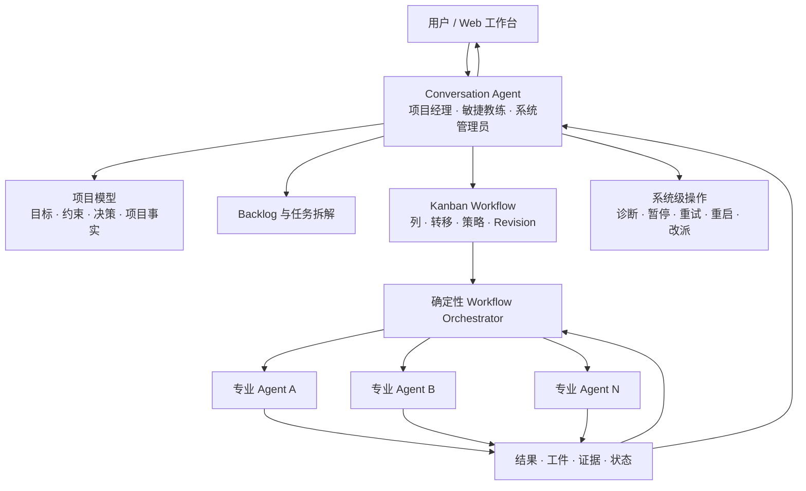

# DevWerk Conversation Agent — Version 1 核心设计

> 实现规范提示：本文定义已确认的产品身份、职责和治理决策。通用 AgentCore、Capability Registry、prompt 数据边界、Workflow/Column schema 与 Runtime 实现以 [`generic-conversation-agent-and-declarative-column-runtime.md`](./generic-conversation-agent-and-declarative-column-runtime.md) 为第一事实。

**文档状态**：Version 1 已确认核心设计  
**最后更新**：2026-07-17  
**适用范围**：DevWerk 核心服务  
**关联文档**：[Kanban Workflow Version 1 核心设计](./kanban-workflow-design-v1.md)

## 1. 文档效力

本文定义 DevWerk Version 1 的 conversation-agent 产品身份、职责、运行循环、项目隔离、调度治理、监督机制和持久化边界。

本文是目标设计。实现、测试与其他说明均以本文确认的产品定义为依据。

记忆系统的重新设计不属于本文范围；该主题保持挂起，等待独立设计与审查。

## 2. 产品定义

DevWerk 是一个完整的多 agent 工作流系统。每个 Project 拥有一个长期 conversation-agent，由它在 Web 端与用户持续交流，理解需求、建设 workflow、管理 backlog、拆解和调度 task、监督 worker，并在异常时诊断和恢复项目。

conversation-agent 同时承担：

- 项目经理
- 敏捷开发教练
- 需求分析师
- workflow 设计者
- backlog 与 task 拆解者
- 多 agent 调度者
- 项目状态解释者
- 系统诊断和恢复管理员
- 必要时的全功能执行 agent

## 3. 系统关系图



系统边界：

- conversation-agent 负责理解、规划、治理、调度和语义判断。
- workflow orchestrator 负责确定性状态推进和机械约束。
- worker agent 负责明确范围内的专业工作。
- Kanban、task、event、artifact 和 run result 构成项目事实。

## 4. 核心领域概念

### Project

Project 是 DevWerk 的首要隔离边界，用来隔离：

- conversation-agent 身份
- 用户对话
- Project Charter 与已确认项目事实
- workflow 与 revision
- backlog 与 task
- agent run
- event 与 artifact
- 调度决定
- workspace 路径与文件访问范围

所有结构化记录必须携带 `project_id`。任何跨 Project 读取、调度、上下文装配或文件操作都必须显式授权，Version 1 默认禁止。

### Workspace Root 与 Internal Artifact Root

每个 Project 拥有一个规范化后的 `workspace_root`，代表用户项目工作区根目录。DevWerk 另行管理 `internal_artifact_root`，用于保存系统证据与运行工件。

它不同于 DevWerk 内部状态目录：

```text
workspace_root
  用户项目源码、文档和交付物

internal_artifact_root
  SQLite、运行工件、附件、审计归档和临时文件
```

要求：

- Project 创建时解析为绝对规范路径。
- Project 文件 capability 只能在 `workspace_root` 内操作，且不能访问 `internal_artifact_root`。
- 必须防止 `..`、符号链接、junction 或大小写差异逃逸。
- Project 删除不默认删除用户工作区。
- 同一物理路径被多个 Project 使用时必须明确检测并报告冲突。
- 并发写 task 应声明 path/resource conflict domain。

### Conversation Agent

每个 Project 有且只有一个长期逻辑 conversation-agent。它拥有稳定身份和可恢复的治理状态，但不要求保持永久在线的 LLM 连接。

### Backlog Item

尚未达到执行条件的计划工作，可被澄清、拆分、合并、等待或取消；不绑定 workflow revision，不启动 worker。

### Formal Task

达到执行条件的正式工作合同，固定 workflow revision，经 Kanban workflow 执行。

### Direct Run

conversation-agent 直接完成的小型交付或不适合正式 workflow 的工作，不创建 task 和 Kanban 卡片。

### Intervention Run

诊断、恢复、重启、改派、workflow revision、task 迁移等项目治理操作，不创建普通 Kanban 卡片，但完整记录原因、动作、影响和结果。

## 5. 长期逻辑实例

conversation-agent 的“长期”表示：

- 身份与 Project 一一对应。
- 服务重启后恢复治理职责。
- 用户不发消息时仍能监督活跃项目。
- 被用户消息、task/agent event、异常、服务恢复和定时巡检唤醒。
- 单次决策完成后可以释放 LLM 计算资源。
- 不依赖一个永不退出的进程保存项目状态。

Version 1 不允许通过创建第二个 conversation-agent 来绕过同一 Project 的治理冲突。

## 6. 行为原则

- 先理解，再拆解，再调度。
- 不把立即行动当作最高价值。
- 不为不成熟需求创建 Formal Task。
- 默认委派，不为了并发而并发。
- 主动限制 WIP，优先完成已开始的价值。
- 先处理阻塞和失败，再启动更多工作。
- 不信任 worker 的文本 `success`，检查工件和证据。
- 项目事实变化时重新评估调度。
- 能做出 `HOLD`、`MERGE`、`SPLIT`、`CANCEL` 等决定。
- 派发后继续承担监督和验收责任。
- 小型交付、系统诊断、失败恢复和紧急情况可以直接执行。

这些原则由版本化 `ConversationPlatformPolicy`、结构化调度协议和确定性 guard 共同实现。Platform Policy 是产品级正向行为与安全策略，始终存在并冻结到每次 Agent Run；Project instruction 仅保存项目目标、约束和工作约定，可以为空。两者均记录 revision，运行中不得隐式变化。

## 7. Web 用户治理边界

Version 1 的用户治理入口只有 Web conversation。

用户通过自然语言表达：

- 新增或修改需求
- 改变优先级
- 暂停、恢复或重做
- 调整工作方式
- 指出结果偏差
- 查询状态、风险和下一步

用户可以只读查看：

- Kanban
- workflow 与 revision
- backlog 与 task
- agent/run 状态
- event
- artifact
- 进度和风险

Version 1 不提供用户直接修改：

- Kanban 卡片位置
- workflow column、transition 或 action
- task 状态
- agent 分配
- workflow merge

所有治理变化由 conversation-agent 理解用户请求后通过内部工具完成，避免用户状态与 agent 项目认知之间的双向 merge。

## 8. 三种工作入口

### Formal Task Flow

适用于符合项目唯一 workflow 的正式交付：

- 有明确目标、交付物和验收标准
- 需要多个阶段或专业 agent
- 存在依赖、返工、验证或长期跟踪
- 需要在 Kanban 中持续展示

### Direct Run

适用于小型直接交付或不符合正式 task flow 的工作：

- 不创建 task。
- 不进入 Kanban。
- conversation-agent 使用自己的工具直接完成。
- 结果和必要工件关联到对话与 Project。

Direct Run 使用有界 write/process 预算。预算耗尽或工作边界发生实质变化时，conversation-agent 停止直接扩张并形成新的治理决定：可以 `HOLD`、`QUEUE`、`SPLIT`、请求用户方向，或在 Readiness 与当前 workflow 适配均通过后 `DISPATCH` 为 Formal Task。已有调查以结构化上下文或 artifact 关联到该决定。

### Intervention Run

适用于：

- 诊断 pending/running/waiting 异常
- 恢复 interrupted Column Run
- 重试、改派或停止 worker
- 修正 task 上下文
- 发布 workflow revision
- 显式迁移 task
- 处理系统或 provider 异常

Intervention Run 必须记录关联 task/run、触发原因、操作步骤、结果和后续监督计划。

## 9. Task Readiness Gate

conversation-agent 不因为用户提到一项工作就立即派发。Backlog Item 提升为 Formal Task 前必须检查：

### 目标与价值

- 是否直接服务 Project 目标？
- 现在执行是否有价值？
- 是否应与其他工作合并？

### 任务合同

- objective 是否明确？
- scope/non-scope 是否明确？
- deliverables 是否可观察？
- acceptance criteria 是否可判断？

### 依赖

- 前置工作是否完成？
- 是否等待用户、外部结果或其他 task 工件？
- 现在执行是否会造成大面积返工？

### 能力与 workflow

- 项目 workflow 是否适合？
- agent、skill、tool、MCP 和外部能力是否存在？
- 必要 context 是否齐备？

### 并发与资源

- 是否修改相同文件或资源？
- 是否共享不可并发的环境？
- 并发是否真正缩短交付时间？
- 当前 WIP 是否仍可被 conversation-agent 监督？

### 风险与恢复

- 失败成本是什么？
- 是否可重试或恢复？
- provider、预算和系统状态是否健康？

## 10. 调度决定

允许的调度决定：

- `DISPATCH`：成熟并立即进入 workflow。
- `QUEUE`：成熟但等待资源、依赖或并发额度。
- `HOLD`：方向正确但条件不足。
- `MERGE`：与其他工作合并。
- `SPLIT`：范围过大，重新拆解。
- `CANCEL`：重复、失去价值或偏离目标。
- `DIRECT_RUN`：conversation-agent 直接完成。

调度决定保存结构化摘要：

```json
{
  "decision": "DISPATCH",
  "task_ids": ["task-a"],
  "reason_summary": "任务合同完整，前置依赖已完成，与当前写入范围无冲突",
  "dependencies_checked": true,
  "resource_conflicts": [],
  "workflow_revision_id": "workflow-rev-4",
  "risks": ["上游接口仍可能发生小范围字段调整"],
  "next_review_at": "2026-07-17T10:30:00Z"
}
```

不保存或展示模型的原始内部思维链。

## 11. 单写者治理与多 Task 执行

DevWerk 支持多个 Formal Task 同时沿一个 workflow 运行，实际并发由 conversation-agent 决定。

同一 Project 的治理操作使用单写者模型：

```text
User Messages
Task/Agent Events
Exceptions
Scheduled Reviews
        ↓
Project Mailbox
        ↓
Serialized Conversation-agent Decision Loop
        ↓
Backlog / Workflow / Task / Scheduling Mutations
```

约束：

- 一个 Project 同时只有一个 conversation-agent governance lease。
- mailbox event 可以并发写入，但按顺序领取和确认。
- workflow、backlog 和调度决定串行提交。
- worker task/agent run 可以并发。
- dispatch、retry、restart、cancel、migration 必须幂等。

## 12. 事件驱动监督

conversation-agent 由以下版本化点分事件唤醒；event stream 与 Project mailbox 使用相同 `event_type`：

- `conversation.message.created`
- `task.state.changed`、`column.state.changed`、`agent.state.changed`
- `artifact.created`、`validation.completed`
- `agent.assistance.requested`
- `retry.exhausted`
- `run.long_running`、`run.degraded`、`run.stalled`
- `lease.expired`、`column.interrupted`
- `task.done`、`task.failed`、`task.cancelled`
- `project.recovery.started`
- `supervision.review.due`

监督循环：

```text
领取 mailbox event
→ 恢复 Project 治理上下文
→ 检查活跃 Task、Run、Artifact、Risk
→ 继续观察 / 调度 / Direct Run / Intervention Run
→ 验证操作结果
→ 提交项目事实与审计
→ 安排下一次 review
→ 必要时向用户汇报
```

conversation-agent 不因单纯运行时间较长就中断 worker。它结合 heartbeat、tool activity、token、artifact、状态变化、provider progress 和 task 语义判断。

## 13. 终态与异常处理

任何 Task 到达 `done` 或 `failed` 都必须：

- 在 SQLite 中原子提交终态和 terminal event。
- 产生 result/failure artifact 引用。
- 写入 Project mailbox。
- 唤醒 conversation-agent。
- 记录 `notified_at` 和 `observed_at`。

`failed` 后 conversation-agent 可以：

- 重启调度
- 创建新 attempt
- 返回前一个 Column
- 改派 agent
- 修正 task
- 发布新 workflow revision 并显式迁移
- Intervention Run 处理
- 向用户汇报并请求方向

Task 终态、运行异常和长期 waiting 都不能静默。

Task 只有在 output contract、artifact/evidence policy 与显式 success terminal transition 全部通过后才成为 `done`。需要项目级复核时，workflow 必须在 done 前声明独立 review Column；conversation-agent 在终态后异步观察、汇报和决定后续治理，不构成隐藏的同步验收门。

取消是一个可审计终态操作：Task 原子进入 `failed`，记录 `failure_code=cancelled`、`task.cancelled` event、failure artifact 与 mailbox 通知。

Task revision 迁移只允许在 Task 已暂停且没有活跃 lease 时执行。迁移请求必须声明目标 revision、目标 Column、context/artifact 继承策略和期望 `state_version`；Runtime 重新验证目标 input contract，以 CAS transaction 切换 revision 与 Column、创建新 attempt 并写入审计事件。验证或 CAS 失败时保持原 revision 和状态。

## 14. Tool 与权限

conversation-agent Version 1 拥有 Project 内系统级能力：

- Project、workflow、revision、backlog、task CRUD
- task dispatch、pause、resume、retry、cancel、migrate
- agent 创建、配置、停止和改派
- event、artifact、run、log 和 provider 状态读取
- Project workspace 文件读写
- shell/process
- skill、tool、MCP 和外部 API 调用
- scheduled review 与 recovery

Version 1 暂不实现用户审批边界，但仍要求：

- Project Path containment
- 审计事件
- 必要 snapshot/revision
- 幂等操作
- 明确错误记录

Capability Registry 根据 `side_effect_kind` 与 Project 配置执行确定性风险策略。Version 1 默认只启用 `workspace_root` 内可恢复、可审计的读写与本地进程能力；不可逆远程写入、付费调用、发布和远程删除 capability 默认禁用，只有 Project operator 显式配置后才能进入可用目录。Version 1 不提供逐操作用户审批界面；细粒度权限和交互式高风险审批是 release 后高优先级需求。

## 15. Worker Agent 边界

worker agent：

- 接收明确 task/column contract。
- 只处理当前 Column Run。
- 使用允许的 context、skill、tool 和 MCP。
- 返回结构化 outcome、artifact、evidence 和 risk。
- 可以报告 blocked、failed 或需要帮助。
- 不得修改 Project 目标、其他 task 或 workflow。
- 不得自行创建另一个 conversation-agent。

worker 的 `success` 只是输出声明。Runtime 必须验证 Column output contract、artifact/evidence policy 与声明的 transition；需要额外复核时由 workflow 中显式的 review Column 完成。

## 16. SQLite 与文件存储总原则

DevWerk Version 1 使用一个 SQLite 数据库保存所有 Project 的结构化事实。Project 通过 `project_id` 做逻辑隔离，通过 `workspace_root` 做用户工作区隔离；`internal_artifact_root` 独立保存 DevWerk 管理的证据文件。

存储原则：

- SQLite 保存需要事务、过滤、排序、关联和恢复的状态。
- 文件保存大体积、流式、二进制或按需读取的内容。
- SQLite 保存文件的身份、Project 归属、路径、大小、哈希、类型和生命周期状态。
- 不把可查询关键字段只藏在 JSON 中。
- 不在 dashboard 查询中读取大文件正文。
- 不为每个 Project 创建独立 SQLite。

## 17. 建议的 SQLite 记录

### Project 与 Agent

- `projects`
- `conversation_agents`
- `project_settings`
- `project_mailbox`
- `scheduled_reviews`

`projects` 至少包含：

```text
id
name
status
workspace_root
internal_artifact_root
active_workflow_revision_id
created_at
updated_at
state_version
```

### Conversation 与治理

- `conversation_threads`
- `conversation_messages`
- `backlog_items`
- `scheduling_decisions`
- `direct_runs`
- `intervention_runs`

普通文本消息可以保存在 SQLite，附件和超大正文使用文件。消息表保存 Project、thread、role、时间、正文或正文引用。

### Workflow 与运行事实

由 Kanban 文档定义的 workflow、revision、task、column run、agent run、wait handle、event 和 artifact metadata 也进入同一个 SQLite。

### 审计

关键治理操作保存紧凑结构化 audit row。大体积诊断日志和历史归档可以写入文件，SQLite 仅保留索引和哈希。

## 18. 建议的文件存储

DevWerk 内部文件目录建议与用户 Project Path 分开：

```text
data/
  devwerk.db
  projects/
    {project_id}/
      attachments/
      artifacts/
      run-output/
      audit-archive/
      temp/
```

适合文件存储：

- 上传附件
- 图片、视频、音频
- 大模型超长原始响应
- 生成代码包和压缩包
- 大型日志
- screenshot
- tool raw output
- 归档 audit/event 分片

文件写入流程：

1. 在同一文件系统临时目录写入。
2. flush 并计算大小/hash。
3. 原子 rename 到最终路径。
4. 用短 SQLite transaction 提交 metadata 和业务引用。
5. 失败时由 orphan cleanup 回收未引用临时文件。

不要在 SQLite transaction 内执行网络请求、LLM 调用或大文件写入。

## 19. SQLite 并发与写入策略

SQLite 只有一个有效 writer。DevWerk 即使规模不大，也必须避免 worker、supervisor、Web 请求和 conversation-agent 争抢长写锁。

建议：

- 使用 WAL mode。
- 配置合理 `busy_timeout`。
- 默认 `synchronous=NORMAL`；需要更强持久性的关键部署可配置。
- 所有 transaction 保持短小。
- Project governance 使用 per-project lease，数据库写入仍通过统一 repository/write service。
- 关键状态转移立即写入。
- progress、heartbeat、usage 等允许合并和节流。
- 大批量维护使用小批次提交，不能长时间独占 writer。
- 禁止在 transaction 中等待外部操作。

### 写入分级

**必须立即持久化**：

- workflow revision 发布
- task/column terminal transition
- dispatch/retry/migration 幂等记录
- AwaitHandle 创建和终态
- mailbox claim/ack
- Project Path 或治理配置变化

**可以节流合并**：

- heartbeat
- token/usage 累计
- progress 百分比
- dashboard counter
- 相同状态的重复 provider poll

禁止逐 token 写 SQLite。流式 token 仅在内存累积，按时间窗口、阶段结束或有意义 checkpoint 写 usage 汇总。

## 20. 查询与索引策略

关键索引按真实访问路径建设，至少包括：

```text
projects(status, updated_at, id)
project_mailbox(project_id, state, available_at, id)
conversation_messages(project_id, thread_id, id)
backlog_items(project_id, state, priority, updated_at, id)
tasks(project_id, status, updated_at, id)
events(project_id, id)
events(task_id, id)
artifacts(project_id, task_id, created_at, id)
scheduling_decisions(project_id, created_at, id)
scheduled_reviews(state, due_at, id)
```

规则：

- Web 列表必须 cursor pagination，避免高 offset。
- 禁止 dashboard `SELECT *`。
- 不在大 JSON payload 上执行频繁过滤。
- 常用筛选字段提升为正式 column。
- 防止按 task 逐条查询 agent/event/artifact 的 N+1。
- 使用批量 `IN`、join 或预聚合读取。
- 对 query plan 做 release 前检查，避免全表扫描。

## 21. Web 投影与渲染性能

Web 页面不直接拼接整个 Project 历史。建议在同一个 SQLite 内维护轻量 projection：

- `project_summary_projection`
- `kanban_task_projection`
- `active_run_projection`
- `project_activity_cursor`

Projection 只保存渲染所需摘要：状态、标题、进度、风险、最后活动、计数和版本号，不复制大正文。

渲染流程：

1. 首次打开读取 Project summary 和分页 Kanban snapshot。
2. WebSocket/SSE 只推送 `state_version` 后的增量事件。
3. 客户端按 ID 更新局部卡片，不全量重载 board。
4. 消息、event、artifact、run detail 按需分页加载。
5. 大文件正文通过文件 endpoint 按需读取。

Projection 更新与关键状态转移尽量在同一短 transaction 中完成，避免页面看到不一致状态。

## 22. 数据保留与归档

- 关键 workflow/task/terminal/audit 事件长期保留在 SQLite。
- 高频 progress 和重复 poll 事件合并，只保留有意义变化。
- 大型历史日志和 raw provider output 定期归档为文件。
- SQLite 保留归档范围、文件路径、hash、记录数和时间区间。
- 归档和 vacuum 必须在受控维护窗口、小批次执行。

## 23. 事务边界

以下操作应各自形成短原子 transaction：

- Backlog Item 提升为 Task并固定 workflow revision
- 调度决定 + queue entry + audit event
- mailbox event claim
- workflow revision 发布 + Project active revision 更新
- task terminal state + terminal event + mailbox notification
- intervention action result + affected entity version

使用 entity `state_version` 或 optimistic concurrency 防止陈旧 conversation-agent decision 覆盖新状态。

## 24. 记忆系统边界

本文只规定：conversation-agent 被唤醒时必须获得足够的 Project 治理上下文，并且不得把完整历史对话无界装入 prompt。

具体记忆类型、检索、压缩、晋升、文件/SQL 分工和旧系统迁移全部挂起，等待单独设计。

## 25. Version 1 非目标

- IDEA 插件继续开发
- 用户直接编辑 Kanban/workflow/task
- 多 workflow 产品能力
- workflow merge
- 复杂审批流
- 细粒度 RBAC
- 多人协同编辑
- 新记忆系统设计

## 26. 验收不变量

- 一个 Project 只有一个 conversation-agent 身份。
- conversation-agent 在用户无新消息时仍能监督项目。
- 用户治理变更只能经 conversation-agent 或确定性内部 runtime。
- Project 结构化记录不会跨 `project_id` 泄漏。
- Project 文件 capability 不会逃逸 `workspace_root`，也不能进入 `internal_artifact_root`。
- Formal Task、Direct Run、Intervention Run 可区分和审计。
- 调度前存在 Readiness Decision。
- Project governance 串行，worker execution 可并发。
- task done/failed 和运行异常都会进入 mailbox。
- SQLite transaction 不包含网络、LLM 或大文件操作。
- Web board 不依赖全量历史查询和全量轮询。
