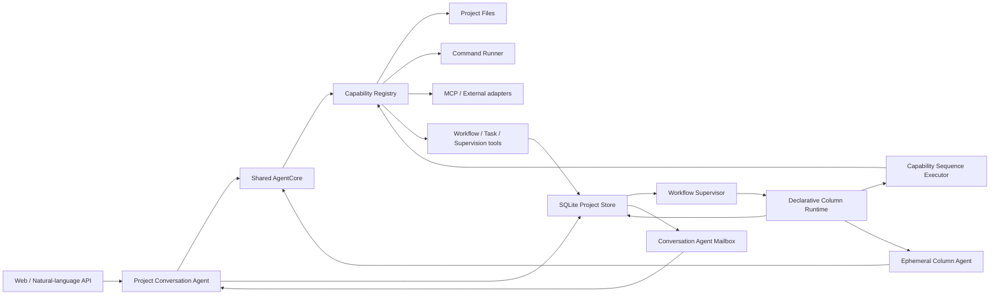
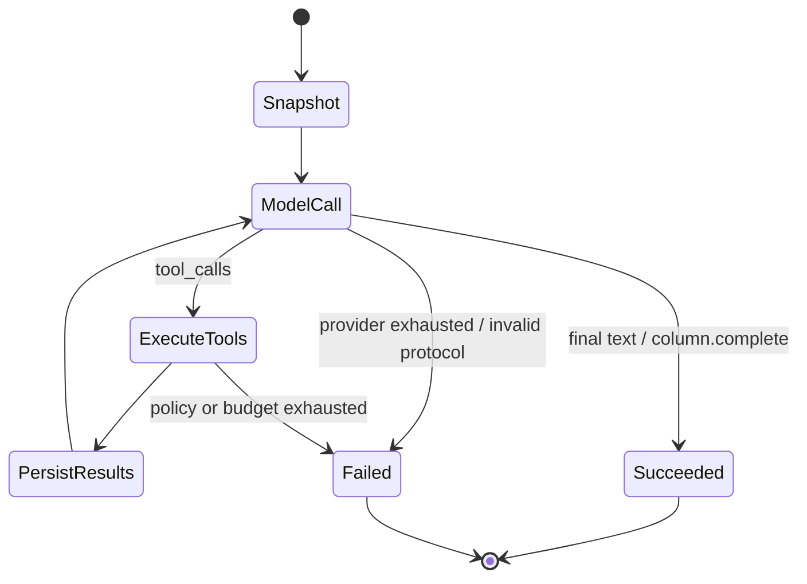

# DevWerk 通用 Conversation Agent 与声明式 Column Runtime 设计

状态：**Normative / Implementation Source of Truth**  
版本：1.0-draft  
日期：2026-07-17

## 1. 文档效力

本文是 DevWerk 当前核心系统重构的第一事实。凡现有代码、测试或其他文档与本文冲突，以本文为准。实现不得为了通过单个用例引入任务类别、领域 prompt、内置 workflow、Column 名称分支或目录布局特判。

本轮范围是 Web 版 DevWerk 的后端核心与对应 Web 视图。IDEA Plugin 继续挂起。此前完整记忆系统的产品设计继续挂起，本轮只保留可扩展接口边界。

## 2. 不可违反的原则

1. Conversation Agent 是每个 Project 唯一的长期逻辑实例，是通用全功能 Agent，并在项目管理、敏捷教练、Kanban 编排和异常恢复方面增强。
2. Conversation Agent 默认委派；小任务、系统诊断、失败恢复和紧急处理可以直接执行。
3. 用户在 version-1 中只读 Kanban；Workflow 和 Task 由 Conversation Agent 通过工具修改。
4. 一个 Project 当前只有一个激活 Workflow，但数据模型保留 revision 和未来多 Workflow 扩展能力。
5. 多个 Task 可以并行沿同一 Workflow 运行；是否创建、拆分和并行由 Conversation Agent 冷静判断。
6. 小任务直接交付时不创建 Task。不符合当前唯一 Task 流程的工作不应被强行塞入 Task。
7. Workflow 必须包含且只能包含一个 done 和一个 failed 终点；任何非终点 Column 都必须存在到终点的可达路径。
8. done/failed 必须形成事件并进入 Conversation Agent mailbox，不允许默认静默。
9. 源码不得包含小说、软件、前端、后端、商城等业务 prompt、流程或校验器。
10. 源码不得根据用户关键词、任务类别、Column key/name、文件路径前缀选择 prompt、Workflow 或执行逻辑。
11. 源码不提供业务 Workflow 模板。Workflow、Column 指令、输入输出约束和能力选择均由 Conversation Agent 在对话中生成、发布和修改，并作为项目数据持久化。
12. 运行时只实现通用协议、状态机、能力调用、契约校验、租约、等待、恢复、审计和终态保证。

## 3. 术语

- **Conversation Agent**：Project 级长期逻辑 Agent。长期表示身份、指令版本、会话和监督职责持久化，不表示一个永不退出的线程或无限上下文。
- **Agent Run**：一次有预算、有输入快照、有终态的 Agent 循环。
- **Column Agent**：为一个 Task 的一个 Column Run 即时创建、完成后销毁的 Agent Run。
- **Capability**：由统一 Registry 注册的通用工具能力，例如读取文件、写文件、运行 argv、发布 Workflow、创建 Task。
- **Workflow Revision**：Conversation Agent 发布的不可变 Workflow 版本。
- **Column Definition**：Workflow 中的声明式处理单元。
- **Column Run**：Task 在某个 Column 上的一次尝试。
- **Runtime Envelope**：由类型化持久数据即时 JSON 序列化出的 Agent 上下文。它不是源码中的自然语言 prompt 模板。
- **Await Handle**：对外部异步工作或合法长等待的持久句柄。

## 4. 总体架构



`AgentCore + Capability Registry` 是系统窄腰。Conversation Agent 与 Column Agent 不拥有不同的领域执行器；它们共享同一循环，只使用不同的持久身份、上下文、工具权限和预算。

## 5. Project 与 Conversation Agent

### 5.1 长期实例语义

每个 Project 创建一条 `conversation_agent` 记录，至少包含：

- `project_id`
- `status`
- `instruction`：当前项目级通用指令数据
- `instruction_revision`
- `last_observed_event_id`
- `created_at` / `updated_at`

每次用户消息触发一个独立 Agent Run。Run 结束后线程可以退出，但下一轮继续使用相同 Project 身份、指令 revision、会话和 mailbox，因此仍是“每项目一个长期实例”。同一 Project 的用户 turn 串行，多个 Project 可并行。

### 5.2 指令不是源码模板

Project 指令是可版本化的项目数据，不是 Python 常量。Project 创建时只保存用户提供的 Project 名称、描述和可选初始 instruction；未提供时 instruction 为空。Conversation Agent 可通过 `agent.instruction.update` 工具在对话中建立或调整自己的工作约定。

AgentCore 不拼接自然语言模板。它把以下类型化对象稳定序列化为 Runtime Envelope：

```json
{
  "protocol_version": "devwerk.agent.v1",
  "agent": {"kind": "conversation", "project_id": "...", "instruction_revision": 3},
  "project": {"name": "...", "description": "...", "base_dir": "..."},
  "instruction": "持久化项目指令原文",
  "workflow": {"active_revision": "...", "summary": "..."},
  "constraints": {
    "kanban_user_access": "read_only",
    "task_terminal_states": ["done", "failed"],
    "default_execution": "delegate",
    "direct_execution_scopes": ["small_task", "diagnostic", "recovery", "emergency"]
  }
}
```

Envelope 的字段来自 schema 和数据库，不因任务领域变化；工具描述来自 Capability Registry。这里允许存在产品协议字段和安全边界，但不允许存在业务任务文本或流程模板。

### 5.3 Conversation Agent 能力

基础工具集：

- `project.inspect`
- `project.files.list`
- `project.files.read`
- `project.files.write`
- `project.files.search`
- `project.command.run`
- `workflow.inspect`
- `workflow.publish`
- `task.create`
- `task.list`
- `task.inspect`
- `run.inspect`
- `event.list`
- `agent.instruction.update`

未来的 skill、MCP 和外部 API 均注册为 Capability，不进入 AgentCore 分支。

`start_task=false` 时，本轮禁用 `workflow.publish` 和 `task.create`，但仍允许讨论、读取状态和安全诊断。`start_task=true` 只是授权创建 Task，不要求一定创建。

Conversation turn 的直接 write/process 默认只有 3 次有界预算；预算耗尽后返回结构化 `DelegationRequired`，要求发布 Workflow 并创建正式 Task。一旦 `task.create` 成功，本轮即进入 **delegated** 边界：Conversation Agent 可以继续读取状态、解释计划和执行监督/恢复控制，但不得再通过文件写入或进程能力亲自完成这个正式 Task。直接执行只适用于没有创建 Task 的小任务、诊断、恢复和紧急处理。两条边界均由 AgentCore 按 capability 的 `side_effect_kind` 统一执行，不依赖任务领域、关键词或 Workflow 名称。

### 5.4 监督职责

Conversation Agent 每轮读取 mailbox 摘要，也可主动查询：

- Task done/failed；
- Run 失败、重试和失败指纹；
- claim/heartbeat 异常；
- 合法 await handle 的进度与 deadline；
- 长期无进展但仍有心跳的 run；
- 重启恢复产生的 recovering 事件。

Conversation Agent 可通过通用控制工具重试、终止或重新发布 Workflow revision，但所有动作必须形成事件。

## 6. 统一 AgentCore

### 6.1 Provider 无关响应

Provider Adapter 将 OpenAI-compatible、Anthropic-compatible 和 Ollama 响应统一为：

```json
{
  "text": "可选最终文本",
  "tool_calls": [
    {"id": "...", "name": "capability.id", "arguments": {}}
  ],
  "usage": {}
}
```

优先使用 provider 原生 tool calling。工具 schema 通过 API 参数发送，不把工具协议伪装成业务 prompt。无原生 tool calling 的 provider 必须由独立 Adapter 兼容，不能污染 AgentCore。

### 6.2 循环



规则：

- Run 启动时冻结 instruction、context、tool definitions 和模型配置版本。
- 每个 assistant tool call 必须有且只有一个 tool result。
- 工具异常转成结构化结果交还模型；只有协议破坏、预算耗尽或不可恢复基础设施错误终止 Run。
- 支持最大迭代数、最大工具调用数、超时、取消和 provider 重试预算。
- 消息、tool call/result、耗时、usage 和最终结果均持久化。
- Conversation Agent 最终文本写入项目会话；Column Agent 必须通过内部 `column.complete` 提交声明 outcome 和 output。

### 6.3 上下文控制

Conversation Agent 使用有界最近会话 + Project/Workflow/Task 摘要，不把无限历史原样发送。Column Agent 只获得：

1. Project 基础事实与选定的 project context；
2. 冻结的 Column Definition；
3. Task brief/input；
4. Column 声明选择的上游输出和 artifact 清单；
5. 工具执行产生的结果。

Column Agent 不继承长期 Conversation 全历史，避免上下文污染。

## 7. Capability Registry

每个 Capability Entry 包含：

```text
id
description
input_schema
output_schema
handler
toolset
availability_check
side_effect_kind
parallel_safe
default_timeout
```

Registry 负责：

- 唯一 ID 和重复注册保护；
- 根据 Agent/Column 白名单解析本轮工具；
- JSON Schema 参数与结果校验；
- Project base_dir、权限和超时注入；
- 统一成功/失败 Tool Result；
- 写操作 artifact 登记；
- 调用审计。

Runtime 不直接调用文件、命令、MCP 或外部 API 实现；它只能向 Registry dispatch capability ID。

### 7.1 Capability 绑定不变量

真实黑盒测试暴露出一种协议级失败：Conversation Agent 先发明不存在的 capability ID，被 Registry 拒绝后又删除全部 capability，使 Workflow 虽能发布，但 Column Agent 只剩内部 `column.complete`，无法完成指令要求的文件或命令工作。

因此 version-1 固定以下通用不变量：

- 每个非终点 `AgentExecutor` 必须显式声明至少一个 capability；空列表和省略字段均拒绝发布；
- `workflow.publish` 的工具 JSON Schema 从当前 Capability Registry 动态注入合法 capability ID 枚举，Conversation Agent 不得发明能力名；
- `CapabilitySequenceExecutor.steps[].capability` 使用同一动态枚举；
- Workflow 发布仍由 Registry 二次校验，防止绕过工具 schema 的 API 请求引用未知能力；
- Registry 以 `delegable_to_column` 元数据区分项目级控制能力与可委派执行能力；`workflow.publish`、`task.create/retry/fail` 和 `agent.instruction.update` 不进入 Column 枚举。Task 数量与调度只由 Conversation Agent 决定，Column Agent 不得递归创建或重排 Task；
- 能力目录只表达通用工具事实，不根据 Column instruction、Task 领域、文件名或用户关键词推断、补齐或替换能力。

纯推理 Column 如果确实不需要外部副作用，也必须显式选择一个无副作用的通用 capability（例如 `system.noop`），从而把“只需推理”变成可审计决策，而不是字段遗漏。

## 8. 声明式 Workflow 与 Column Definition

### 8.1 Workflow Schema

```json
{
  "name": "由 Conversation Agent 生成",
  "description": "由 Conversation Agent 生成",
  "entry": "column-key",
  "columns": []
}
```

发布时执行纯结构校验：key 唯一、entry 存在、恰有 done/failed、transition outcome 唯一、target 存在、所有 Column 可达、每个非终点均有到终点路径。校验不理解业务含义。

### 8.2 Column Schema

```json
{
  "key": "draft",
  "name": "由 Conversation Agent 生成",
  "instruction": "由 Conversation Agent 生成并持久化",
  "executor": {
    "kind": "agent",
    "capabilities": ["project.files.read", "project.files.write"],
    "max_iterations": 12,
    "max_tool_calls": 40
  },
  "context": {
    "include_task": true,
    "include_project": true,
    "upstream_outputs": ["previous-column-key"],
    "artifact_globs": ["relative/glob"]
  },
  "input_contract": {},
  "output_contract": {},
  "transitions": [
    {"outcome": "success", "target": "done"},
    {"outcome": "failure", "target": "failed"}
  ],
  "retry": {"max_attempts": 3, "backoff_seconds": 5, "retryable_errors": ["provider_transient"]},
  "wait": {"timeout_seconds": 900, "heartbeat_seconds": 30, "stale_after_seconds": 180},
  "max_visits": 100,
  "terminal": null,
  "metadata": {}
}
```

`instruction`、contract、glob、capability 选择都是 Workflow revision 中的数据。它们可以描述任意领域，但不得被复制到 Python 常量。

`max_visits` 是与领域无关的循环熔断器：即使所有 Column Run 都返回已声明的非失败 outcome，Task 也不能无限循环；超过上限后按该 Column 的失败/重试策略进入 failed 路径。

### 8.3 两类通用 Executor

#### Agent Executor

创建临时 Column Agent，复用 AgentCore。Runtime 只传递冻结上下文和 Column 允许的 capabilities，并额外提供内部 `column.complete`。Agent 通过工具完成任意工作，再提交：

```json
{"outcome": "success", "output": {}, "summary": "..."}
```

`outcome` 必须已在 Column transitions 中声明，`output` 必须满足 output contract。

#### Capability Sequence Executor

用于完全不需要 LLM 的 Column：

```json
{
  "kind": "capability_sequence",
  "steps": [
    {"capability": "system.noop", "arguments": {}},
    {"capability": "project.files.write", "arguments": {"path": "result.txt", "content": "..."}}
  ],
  "success_outcome": "success",
  "failure_outcome": "failure"
}
```

参数可使用受限 JSON Reference 从 `task.input`、`task.context`、前序 step result 中取值。解析器只支持明确路径，不执行表达式、Python、shell 或 prompt 模板。所有 step 经同一 Capability Registry 执行。

Runtime 可以按 `executor.kind` 从 Executor Registry 选择基础设施策略；这是协议级多态，不是业务分支。允许的 kind 只有已注册的通用 executor，未知 kind 在 Workflow 发布时即拒绝。

## 9. 状态机、等待与终态保证

### 9.1 Task 状态

`pending -> running -> waiting/recovering -> running -> done|failed`

Column Run 状态：

`pending -> running -> waiting -> succeeded|failed|interrupted`

### 9.2 长等待分类

不能仅用总耗时判断异常：

- **Active**：有租约和 heartbeat，且 `last_progress_at` 在推进；
- **Long running**：有 heartbeat，但进度间隔较长；Conversation Agent 收到观察事件但不立即杀死；
- **Awaiting external**：worker 已释放，存在带查询 capability、next_poll_at、deadline 和 token/reference 的 await handle；
- **Stalled**：租约/heartbeat 过期且无合法 await handle；进入 recovering；
- **Exhausted**：恢复或重试预算耗尽；进入 failed。

外部图片、视频或异步 API 必须返回 await handle。Supervisor 到期调用声明的 poll capability；token/reference 在 handle 终态后销毁或脱敏归档。

### 9.3 失败循环保护

每次失败保存标准化 `failure_fingerprint`。同一 Column 连续出现相同 fingerprint 时采用更严格的重试上限；超过上限直接 failed 并通知 Conversation Agent，避免无意义自动修复循环。

### 9.4 终态事件

以下事件必须同时写入 append-only event stream 和 Project mailbox：

- `task.done`
- `task.failed`
- `task.recovering`
- `run.long_running`
- `await.deadline_exceeded`
- `retry.exhausted`

Mailbox 只有在 Conversation Agent 成功读取并纳入下一次监督上下文后才标记 observed。

## 10. SQLite 持久化与性能

DevWerk 使用一个 SQLite 数据库，以 `project_id` 隔离逻辑上下文，以 Project `base_dir` 隔离文件产物。

核心表：

- `v1_projects`
- `v1_conversation_agents`
- `v1_conversations`
- `v1_conversation_jobs`
- `v1_agent_runs`
- `v1_agent_messages`
- `v1_tool_invocations`
- `v1_workflow_revisions`
- `v1_tasks`
- `v1_column_runs`
- `v1_await_handles`
- `v1_artifacts`
- `v1_events`
- `v1_project_mailbox`

约束：

- WAL、foreign keys、busy timeout；写事务短小，模型和工具调用绝不包在事务中。
- claim/finish/recover 使用 `BEGIN IMMEDIATE` + 条件 UPDATE，避免重复执行。
- Workflow/Column JSON 在发布时完整校验，运行时按 revision ID 读取；进程内可按 immutable revision ID 做小型缓存。
- board 查询使用一次有界查询和预聚合，不为每张卡逐条读取 runs/artifacts/events。
- 所有列表强制 limit/cursor；event 使用递增 ID 游标。
- 索引至少覆盖 `(project_id,status,updated_at)`、`(task_id,sequence)`、`(project_id,id)`、`(agent_run_id,sequence)`、`(state,next_poll_at)`。
- 大文件内容不进入 SQLite；只保存相对路径、hash、size、kind 和摘要。
- Agent 消息和 Tool Result 设字符上限；超大结果落地为 project artifact，消息中只保存引用。

## 11. 记忆边界

本轮明确区分：

- 会话：用户与 Conversation Agent 的持久 turn；
- 项目事实：Project、Workflow、Task、Run、artifact、event；
- Run 上下文：启动时冻结的有界快照；
- 未来记忆：可选 provider，不属于本轮实现。

未来 memory provider 可提供 `initialize/prefetch/sync_turn/tools/shutdown` 生命周期，但不能改变 AgentCore、Workflow 或 Column Runtime 协议。任何记忆写入不得在运行中悄悄改变已经冻结的 instruction/context。

## 12. API 与 Web

保留现有 Project、Conversation、Workflow、Task、Board、Run、Artifact 和 Event 的资源方向，更新 schema：

- Project create 可选 `agent_instruction`；
- Workflow publish 接收新的声明式 Column schema；
- 增加 Agent Run/Tool Invocation 只读审计端点；
- Conversation job 返回最终 reply、创建的 workflow revision/task IDs 和直接执行 artifact；
- Board 对用户只读。

Web 界面不得展示任务类别或领域模板。Workflow/Column 视图显示 executor kind、capabilities、contract、retry/wait policy；Task 详情显示 Column Runs、Agent Runs、Tool Invocations、artifact 和终态事件。页面使用有界并行请求、加载骨架和 event cursor，不使用高频全量刷新。

## 13. 迁移与删除清单

必须删除：

- `CONVERSATION_SYSTEM`、`AGENT_SYSTEM`、`NOVEL_SYSTEM` 等源码 prompt 常量；
- `task_type` 及 novel/software/generic/discussion 枚举路由；
- `novel_workflow()`、`software_workflow()`、`generic_workflow()`；
- `operation` 字段和 `if column.operation` 分派；
- `_novel_chapter`、`_software_files`、`_verify_software`；
- backend/frontend 路径约束、固定 Maven/npm 验证和固定章节数量；
- 以旧字段、旧 factory 或业务分类为事实的测试。

应保留并重构：

- Project base_dir 安全边界；
- SQLite revision/task/run/artifact/event/mailbox；
- claim、lease、heartbeat 和 restart recovery；
- provider 配置与 usage 记录；
- Web 的 Project、Conversation、Kanban、Task、Event 信息架构。

旧数据库中的旧 Workflow revision 可以保留为历史 JSON，但新 Runtime 不执行含 legacy `operation/prompt/execution` 的 revision；运行中的旧 Task 应显式 failed，错误类型为 `legacy_workflow_unsupported`，并通知 Conversation Agent，而不是隐式套用兼容分支。

## 14. 测试策略

测试只验证本文新契约，不保留旧契约兼容测试。

### 14.1 结构测试

- 任意合法 Workflow graph 可发布；无终点、不可达、未知 capability/executor 必须拒绝。
- Column instruction 和 contract 可包含任意领域内容，Runtime 行为不因文本改变。
- Project base_dir 越界、绝对路径、`..`、shell 字符串命令被拒绝。

### 14.2 AgentCore 行为测试

- provider tool call -> registry dispatch -> tool result -> final response 完整闭环；
- 多工具调用一一对应；
- 工具异常作为结构化结果回到模型；
- 迭代/工具/时间预算终止；
- Conversation Agent 会话持久且每 Project 串行；
- Column Agent 只获得声明工具和最小上下文。

### 14.3 Runtime 行为测试

- capability sequence 在完全不调用 LLM 时自动流转到 done；
- agent executor 可以在未知任务领域使用通用文件/命令工具并到 done；
- output contract 失败按 retry policy 重试，耗尽后到 failed；
- restart 后 expired running 恢复；合法 await 不被误判 stalled；
- done/failed 一定进入 event + mailbox。

### 14.4 泛化验收

使用三个互不相似、实现前未知的任务描述创建 Workflow。测试不得 monkeypatch 任务分类，也不得修改 Runtime 源码。只要它们通过声明式 Workflow + 通用 tools 完成，才证明系统泛化。

源码扫描可以作为发布审计，但不替代行为测试。发布审计应确认核心目录中不存在被删除的旧常量/factory/operation 和已知业务约束。

## 15. Hermes Agent 参考结论

本设计参考了 `D:/workspace/hermes-agent` 的以下经验：

- `agent/conversation_loop.py`：稳定会话循环、重试、预算、中断、工具结果回填；
- `tools/registry.py`：schema/handler/check/toolset 分离的工具注册窄腰；
- `agent/tool_executor.py`：每个 tool call 对应结果、顺序/并发边界、结果持久化；
- `tools/delegate_tool.py`：子 Agent 的上下文、工具、深度、并发和预算隔离；
- `agent/memory_provider.py`：记忆作为可选 provider 的生命周期边界；
- `hermes_cli/kanban_db.py`：SQLite board、原子 claim、attempt、heartbeat、stale recovery 和失败循环保护；
- Developer Guide：同一个 Agent 核心服务多个接入面，prompt 分层与会话内冻结。

没有复制 Hermes 源码中的任务分解、规格化或 delegation prompt。那些 prompt 在 Hermes 中是产品实现选择，而 DevWerk 的更高优先级约束是：所有业务指令和流程必须由 Conversation Agent 在对话中产生并持久化，源码只保留通用协议。

## 16. 完成定义

重构完成必须同时满足：

1. 旧领域路由、prompt、workflow factory、operation handler 全部删除；
2. Conversation Agent 与 Column Agent 共用 AgentCore；
3. Workflow/Column 完全声明式且由对话/API 作为数据发布；
4. 无 LLM capability sequence 测试全绿；
5. 通用 Agent tool loop、文件/命令能力和 Column completion 测试全绿；
6. 等待、恢复、重试、终态事件测试全绿；
7. Web 能查看新 Workflow、Task、Run、artifact、event 和 Agent 审计数据；
8. README 将本文列为核心规范，并明确 IDEA Plugin 挂起；
9. 独立自然语言冒烟用例不得再触发领域模板串用；
10. 所有计划、开发过程、结果和踩坑记录落入 `D:/workspace/codex-notes`。
