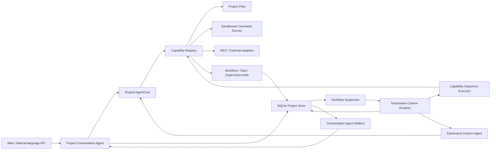
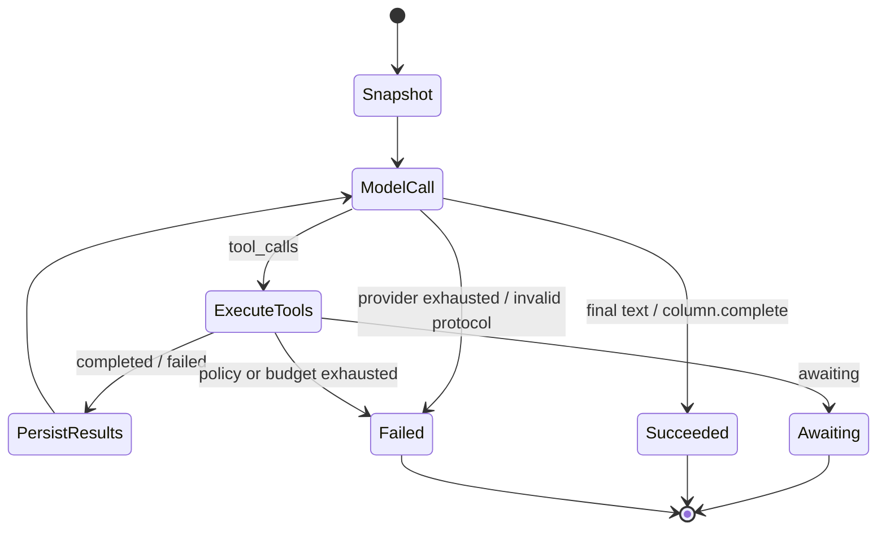

# DevWerk 通用 Conversation Agent 与声明式 Column Runtime 设计

状态：**Normative / Implementation Source of Truth**  
版本：1.0-draft  
日期：2026-07-17

## 1. 文档效力

本文是 DevWerk 当前核心系统重构的第一事实。凡现有代码、测试或其他文档与本文冲突，以本文为准。实现以通用 Agent 协议、声明式 Workflow 数据和统一 Column 状态机为基础，所有任务差异均由项目数据表达。

本轮范围是 Web 版 DevWerk 的后端核心与对应 Web 视图。IDEA Plugin 与完整记忆系统产品设计不在本轮范围；本轮为记忆能力保留可扩展接口边界。

## 2. 不可违反的原则

1. Conversation Agent 是每个 Project 唯一的长期逻辑实例，是通用全功能 Agent，并在项目管理、敏捷教练、Kanban 编排和异常恢复方面增强。
2. Conversation Agent 默认委派；小任务、系统诊断、失败恢复和紧急处理可以直接执行。
3. 用户在 version-1 中只读 Kanban；Workflow 和 Task 由 Conversation Agent 通过工具修改。
4. 一个 Project 当前只有一个激活 Workflow，但数据模型保留 revision 和未来多 Workflow 扩展能力。
5. 多个 Task 可以并行沿同一 Workflow 运行；是否创建、拆分和并行由 Conversation Agent 冷静判断。
6. 小任务直接交付时不创建 Task。不符合当前唯一 Task 流程的工作不应被强行塞入 Task。
7. Workflow 必须包含且只能包含一个 `done` 和一个 `failed` terminal sentinel；sentinel 没有 executor，也不创建 Column Run。任何非终态 Column 都必须存在到 sentinel 的可达路径。
8. done/failed 必须形成事件并进入 Conversation Agent mailbox，不允许默认静默。
9. 源码只承载跨领域通用的 Agent 协议、能力契约和运行时机制。
10. Prompt、Workflow、Column 指令、输入输出约束和能力选择均由 Conversation Agent 在对话中生成、发布和修改，并作为 Project 数据持久化。
11. Runtime 依据类型化定义和持久化状态执行，不依据自然语言内容或领域语义选择执行路径。
12. Runtime 统一提供状态机、能力调用、契约校验、租约、等待、恢复、审计和终态保证。

## 3. 术语

- **Conversation Agent**：Project 级长期逻辑 Agent。长期表示身份、指令版本、会话和监督职责持久化，不表示一个永不退出的线程或无限上下文。
- **Agent Run**：一次有预算、有输入快照、有终态的 Agent 循环。
- **Agent Segment**：Agent Executor 在一个 Column Attempt 内的一段活动上下文；Awaiting 时结束，恢复时创建新 Segment。
- **Column Agent**：为一个 Column Attempt 即时创建、完成或等待后释放的 Agent Run/Segment。
- **Capability**：由统一 Registry 注册的通用工具能力，例如读取文件、写文件、运行 argv、发布 Workflow、创建 Task。
- **Workflow Revision**：Conversation Agent 发布的不可变 Workflow 版本。
- **Column Definition**：Workflow 中的声明式处理单元。
- **Column Run**：Task 对一个非终态 Column 的一次 visit，拥有独立 `visit_no`、输入快照和最终 outcome。
- **Column Attempt**：Column Run 内一次不可变的执行尝试；retry 创建新的 Attempt，不创建新的 Run，也不覆盖先前证据。
- **Runtime Envelope**：由类型化持久数据即时 JSON 序列化出的 Agent 上下文。它不是源码中的自然语言 prompt 模板。
- **Await Handle**：对外部异步工作或合法长等待的持久句柄。

## 4. 总体架构



`AgentCore + Capability Registry` 是系统窄腰。Conversation Agent 与 Column Agent 不拥有不同的领域执行器；它们共享同一循环，只使用不同的持久身份、上下文、工具权限和预算。

## 5. Project 与 Conversation Agent

### 5.1 长期实例语义

每个 Project 创建一条 `conversation_agent` 记录，至少包含：

- `project_id`
- `status`
- `instruction`：当前项目级通用指令数据
- `instruction_revision`
- `last_acknowledged_event_id`
- `created_at` / `updated_at`

每次用户消息触发一个独立 Agent Run。Run 结束后线程可以退出，但下一轮继续使用相同 Project 身份、指令 revision、会话和 mailbox，因此仍是“每项目一个长期实例”。同一 Project 的用户 turn 串行，多个 Project 可并行。

### 5.2 版本化平台策略与 Project 指令

Conversation Agent 的指令分为两层：版本化 `ConversationPlatformPolicy` 定义产品身份、治理职责、Readiness、WIP、验收、监督和安全策略；版本化 Project instruction 保存项目目标、约束和工作约定。Project instruction 可以为空，Platform Policy 始终存在。两层均冻结到 Agent Run 输入快照并记录 revision。

AgentCore 不拼接自然语言模板。它把以下类型化对象稳定序列化为 Runtime Envelope：

```json
{
  "protocol_version": "devwerk.agent.v1",
  "agent": {"kind": "conversation", "project_id": "...", "instruction_revision": 3},
  "platform_policy": {"revision": 1, "roles": ["general_agent", "project_manager", "agile_coach"], "governance": {}},
  "project": {"name": "...", "description": "...", "workspace_root": "..."},
  "instruction": "持久化项目指令原文",
  "workflow": {"active_revision": "...", "summary": "..."},
  "constraints": {
    "kanban_user_access": "read_only",
    "task_terminal_states": ["done", "failed"],
    "default_execution": "delegate",
    "direct_execution_scopes": ["small_task", "diagnostic", "recovery", "emergency"]
  }
}
```

Envelope 的字段来自 schema 和数据库，不因任务领域变化；工具描述来自 Capability Registry。这里允许存在产品协议字段和安全边界，但不允许存在业务任务文本或流程模板。

### 5.3 Conversation Agent 能力

Version 1 Conversation Capability 目录：

- `project.inspect`
- `project.files.list`
- `project.files.read`
- `project.files.write`
- `project.files.search`
- `project.command.run`
- `workflow.inspect`
- `workflow.publish`
- `backlog.record` / `backlog.inspect` / `backlog.list`
- `scheduling.decide` / `scheduling.inspect`
- `task.create`
- `task.list`
- `task.inspect`
- `task.pause` / `task.resume` / `task.retry` / `task.cancel` / `task.migrate`
- `intervention.record`
- `supervision.review.schedule`
- `run.inspect`
- `event.list`
- `agent.instruction.update`

未来的 skill、MCP 和外部 API 均注册为 Capability，不进入 AgentCore 分支。

Conversation API 使用显式 `mutation_scope`：`observe` 只读，`govern` 允许 backlog、调度、监督和 Task 控制，`execute` 额外允许 Project 内直接执行。Workflow 发布和 Task 创建分别由 `allow_workflow_mutation`、`allow_task_mutation` 确定性 guard 控制。授权表示可以执行，不表示必须执行；所有 mutation capability 定义输入 schema、Project scope、幂等键和事件。

Conversation turn 的直接 write/process 使用有界预算。预算耗尽后返回结构化 `GovernanceDecisionRequired`；Conversation Agent 必须形成 `HOLD`、`QUEUE`、`SPLIT`、请求用户方向或 `DISPATCH` 决策。只有 Readiness 与当前 Workflow 适配均通过时才创建 Formal Task。一旦 `task.create` 成功，本轮进入 **delegated** 边界：Conversation Agent继续监督，但不再直接完成该 Formal Task。

### 5.4 监督职责

Conversation Agent 每轮读取 mailbox 摘要，也可主动查询：

- Task done/failed；
- Run 失败、重试和失败指纹；
- claim/heartbeat 异常；
- 合法 await handle 的进度与 deadline；
- 长期无进展但仍有心跳的 run；
- 重启恢复产生的 recovering 事件。

Conversation Agent 可通过通用控制工具重试、终止或重新发布 Workflow revision，但所有动作必须形成事件。

### 5.5 确定性 Dispatch Guard

Conversation Agent 提出调度决定，Repository 在短事务内最终裁决。Version 1 的确定性事实包括：

- `task_dependencies(task_id, depends_on_task_id, required_terminal)`；
- `resource_claims(project_id, resource_key, task_id, mode, lease_expires_at)`；
- Project `wip_limit` 与可选 Column `wip_limit`；
- Scheduling Entry 的 `decision/status/not_before/priority/state_version`。

`DISPATCH` transaction 使用期望 `state_version` 同时验证 Task readiness、所有依赖、Project/Column WIP、互斥或共享 resource claim，并原子创建 queue/claim facts。任一 guard 不满足则不启动 Task，返回版本化结构化错误供 Conversation Agent 形成 `QUEUE/HOLD/SPLIT/CANCEL` 等新决定。LLM 不绕过 Repository guard。

## 6. 统一 AgentCore

### 6.1 Provider 无关响应

Provider Adapter 将当前配置的模型服务响应统一为：

```json
{
  "text": "可选最终文本",
  "tool_calls": [
    {"id": "...", "name": "capability.id", "arguments": {}}
  ],
  "usage": {}
}
```

Version 1 release 只要求一个 operator 配置的主 Provider 可用。工具 schema 通过 Provider API 参数发送，不把工具协议伪装成业务 prompt；其他 Provider Adapter 通过相同接口增量接入，不能改变 AgentCore。

### 6.2 循环



规则：

- Run 启动时冻结 instruction、context、tool definitions 和模型配置版本。
- 每个 assistant tool call 必须有且只有一个 tool result。
- 工具异常转成结构化结果交还模型；只有协议破坏、预算耗尽或不可恢复基础设施错误终止 Run。
- 支持最大迭代数、最大工具调用数、超时、取消和 provider 重试预算。
- 消息、tool call/result、耗时、usage 和最终结果均持久化。
- Conversation Agent 最终文本写入项目会话；Column Agent 必须通过内部 `column.complete` 提交声明 outcome 和 output。
- Capability 返回统一的 `CapabilityResult = completed | awaiting | failed`。`awaiting` 必须包含 handle draft、恢复方式和 checkpoint；AgentCore 原子保存 handle/checkpoint 并结束当前 Agent Segment，恢复时创建使用同一 Column Attempt 的新 Segment。

### 6.3 上下文控制

Conversation Agent 使用有界最近会话 + Project/Workflow/Task 摘要，不把无限历史原样发送。Column Agent 只获得：

1. Project 基础事实与选定的 project context；
2. 冻结的 Column Definition；
3. Task brief/input；
4. Column 声明选择的上游输出和 artifact 清单；
5. 工具执行产生的结果。

Column Agent 不继承长期 Conversation 全历史，避免上下文污染。

## 7. Capability Registry

每个 Capability Entry 包含：

```text
id
description
input_schema
output_schema
handler
toolset
availability_check
side_effect_kind
parallel_safe
default_timeout
delegable_to_column
sandbox_policy
```

Registry 负责：

- 唯一 ID 和重复注册保护；
- 根据 Agent/Column 白名单解析本轮工具；
- JSON Schema 参数与结果校验；
- Project workspace_root、权限和超时注入；
- 统一 `completed/awaiting/failed` Capability Result；
- 写操作 artifact 登记；
- 调用审计。

Runtime 不直接调用文件、命令、MCP 或外部 API 实现；它只能向 Registry dispatch capability ID。

Version 1 是单用户、可信 operator 的本地部署；Project access 与 mutation scope 由服务端 conversation job 派生，普通 API 不接受客户端传入的 scope。Operator 配置只能来自启动配置或使用进程启动时生成 secret 的 loopback admin channel，并形成审计事件。多用户身份、Project membership 和远程部署授权不在 Version 1 范围。

Capability Risk Policy 以 `side_effect_kind` 和 Project 配置执行确定性 guard。默认能力范围是 `workspace_root` 内可恢复、可审计的操作。不可逆远程写入、付费调用、发布和远程删除 capability 不进入 Version 1 release 目录。

`project.command.run` 只能通过隔离执行器运行结构化 argv。执行器必须限制可见文件系统为声明的 workspace mount，使用显式环境变量 allowlist，默认禁用网络与凭据注入，限制 child process、CPU、内存、输出与时间，并保存 started/completed execution receipt。仅设置 cwd 或规范化路径不构成进程隔离。

### 7.1 Capability 绑定不变量

Version 1 Capability 绑定不变量：

- 每个非终点 `AgentExecutor` 必须显式声明至少一个 capability；空列表和省略字段均拒绝发布；
- `workflow.publish` 的工具 JSON Schema 从当前 Capability Registry 动态注入合法 capability ID 枚举，Conversation Agent 不得发明能力名；
- `CapabilitySequenceExecutor.steps[].capability` 使用同一动态枚举；
- Workflow 发布仍由 Registry 二次校验，防止绕过工具 schema 的 API 请求引用未知能力；
- Registry 以 `delegable_to_column` 元数据区分项目级控制能力与可委派执行能力；`workflow.publish`、`task.create`、Task 控制能力和 `agent.instruction.update` 不进入 Column 枚举。Task 数量与调度只由 Conversation Agent 决定，Column Agent 不得递归创建或重排 Task；
- 能力目录只表达通用工具事实，不根据 Column instruction、Task 领域、文件名或用户关键词推断、补齐或替换能力。

纯推理 Column 如果确实不需要外部副作用，也必须显式选择一个无副作用的通用 capability（例如 `system.noop`），从而把“只需推理”变成可审计决策，而不是字段遗漏。

## 8. 声明式 Workflow 与 Column Definition

### 8.1 Workflow Schema

```json
{
  "schema_version": "devwerk.workflow.v1",
  "name": "由 Conversation Agent 生成",
  "description": "由 Conversation Agent 生成",
  "entry": "column-key",
  "terminals": {"success": "done", "failure": "failed"},
  "columns": []
}
```

`schema_version/name/entry/terminals/columns` 为 required；`description` 默认空字符串。`done` 与 `failed` 是保留的 terminal sentinel key，不出现在 `columns` 数组中、不包含 executor，也不创建 Column Run。

发布时执行结构与 liveness 校验：Column key 唯一、entry 存在、每个 `(column,outcome)` 只有一个 target、target 是 Column key 或 terminal sentinel、所有 Column 可达、每个 Column 均有到 sentinel 的受限路径；failure、interrupted、retry exhausted、wait success 和 timeout outcome 均映射到已声明 transition；每个循环有 `max_visits`。Version 1 transition 不支持 guard 或 priority，业务分支由 executor 提交不同的枚举 outcome。取消具备独立的原子 failed 终态、清理与通知协议。校验不理解业务内容。

### 8.2 Column Schema

```json
{
  "key": "draft",
  "name": "由 Conversation Agent 生成",
  "instruction": "由 Conversation Agent 生成并持久化",
  "executor": {
    "kind": "agent",
    "capabilities": ["project.files.read", "project.files.write"],
    "max_iterations": 12,
    "max_tool_calls": 40
  },
  "context": {
    "include_task": true,
    "include_project": true,
    "upstream_outputs": ["previous-column-key"],
    "artifact_globs": ["relative/glob"]
  },
  "input_contract": {},
  "output_contract": {},
  "transitions": [
    {"outcome": "success", "target": "done"},
    {"outcome": "failure", "target": "failed"}
  ],
  "retry": {"max_attempts": 3, "backoff_seconds": 5, "retryable_errors": ["provider_transient"]},
  "wait_policy": null,
  "max_visits": 100,
  "metadata": {}
}
```

`key/name/instruction/executor/input_contract/output_contract/transitions/retry/max_visits` 为 required；`context` 与 `metadata` 默认空对象，`wait_policy` 默认 `null`。Executor 使用按 `kind` 判别的联合 schema：`agent` 要求 `capabilities/max_iterations/max_tool_calls`；`capability_sequence` 要求 `steps/success_outcome/failure_outcome`，不接受 Agent 字段。Transition 只有 required 的 `outcome/target`，同一 Column 的 outcome 不得重复。

`instruction`、contract、glob、capability 选择都是 Workflow revision 中的数据。它们可以描述任意领域，但不得被复制到源码常量。

`max_visits` 是与领域无关的循环熔断器：即使所有 Column Run 都返回已声明的非失败 outcome，Task 也不能无限循环；超过上限后按该 Column 的失败/重试策略进入 failed 路径。

### 8.3 两类通用 Executor

#### Agent Executor

创建临时 Column Agent，复用 AgentCore。Runtime 只传递冻结上下文和 Column 允许的 capabilities，并额外提供内部 `column.complete`。Agent 通过工具完成任意工作，再提交：

```json
{"outcome": "success", "output": {}, "summary": "..."}
```

`outcome` 必须已在 Column transitions 中声明，`output` 必须满足 output contract。

#### Capability Sequence Executor

用于完全不需要 LLM 的 Column：

```json
{
  "kind": "capability_sequence",
  "steps": [
    {"capability": "system.noop", "arguments": {}},
    {"capability": "project.files.write", "arguments": {"path": "result.txt", "content": "..."}}
  ],
  "success_outcome": "success",
  "failure_outcome": "failure"
}
```

参数可使用受限 JSON Reference 从 `task.input`、`task.context`、前序 step result 中取值。解析器只支持明确路径，不执行表达式、Python、shell 或 prompt 模板。所有 step 经同一 Capability Registry 执行。

Capability Sequence 在每个 step 前写 started receipt，完成后写 completed/failed receipt，并持久化 `next_step_index`。Step 返回 `awaiting` 时，Runtime 在同一短事务保存 AwaitHandle、receipt 与 step cursor，将 Column Attempt 置为 waiting；恢复后从该 step 的持久结果或下一个 step 继续，不重复已完成副作用。

Runtime 可以按 `executor.kind` 从 Executor Registry 选择基础设施策略；这是协议级多态，不是业务分支。允许的 kind 只有已注册的通用 executor，未知 kind 在 Workflow 发布时即拒绝。

### 8.4 Wait Policy 判别联合

`wait_policy` 按 `kind` 使用以下 Version 1 联合类型：

- `poll`：required `poll_capability`、`poll_arguments`、`poll_interval_seconds`、`resume_condition`、`soft_deadline_seconds`、`stale_after_seconds`、`hard_deadline_seconds`、`success_outcome`、`timeout_outcome`；可选 `cancel_capability/cleanup_capability`。
- `event`：required `event_type`、`correlation_key`、`soft_deadline_seconds`、`hard_deadline_seconds`、`success_outcome`、`timeout_outcome`；用于用户输入和 Task dependency 等内部事件。
- `timer`：required `resume_at` 或 `delay_seconds` 二者之一，以及 `hard_deadline_seconds/success_outcome/timeout_outcome`；用于计划时间与退避。

每个 AwaitHandle 冻结 `kind` 对应的策略快照，并保存 `owner_project_id/task_id/column_run_id/column_attempt_id`、`status`、`next_check_at`、deadline、checkpoint reference、幂等键和 `state_version`。所有 outcome 必须存在于所属 Column transitions。Version 1 release 实现 poll、event 与 timer 三类通用机制，不实现 provider 专用 waiting kind。

## 9. 状态机、等待与终态保证

### 9.1 Task 状态

Task execution state：

`pending -> running -> waiting/recovering -> running -> done|failed`

Task control state 独立为 `active | pause_requested | paused`。`task.pause` 以 CAS 将 control state 置为 `pause_requested`；Runtime 停止领取新工作，协作取消或等待当前 capability 到安全 checkpoint，释放 lease 后置为 `paused`。AwaitHandle 与 checkpoint 在暂停时保留但不触发恢复执行。`task.resume` 将 `paused` 置回 `active` 并重新入队。只有 `paused` 且无活跃 Task/Attempt lease 时允许迁移。`done/failed` 的 control state 固定为 `active`。

Column Run 状态：

`pending -> running -> waiting -> succeeded|failed|interrupted`

Column Attempt 状态：

`pending -> running -> waiting -> succeeded|failed|interrupted|cancelled`

Column Run 代表一次 visit；它在 retry budget 内顺序拥有一个或多个 immutable Attempt。Run 只在某个 Attempt 通过 output contract 后 `succeeded`，或 retry/recovery 决策耗尽后 `failed/interrupted`。Artifact、Agent Segment、AwaitHandle 与 execution receipt 均关联明确的 `column_attempt_id`。

### 9.2 长等待分类

不能仅用总耗时判断异常：

- **Active**：有租约和 heartbeat，且 `last_progress_at` 在推进；
- **Long running**：有 heartbeat，但进度间隔较长；Conversation Agent 收到观察事件但不立即杀死；
- **Awaiting**：worker 已释放，存在符合 poll/event/timer schema、带 next check 或恢复事件和 deadline 的 AwaitHandle；
- **Stalled**：租约/heartbeat 过期且无合法 await handle；进入 recovering；
- **Exhausted**：恢复或重试预算耗尽；进入 failed。

任何不能在当前 capability 调用内完成的工作必须返回 AwaitHandle。Supervisor 按 handle kind 查询、接收关联事件或触发 timer；token/reference 在 handle 终态后销毁或脱敏归档。

### 9.3 完成、取消与迁移

Task 通过 output contract、artifact/evidence policy 和显式 success terminal transition 后成为 `done`。Conversation Agent 在终态后异步观察和汇报；需要项目级复核的 Workflow 必须在 done 前声明独立 review Column，因此不存在隐藏的同步验收门。

Task 取消原子进入 `failed` terminal，并记录 `failure_code=cancelled`、`task.cancelled` event、failure artifact 与 mailbox 通知。

Task revision 迁移只允许在 `control_state=paused` 且没有活跃 Task/Attempt lease 时执行。请求明确目标 revision、目标 Column、context/artifact 继承策略和期望 `state_version`；Runtime 重新验证目标 input contract，以 CAS transaction 切换 revision/Column、创建新的 Column Run 与首个 Attempt 并写审计事件。任一验证或 CAS 失败均保持原 revision 和状态。

### 9.4 失败循环保护

每次失败保存标准化 `failure_fingerprint`。同一 Column 连续出现相同 fingerprint 时采用更严格的重试上限；超过上限直接 failed 并通知 Conversation Agent，避免无意义自动修复循环。

### 9.5 终态事件

Version 1 canonical event catalog 使用以下点分名称。监督相关事件同时写入 append-only event stream 和 Project mailbox；mailbox 保留相同 `event_type`：

- `conversation.message.created`
- `task.state.changed`
- `column.state.changed`
- `agent.state.changed`
- `artifact.created`
- `validation.completed`
- `agent.assistance.requested`
- `task.done`
- `task.failed`
- `task.recovering`
- `task.paused`
- `task.resumed`
- `task.cancelled`
- `run.long_running`
- `run.degraded`
- `run.stalled`
- `lease.expired`
- `column.input_missing`
- `column.interrupted`
- `await.deadline_exceeded`
- `external.result.unknown`
- `retry.exhausted`
- `project.recovery.started`
- `supervision.review.due`

Mailbox 使用 claim lease 与 at-least-once delivery。读取事件只产生 claimed 状态；Conversation Agent 必须在治理决定或显式 audited no-op 持久化后，于同一短事务写 `observed_at/acknowledged_at`。Agent Run 失败或 claim lease 过期时事件自动重新投递。

## 10. SQLite 持久化与性能

DevWerk 定义服务级 `data_root`：共享数据库固定为 `data_root/devwerk.db`，每个 Project 的 `internal_artifact_root` 固定为 `data_root/projects/{project_id}`。Project `workspace_root` 是 Capability 可访问的用户工作区；`internal_artifact_root` 只保存该 Project 的附件、运行工件、日志与临时文件，不向 Project 文件 Capability 暴露。两个 Project 根分别执行 canonical containment 和符号链接目标校验，SQLite 不属于任何 Project artifact root。

核心表：

- `v1_projects`
- `v1_conversation_agents`
- `v1_platform_policy_revisions`
- `v1_project_settings`
- `v1_conversations`
- `v1_conversation_messages`
- `v1_conversation_jobs`
- `v1_agent_runs`
- `v1_agent_segments`
- `v1_agent_messages`
- `v1_tool_invocations`
- `v1_workflows`
- `v1_workflow_revisions`
- `v1_tasks`
- `v1_column_runs`
- `v1_column_attempts`
- `v1_await_handles`
- `v1_artifacts`
- `v1_events`
- `v1_project_mailbox`
- `v1_scheduled_reviews`
- `v1_backlog_items`
- `v1_scheduling_entries`
- `v1_task_dependencies`
- `v1_resource_claims`
- `v1_execution_receipts`
- `v1_direct_runs` / `v1_intervention_runs`

约束：

- WAL、foreign keys、busy timeout；写事务短小，模型和工具调用绝不包在事务中。
- claim/finish/recover 使用 `BEGIN IMMEDIATE` + 条件 UPDATE，避免重复执行。
- Workflow/Column JSON 在发布时完整校验，运行时按 revision ID 读取；进程内可按 immutable revision ID 做小型缓存。
- board 查询使用一次有界查询和预聚合，不为每张卡逐条读取 runs/artifacts/events。
- 所有列表强制 limit/cursor；event 使用递增 ID 游标。
- 索引至少覆盖 `(project_id,status,updated_at)`、`(task_id,sequence)`、`(project_id,id)`、`(agent_run_id,sequence)`、`(state,next_poll_at)`。
- 大文件内容不进入 SQLite；只保存相对路径、hash、size、kind 和摘要。
- Agent 消息和 Tool Result 设字符上限；超大结果落地为 project artifact，消息中只保存引用。

### 10.1 Canonical Data Dictionary

本文出现的 `v1_*` 名称是 Version 1 唯一物理表名；其他两份核心文档中的无前缀名称仅表示对应领域概念。所有 Project-scoped 表必须直接携带 `project_id` 并通过复合 foreign key 保证其父记录属于同一 Project。

核心身份与约束：

- `v1_workflows`：`id/project_id/name/active_revision_id/state_version` required；Version 1 对 active workflow 使用 `project_id` unique。
- `v1_workflow_revisions`：`id/project_id/workflow_id/revision_no/schema_version/definition_json/definition_hash` required；`(workflow_id,revision_no)` unique，`definition_hash` indexed。
- `v1_tasks`：`id/project_id/workflow_revision_id/current_column_key/status/control_state/state_version` required；`(project_id,id)` unique。
- `v1_column_runs`：`id/project_id/task_id/column_key/visit_no/status/outcome/state_version` required；`(task_id,visit_no)` unique。
- `v1_column_attempts`：`id/project_id/column_run_id/attempt_no/status/lease_owner/lease_expires_at/state_version` required；`(column_run_id,attempt_no)` unique。
- `v1_await_handles`：`id/project_id/task_id/column_run_id/column_attempt_id/kind/status/policy_json/checkpoint_ref/next_check_at/hard_deadline/state_version` required；settlement 只允许从 `pending` CAS 一次。
- `v1_execution_receipts`：`id/project_id/column_attempt_id/capability_id/idempotency_key/status/arguments_hash/result_ref/started_at/completed_at` required；`(project_id,capability_id,idempotency_key)` unique。
- `v1_project_mailbox`：`id/project_id/event_id/state/claim_owner/claim_expires_at/observed_at/acknowledged_at` required；`event_id` unique。
- `v1_task_dependencies`：`project_id/task_id/depends_on_task_id/required_terminal` required；禁止自依赖，发布/派发时检查环。
- `v1_resource_claims`：`project_id/resource_key/task_id/mode/lease_expires_at` required；`mode=exclusive|shared`，冲突由 transaction guard 判定。

所有 JSON 字段在写入前由带 `schema_version` 的 JSON Schema 校验。API request/response 由同一领域模型生成 OpenAPI；required、enum、default 和 cross-field validator 不在 route 中另写一套。未知 schema version 返回 `schema_version_unsupported`。

### 10.2 状态、事件与幂等契约

Task execution state 允许：`pending -> running|failed`，`running -> waiting|recovering|done|failed`，`waiting -> running|recovering|failed`，`recovering -> running|failed`；terminal 不再转移。Control state 允许：`active -> pause_requested -> paused -> active`，Task terminal 时规范化为 `active`。Column Run 与 Attempt 只允许按第 9.1 节前向转移。

Event payload 统一为：

```json
{"schema_version":"devwerk.event.v1","event_id":1,"event_type":"task.done","project_id":"...","entity":{"kind":"task","id":"...","state_version":4},"occurred_at":"...","payload":{}}
```

所有 mutation request 必须携带 `idempotency_key`；状态 mutation 额外携带 `expected_state_version`。相同 key 与相同 arguments hash 返回首次结果，相同 key 与不同 arguments 返回 `idempotency_conflict`。通用错误码至少包括 `validation_failed`、`state_conflict`、`transition_not_allowed`、`scope_denied`、`capability_unavailable`、`dependency_unsatisfied`、`wip_limit_reached`、`resource_conflict`、`schema_version_unsupported` 和 `idempotency_conflict`。

### 10.3 Machine-readable Contract Artifacts

实现阶段必须从同一组领域模型生成并提交以下 Version 1 artifacts，作为本文语义约束的机器可读表达：

- `contracts/devwerk-workflow-v1.schema.json`：Workflow、Column、Executor、Transition、Retry 与 WaitPolicy；
- `contracts/devwerk-capability-result-v1.schema.json`：completed/awaiting/failed 联合；
- `contracts/devwerk-event-v1.schema.json`：统一事件 envelope；
- `contracts/devwerk-api-v1.openapi.json`：Project、Conversation、Workflow、Task、Board、Run、Artifact、Event API。
- `contracts/devwerk-storage-v1.sql`：全部 `v1_*` 表、主外键、unique/check 约束与核心索引。

Artifacts 使用 JSON Schema Draft 2020-12，固定 `$id` 与 `schema_version`，并由 CI 验证样例、API 模型和运行时 validator 使用同一 schema hash。本文中的 JSON/YAML 片段是这些 artifacts 的可读投影，不构成另一套字段定义；artifact 与本文语义不一致时不得发布。

## 11. 记忆边界

本轮明确区分：

- 会话：用户与 Conversation Agent 的持久 turn；
- 项目事实：Project、Workflow、Task、Run、artifact、event；
- Run 上下文：启动时冻结的有界快照；
- 未来记忆：可选 provider，不属于本轮实现。

未来 memory provider 可提供 `initialize/prefetch/sync_turn/tools/shutdown` 生命周期，但不能改变 AgentCore、Workflow 或 Column Runtime 协议。任何记忆写入不得在运行中悄悄改变已经冻结的 instruction/context。

## 12. API 与 Web

保留现有 Project、Conversation、Workflow、Task、Board、Run、Artifact 和 Event 的资源方向，更新 schema：

- Project create 可选 `agent_instruction`；
- Workflow publish 接收新的声明式 Column schema；
- 增加 Agent Run/Tool Invocation 只读审计端点；
- Conversation job 返回最终 reply、创建的 workflow revision/task IDs 和直接执行 artifact；
- Board 对用户只读。

Web 界面不得展示任务类别或领域模板。Workflow/Column 视图显示 executor kind、capabilities、contract、retry/wait policy；Task 详情显示 Column Runs、Agent Runs、Tool Invocations、artifact 和终态事件。页面使用有界并行请求、加载骨架和 event cursor，不使用高频全量刷新。

## 13. Version 1 Release Slice

Version 1 的 release gate 是一条可独立交付的纵向切线：

- 单用户可信本地部署、一个可配置主 Provider；
- `workspace_root/data_root/internal_artifact_root` 隔离；
- 提交并验证五个 machine-readable contract artifacts；
- Project 级 Conversation Agent、mailbox claim/ack 与持久治理循环；
- 通用 AgentCore、Capability Registry、project file 与 sandboxed command capability；
- `agent/capability_sequence` 两类 executor；
- 唯一 transition、Column Run/Attempt、contract、retry、poll/event/timer AwaitHandle；
- SQLite revision/task/run/attempt/artifact/event/mailbox/receipt、lease、heartbeat、CAS 与 restart reconciler；
- 只读基础 Web：Project、Conversation、Kanban、Task、Run、Artifact、Event，所有列表使用 limit/cursor 与增量 event cursor。

MCP adapter、callback receiver、多 Provider 自动切换、专用 ProgressAdapter、复杂预计算 projection、多用户权限和不可逆外部 capability 是兼容扩展点，不属于 Version 1 release gate。扩展只能注册到现有协议，不改变 AgentCore、CapabilityResult、Workflow schema 或状态机。

## 14. 测试策略

测试以本文定义的 Version 1 契约为唯一验收依据。

### 14.1 结构测试

- 任意合法 Workflow graph 可发布；无终点、不可达、未知 capability/executor 必须拒绝。
- Column instruction 和 contract 可包含任意领域内容，Runtime 行为不因文本改变。
- workspace_root 越界、绝对路径、`..`、shell 字符串命令被拒绝。

### 14.2 AgentCore 行为测试

- provider tool call -> registry dispatch -> tool result -> final response 完整闭环；
- 多工具调用一一对应；
- 工具异常作为结构化结果回到模型；
- 迭代/工具/时间预算终止；
- Conversation Agent 会话持久且每 Project 串行；
- Column Agent 只获得声明工具和最小上下文。

### 14.3 Runtime 行为测试

- capability sequence 在完全不调用 LLM 时自动流转到 done；
- agent executor 可以在未知任务领域使用通用文件/命令工具并到 done；
- output contract 失败按 retry policy 重试，耗尽后到 failed；
- restart 后 expired running 恢复；合法 await 不被误判 stalled；
- done/failed 一定进入 event + mailbox。

### 14.4 泛化验收

使用三个互不相似、实现前未知的任务描述创建 Workflow。测试不得 monkeypatch 任务分类，也不得修改 Runtime 源码。只要它们通过声明式 Workflow + 通用 tools 完成，才证明系统泛化。

源码扫描可以作为发布审计，但不替代行为测试。发布审计确认核心目录只包含通用协议、声明式执行与基础设施能力。

## 15. Hermes Agent 参考结论

本设计参考了 `D:/workspace/hermes-agent` 的以下经验：

- `agent/conversation_loop.py`：稳定会话循环、重试、预算、中断、工具结果回填；
- `tools/registry.py`：schema/handler/check/toolset 分离的工具注册窄腰；
- `agent/tool_executor.py`：每个 tool call 对应结果、顺序/并发边界、结果持久化；
- `tools/delegate_tool.py`：子 Agent 的上下文、工具、深度、并发和预算隔离；
- `agent/memory_provider.py`：记忆作为可选 provider 的生命周期边界；
- `hermes_cli/kanban_db.py`：SQLite board、原子 claim、attempt、heartbeat、stale recovery 和失败循环保护；
- Developer Guide：同一个 Agent 核心服务多个接入面，prompt 分层与会话内冻结。

Hermes 的参考范围限定为通用 Agent 循环、工具注册、委派隔离、可选 provider 生命周期与持久 Kanban 机制。DevWerk 的 Project 指令和流程由 Conversation Agent 在对话中产生并持久化。

## 16. 完成定义

重构完成必须同时满足：

1. 核心源码只实现通用 Agent、Capability、Workflow 与 Column Runtime 协议；
2. Conversation Agent 与 Column Agent 共用 AgentCore；
3. Workflow/Column 完全声明式且由对话/API 作为数据发布；
4. 无 LLM capability sequence 测试全绿；
5. 通用 Agent tool loop、文件/命令能力和 Column completion 测试全绿；
6. 等待、恢复、重试、终态事件测试全绿；
7. Web 能查看新 Workflow、Task、Run、artifact、event 和 Agent 审计数据；
8. README 将本文列为核心规范，并明确 IDEA Plugin 挂起；
9. 独立自然语言冒烟用例均通过同一套通用协议完成；
10. 所有计划、开发过程、结果和踩坑记录落入 `D:/workspace/codex-notes`。
11. Machine-readable schema/OpenAPI artifacts 与领域模型、运行时校验使用相同 schema hash。
