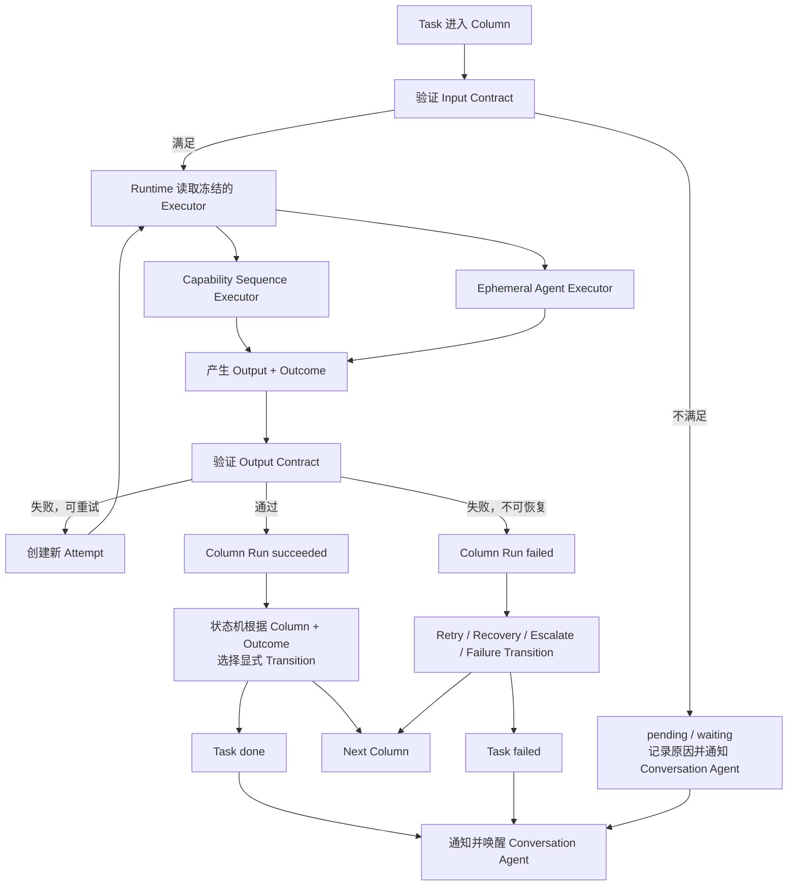

# DevWerk Kanban Workflow — Version 1 核心设计

> 实现规范提示：本文定义 Kanban、状态机、等待和恢复产品决策。声明式 Column schema、通用 executor、Capability Registry 与无源码模板约束以 [`generic-conversation-agent-and-declarative-column-runtime.md`](./generic-conversation-agent-and-declarative-column-runtime.md) 为第一事实。

**文档状态**：Version 1 已确认核心设计  
**最后更新**：2026-07-17  
**适用范围**：DevWerk 核心服务  
**关联文档**：[Conversation Agent Version 1 核心设计](./conversation-agent-design-v1.md)

## 1. 文档效力

本文定义 DevWerk Version 1 的 Kanban、Workflow、Column、Task、Column Run、临时 agent、状态机、长时间等待和异常恢复设计。

本文是目标设计。实现与测试必须满足本文定义的显式 schema、状态机、终态和有界恢复契约。

## 2. 核心定义

> Workflow 以 Column 为基础单元。Task 沿 Column 构成的显式状态机运行；每次进入 Column 产生独立 Column Run。Column 统一声明处理逻辑、执行方式、上下文、能力、输入输出契约和 transition，直到 Task 明确进入 `done` 或 `failed`。

目标：

- Column 是 workflow 的统一抽象单元。
- 状态机不根据列名猜测行为。
- 简单步骤由 deterministic runtime 完成。
- 复杂工作由即生即死的 ephemeral sub-agent 完成。
- 每个 agent 只获取当前阶段必需 context。
- 所有成功、失败、等待、重试和恢复路径显式声明。
- 不允许隐式成功、静默终止或无界 waiting。
- 服务重启后可以从持久状态恢复调度。
- Task 终态和异常必须被 conversation-agent 观察。

## 3. 与 Conversation Agent 的边界

conversation-agent：

- 与用户理解需求。
- 建设和发布 workflow revision。
- 建设 backlog 和 Formal Task。
- 判断 Task readiness、派发和并发。
- 监督 Task、Run、Artifact 和异常。
- 在失败时重启、改派、迁移或向用户汇报。

Kanban Workflow Runtime：

- 验证 workflow 定义。
- 根据固定 revision 执行 Task。
- 创建和管理 Column Run。
- 选择允许的执行方式。
- 验证 input/output contract。
- 执行显式 transition。
- 管理 retry、waiting、lease 和 recovery。
- 产生 event、artifact 和 terminal notification。

Runtime 不重新解释用户项目目标，也不隐式改写 workflow。

## 4. Workflow Definition 与 Revision

Version 1 每个 Project 有一个正式 workflow，但支持不可变 revision。

```yaml
workflow:
  id:
  project_id:
  name:
  description:
  active_revision_id:

workflow_revision:
  id:
  workflow_id:
  revision_no:
  status: draft | published | retired
  start_column_id:
  success_terminal_column_id:
  failure_terminal_column_id:
  created_by_conversation_agent_run_id:
  created_at:
  definition_hash:
```

规则：

- published revision 不可原地修改。
- 新 Task 固定当前 revision。
- 运行中 Task 不因新 revision 发布而自动变化。
- Task 迁移必须由 conversation-agent 通过 Intervention Run 显式执行。
- 旧 revision 保留用于恢复、审计和解释。
- 未来多 workflow 扩展不得要求重写 Task/Column Run 核心模型。

## 5. Column Definition 与 Column Run 分离

### Column Definition

Workflow revision 内的不可变定义，描述一个阶段应该如何工作。

### Column Run

某个 Task 实际进入 Column 后产生的一次运行实例，记录状态、attempt、执行器、上下文引用、工件、等待和结果。

一个 Column Definition 可以被多个 Task 使用；每次进入都创建独立 Column Run。

## 6. Column 统一抽象

```yaml
column:
  key:
  name:
  instruction:
  executor:
    kind: capability_sequence | agent
    capabilities: []
    steps: []
    max_iterations:
    max_tool_calls:
  context:
    include_task: true
    include_project: true
    upstream_outputs: []
    artifact_globs: []
  input_contract:
  output_contract:
  transitions: []
  retry:
  wait:
  max_visits:
  terminal: null | success | failure
  metadata: {}
```

### Instruction 与 Metadata

- `instruction` 是 Conversation Agent 在对话中生成并持久化到 Workflow revision 的阶段工作指令。
- `metadata` 保存机器可读的展示与扩展信息，不承担运行时路由职责。
- capability、contract、transition、retry、wait 与 context 均使用各自的结构化字段。

Instruction 不替代结构化 contract、transition 和 policy。

### Column Flow

Column 可以具有有限内部流程：

```text
validate_input
→ inspect_context
→ execute
→ validate_output
→ produce_outcome
```

Column flow 不应发展成第二套复杂 workflow。如果内部出现大量分支、长期循环、多个独立交付和不同 agent 角色，应拆为多个 Column。

## 7. Column Run 模型

```yaml
column_run:
  id:
  project_id:
  task_id:
  workflow_revision_id:
  column_id:
  attempt_no:
  status:
  health:
  executor_kind:
  executor_id:
  lease_owner:
  lease_expires_at:
  heartbeat_at:
  input_snapshot_ref:
  output_artifact_ref:
  outcome:
  waiting_kind:
  wait_handle_id:
  error_code:
  error_summary:
  started_at:
  finished_at:
  state_version:
```

Retry 创建新的 attempt 或新的 Column Run attempt 记录，不覆盖历史执行证据。

## 8. Run Status 与 Business Outcome 分离

统一 Column Run status：

```text
pending
running
waiting
succeeded
failed
interrupted
```

Business outcome 表示下一步业务路由，例如：

```text
approve
continue
rework
retry
reject
escalate
complete
```

状态描述运行健康度，outcome 决定 transition：

```text
Current Column + Validated Outcome
→ Explicit Transition
→ Next Column or Terminal
```

禁止用 `succeeded` 自动推断唯一下一列，也禁止从输出文本关键词猜 outcome。

## 9. Column Run 状态定义

### `pending`

Run 已创建但尚未执行，必须有明确 `pending_reason`：

- waiting_dispatch
- waiting_input
- waiting_dependency
- waiting_resource

满足条件却长期未调度属于异常，由 Runtime Reconciler 检测。

### `running`

执行器已取得 lease，必须记录：

- owner
- executor_kind
- attempt
- started_at
- lease_expires_at
- heartbeat_at

### `waiting`

当前执行暂停，等待明确外部条件。必须有 `waiting_kind`、AwaitHandle、resume condition、next check 和 deadline。

### `succeeded`

当前 Column Run 已完成，output contract 与 artifact/evidence policy 通过，并产生合法 outcome。它不等于 Task `done`。

### `failed`

当前 attempt 无法成功完成。Runtime 先执行 retry/recovery/failure policy；只有状态机显式进入 failure terminal 时 Task 才成为 `failed`。

### `interrupted`

服务重启、worker 崩溃、lease 丢失或执行器消失造成的运行中断。它与业务失败分开，可以通过检查工件、执行收据和 checkpoint 决定恢复或新 attempt。

## 10. 两种显式 Executor

Conversation Agent 在发布 Workflow revision 时，为每个非终态 Column 明确选择一种 executor。Runtime 只解释已经冻结的选择。

### Capability Sequence Executor

`kind=capability_sequence` 不启动 LLM Agent，按声明的 capability steps、参数引用、成功 outcome 和失败 outcome 执行。文件、命令、MCP、外部 API、数据转换和 contract validation 都通过统一 Capability Registry 完成。

### Agent Executor

`kind=agent` 启动即生即死型 Column Agent，并冻结 instruction、context、capability allowlist、预算和 completion contract。

Version 1 只接受 `capability_sequence` 与 `agent`。Conversation Agent 在发布 revision 前完成选择，Runtime 不再进行语义判定。

## 11. Agent 判定边界

如果执行过程需要模型：

- 读取 prompt
- 选择工具
- 观察工具结果
- 继续推理
- 决定下一动作

它本质上就是 agent run，即使实现没有把它命名为 sub-agent。

“Column 自己完成”只指：

- 完全确定性的 Column Runtime；或
- 由 Agent Executor 创建一个轻量 ephemeral agent。

## 12. Ephemeral Agent 组装

```text
Agent Runtime 基础约束
+ Conversation-agent 提供的 Project Context
+ Column Instruction
+ Task Brief 与 Input
+ Input/Output Contract
+ Capability Allowlist
+ Relevant Artifacts
+ Current Attempt Context
= Ephemeral Column Agent
```

agent：

- 不继承完整 Project 对话历史。
- 不继承其他 agent 原始对话。
- 不拥有 Project 治理权限。
- 不修改 workflow 或其他 task。
- 只获取完成当前 Column Run 必需 context。
- 完成后销毁。
- 重试创建新 attempt，不复用污染上下文。

## 13. Context Pack 契约

本设计只定义 context 输入边界，不重新设计记忆系统。

### Conversation-agent Context

- Project 目标
- 当前约束
- 已确认决策
- 当前 Task 相关项目事实
- 当前风险
- Task 派发原因

不是完整 conversation history。

### Column Context

- 阶段目标
- Column instruction/metadata
- 输入、输出、验收契约
- capability allowlist
- allowed outcomes
- retry/failure/wait policy

### Task Context

- objective
- scope/non-scope
- inputs
- deliverables
- acceptance criteria
- dependencies
- task brief/input
- 上游 artifact reference

### Run Context

- Column Run ID
- attempt
- 上次失败摘要
- 当前相关 artifact
- workspace snapshot reference
- 当前资源、预算和时间限制

Context Pack 保存引用、hash、预算和编译摘要；不无界拼接历史。

## 14. Input Contract

Task 进入 Column 后先验证输入。

```text
Input Contract 满足
→ 允许执行

Input Contract 不满足但可等待
→ pending/waiting + 明确原因
→ 建立依赖或 AwaitHandle

Input Contract 无法满足
→ Column Run failed
→ recovery/escalation/failure policy
```

输入不满足时不能启动 agent 让其猜测缺失信息。

## 15. Output Contract

agent/runtime 返回后必须验证：

- 必须字段
- artifact 类型和数量
- 文件或外部结果
- evidence
- quality/acceptance rule
- allowed outcome
- tool/API receipt

```text
Output Contract 通过
→ Column Run succeeded + outcome

Output Contract 不通过且可重试
→ 新 attempt

Output Contract 不通过且预算耗尽
→ failed + recovery/failure policy
```

允许有限、明确的协议重试；禁止无限修复 LLM 输出，禁止 output 不合法仍推进下一列。

## 16. Task 状态

```text
pending
running
waiting
recovering
done
failed
```

只有 `done` 和 `failed` 是终态。

### `done`

必须通过显式 success terminal transition 到达，并满足：

- 当前 Column Run succeeded
- output contract 通过
- 必需 artifact 存在
- workflow success terminal 明确
- terminal state/event 原子持久化

Conversation Agent 在终态后异步观察和汇报。需要项目级复核的 workflow 必须在 `done` 前声明独立 review Column，Runtime 不依赖隐藏的同步验收门。

### `failed`

必须通过显式 failure terminal 到达，并记录：

- 最后失败 Column/Run
- failure reason/code
- attempts
- 已产生 artifact
- 是否可恢复
- 推荐恢复方式

取消原子进入 `failed`，并额外记录 `failure_code=cancelled`、`task.cancelled` event、failure artifact 与 Project mailbox 通知。

### Revision 迁移

迁移只允许在 Task 已暂停且没有活跃 lease 时执行。请求必须声明目标 revision、目标 Column、context/artifact 继承策略和期望 `state_version`。Runtime 重新验证目标 input contract，以 CAS transaction 切换 revision 与 Column、创建新 attempt 并写审计事件；验证或 CAS 未通过时保持原 revision 和状态。

“没有下一列”不能表示 `done`。它是 workflow definition error 或 runtime anomaly。

## 17. 状态流转图



## 18. Transition 模型

```yaml
transition:
  id:
  workflow_revision_id:
  from_column_id:
  outcome:
  to_column_id:
  kind: normal | retry | recovery | escalation | terminal_success | terminal_failure
  guard:
  max_traversals:
  priority:
```

规则：

- `from_column_id + outcome` 在同一优先级必须确定。
- guard 使用受控表达式，不执行任意代码。
- 每个循环有 `max_traversals`、时间或预算出口。
- terminal transition 没有隐藏后继。
- Runtime 只能执行当前 revision 已声明 transition。

## 19. Retry、Recovery 与 Failure

Column Run 失败后的顺序：

1. 判断 retry policy 和 attempt budget。
2. 判断显式 recovery transition。
3. 判断是否需要 conversation-agent Intervention Run。
4. 无法恢复时进入 failure terminal。
5. 写 failure artifact/event。
6. 通知 conversation-agent。

Column Run `failed` 不自动令 Task `failed`。只有 failure terminal 使 Task 终止。

## 20. Waiting 设计目标

DevWerk 不能保证 LLM 或第三方服务成功，但必须保证：

> 不存在无限期、无解释、无 owner、无下一次检查、无退出策略的 waiting。

长时间等待可能是正常状态，不能用一个固定秒数判断所有能力。

### 长等待五个核心组件

1. **AwaitHandle**：持久化异步操作身份、外部 job、状态、期限和恢复信息。
2. **WaitPolicy**：定义查询、callback、soft/stale/hard deadline、重试、取消和 timeout outcome。
3. **ProgressAdapter**：把 LLM、图片、视频、进程、MCP 和外部 API 的不同进度转换为统一证据。
4. **Runtime Reconciler**：在定时巡检和服务重启后恢复 orphan pending/running/waiting。
5. **Workflow Liveness Validator**：发布 revision 前验证所有 waiting、循环、失败和中断路径最终能够到达 `done` 或 `failed`。

五个组件共同提供 eventual decision。只实现其中某一个，例如固定 timeout 或异步 job token，都不足以保证 workflow 自驱完成。

## 21. Running 与 Waiting 分离

### Running

系统仍在主动执行并存在活动证据：

- LLM stream/token
- agent tool call
- shell process
- 文件持续生成
- heartbeat

### Waiting

当前不需要保留推理 agent，正在等待外部条件：

- 图片/视频 job
- 外部 API callback
- 其他 Task artifact
- 用户输入
- rate limit
- 资源槽位
- provider 恢复

长时间 active computing 保持 `running`；持久异步等待使用 `waiting`。

## 22. Waiting Kind

统一分类：

```text
external_job
dependency
user_input
rate_limit
resource
scheduled_time
provider_recovery
unknown_external_result
```

每种 waiting 都必须有独立 resume condition 和 timeout outcome。

## 23. Durable AwaitHandle

```yaml
await_handle:
  id:
  project_id:
  task_id:
  column_run_id:
  waiting_kind:

  provider:
  operation_type:
  external_job_id:
  idempotency_key:

  status:
  health:
  progress_value:
  progress_message:

  created_at:
  updated_at:
  last_progress_at:
  next_check_at:

  soft_deadline:
  stale_deadline:
  hard_deadline:

  poll_capability:
  poll_arguments:
  callback_policy:
  retry_policy:
  resume_condition:
  success_outcome:
  timeout_outcome:
  cancel_capability:
  cleanup_capability:

  secret_reference:
  state_version:
```

AwaitHandle 必须持久化，不能只存在 worker 内存。Secret 只保存安全引用，不保存明文凭据。

Handle 在外部任务终态、取消或最终过期并完成 reconciliation 后清理；agent 退出时不销毁。

## 24. 等待时释放 Agent

```text
Agent 发起异步 Tool/API
→ Tool 返回 AwaitHandle
→ Agent 写 compact checkpoint
→ Agent Segment 结束并释放 context
→ Column Run waiting
→ Callback/Poller/Reconciler 跟踪
→ 外部结果完成
→ Column Run 恢复
→ 创建新的 Ephemeral Agent Segment
```

新的 segment 只获得原 Task、Column、checkpoint 和外部结果，不恢复上一 agent 的完整会话。

## 25. Soft、Stale、Hard Deadline

### Soft Deadline

比预期慢，需要关注但不失败：

- 产生 `run.long_running`
- 唤醒 conversation-agent
- 检查 provider
- 可以继续等待

### Stale Deadline

长时间没有可信进展：

- health 改为 `stalled`
- 执行确定性诊断
- 触发 recovery policy
- 唤醒 conversation-agent

### Hard Deadline

本次等待不允许继续无界延长。到达后执行显式 timeout outcome：

- retry
- cancel_and_retry
- return_to_previous_column
- switch_provider（policy 允许或 conversation-agent 明确决定）
- escalate
- fail_task

conversation-agent 可以延期，但每次必须记录原因、新期限和 extension budget；延期次数有上限。

## 26. Waiting Health

Run status 与健康度分开：

```text
healthy
slow
degraded
stalled
unknown
```

示例：

```yaml
status: waiting
waiting_kind: external_job
health: healthy
provider_status: rendering
progress_value: 72
last_progress_at: 30_seconds_ago
```

总耗时不是唯一判断依据。一个等待 20 分钟但持续渲染的视频任务可以健康；一个等待 3 分钟但连续 poll 失败的普通 API 可以 degraded。

## 27. ProgressAdapter

每种 capability 把自身进度统一转换为：

```yaml
progress_evidence:
  alive:
  progress_value:
  progress_message:
  last_activity_at:
  provider_status:
  estimated_completion:
```

### LLM

- stream token/chunk
- provider request ID
- last chunk time
- tool call
- partial output
- usage checkpoint

Token 增长证明活跃，不证明结果质量。

### 图片/视频

- external job ID
- queue/render status
- percentage
- queue position
- estimated completion
- callback

### Shell/Process

- PID
- heartbeat
- CPU time
- stdout/stderr 增量
- 文件变化
- exit code

### MCP

- request ID
- progress notification
- server heartbeat
- partial result
- cancellation capability

### External API

- HTTP/provider request ID
- Retry-After
- callback
- status endpoint
- idempotency key

## 28. Provider 错误分类

### 通常不可重试

- 400 invalid request
- 401 credential
- 403 permission
- 404 endpoint/job missing
- policy rejection
- unsupported parameters

应快速失败或由 conversation-agent 修正。

### 通常可重试

- 408
- 429（遵循 Retry-After）
- 502/503/504
- overload
- connection reset
- temporary DNS/network failure

采用指数退避、jitter、attempt budget、总时间预算和 circuit breaker。

### Unknown External Result

请求可能已产生副作用但连接中断：

- 先按 idempotency key 查询。
- 有 status endpoint 时先查询。
- 不能确认时进入 `unknown_external_result`。
- 不盲目重复图片生成、发布、支付等操作。
- 唤醒 conversation-agent。

Provider 切换不能是隐藏 fallback，必须由 Column policy 允许或 conversation-agent 明确、可审计地决定。

## 29. Workflow Liveness Validator

conversation-agent 发布 revision 前必须通过静态完整性检查。

每个非终态 Column 明确处理：

- success outcome
- business rejection
- execution failure
- timeout
- interrupted
- waiting expired
- retry exhausted
- cancellation

每个 waiting 明确：

- resume condition
- check strategy
- soft/stale/hard deadline
- timeout outcome

每个循环明确：

- traversal/attempt count
- 时间或预算上限
- 退出 edge
- 可达 done 或 failed

禁止：

- 无界自循环
- 没有 hard deadline 的 waiting
- 没有 timeout transition 的外部调用
- 没有 failure terminal
- 无下一列时默认成功
- 永远只回到自己的恢复路径

验证目标：从任意可达 Column 和合法 outcome 出发，都存在受限路径最终到达 `done` 或 `failed`。

## 30. Runtime Reconciler

Runtime Reconciler 独立于原 worker 定期检查：

- pending 是否应该已入队
- running lease 是否有效
- heartbeat 是否过期
- waiting 是否到 `next_check_at`
- soft/stale/hard deadline
- external job 是否完成
- dependency 是否满足
- 是否存在无 owner 的 run
- terminal event 是否已通知 conversation-agent

可执行：

- 重新入队
- 标记 interrupted
- 查询 AwaitHandle
- 恢复 waiting
- 创建新 attempt
- 执行 recovery transition
- 唤醒 conversation-agent
- 明确进入 failed

## 31. 服务重启恢复

持久化：

- Task 当前 Column
- Column Run status/health
- execution mode
- attempt
- lease/heartbeat
- input/output artifact
- AwaitHandle
- tool/API receipt
- pending/waiting reason
- transition decision
- terminal state

启动 reconcile：

### 异常 pending

输入已满足但无 queue/dispatch 时重新入队或升级 conversation-agent。

### 异常 running

lease 过期、owner 不存在或 worker 丢失时：

- 不假设成功或失败。
- 转为 interrupted。
- 检查 artifact、checkpoint 和 execution receipt。
- 可恢复则恢复，否则创建新 attempt。
- 通知 conversation-agent。

### 外部副作用

每个 step 需要 idempotency key、started receipt、completed receipt、result reference 和 side-effect classification。恢复时先查询 receipt，再决定重试。

## 32. Conversation-agent 通知

以下事件进入 Project mailbox：

- `column.input_missing`
- `run.long_running`
- `run.degraded`
- `run.stalled`
- `await.deadline_exceeded`
- `external.result.unknown`
- `retry.exhausted`
- `column.interrupted`
- `task.done`
- `task.failed`
- `task.cancelled`

Task 终态记录：

```text
terminal_at
terminal_event_id
conversation_agent_notified_at
conversation_agent_observed_at
conversation_agent_action
```

不能只证明通知已发送，还要知道 conversation-agent 是否观察并处理。

## 33. SQLite 单库设计

所有 Project 使用一个 SQLite。Project 通过 `project_id` 隔离结构化状态，通过 `workspace_root` 隔离用户工作区；`internal_artifact_root` 保存 DevWerk 管理的证据文件，并且不向 Project 文件 capability 暴露。

建议表组：

### Workflow Definition

- `workflows`
- `workflow_revisions`
- `workflow_columns`
- `workflow_transitions`

### Task Runtime

- `tasks`
- `column_runs`
- `agent_runs`
- `run_checkpoints`
- `await_handles`
- `execution_receipts`

### Evidence

- `events`
- `artifacts`
- `artifact_links`
- `usage_aggregates`

### Read Projection

- `kanban_task_projection`
- `active_run_projection`
- `workflow_revision_summary`

所有表的 Project 数据带 `project_id`；外键和 repository API 验证 Project 一致性。

## 34. SQL 与文件分工

SQLite 保存：

- workflow/column/transition 定义
- task/run 状态
- lease、heartbeat 汇总
- AwaitHandle
- retry/timeout/recovery 决定
- event metadata 和紧凑 payload
- artifact metadata、path、hash、size、type
- terminal state 和 notification
- projection

文件保存：

- 大模型超长 raw response
- 图片、视频、音频
- 代码包、压缩包
- 大型 tool output
- screenshot
- 大日志
- checkpoint 大正文
- 历史归档

Dashboard 和 scheduler 不读取文件正文，只读取 SQLite metadata；正文在详情页或 agent context 编译时按需加载。

## 35. SQLite 写入性能

关键原则：

- WAL mode
- 合理 busy timeout
- 短 transaction
- transaction 内禁止网络、LLM、MCP 和大文件写入
- 关键状态立即提交
- 高频进度合并节流
- 批量维护小批次执行

### 立即持久化

- Task/Column transition
- terminal state/event
- dispatch/retry/recovery 幂等记录
- AwaitHandle 创建/终态
- execution receipt
- lease owner 变化

### 节流合并

- heartbeat
- token usage
- progress percentage
- 重复 provider poll
- dashboard counter

禁止逐 token、逐 stdout 行、逐秒 heartbeat 写 SQLite。可以按时间窗口、状态变化或阶段 checkpoint 合并。

## 36. 索引建议

```text
workflow_revisions(project_id, workflow_id, revision_no)
workflow_columns(workflow_revision_id, key)
workflow_transitions(workflow_revision_id, from_column_id, outcome)
tasks(project_id, status, updated_at, id)
tasks(project_id, workflow_revision_id, status, id)
column_runs(task_id, status, id)
column_runs(project_id, status, heartbeat_at, id)
column_runs(project_id, lease_expires_at, status, id)
agent_runs(column_run_id, attempt_no, id)
await_handles(status, next_check_at, id)
await_handles(project_id, health, hard_deadline, id)
events(project_id, id)
events(task_id, id)
artifacts(project_id, task_id, created_at, id)
execution_receipts(column_run_id, idempotency_key)
```

要求：

- Reconciler 查询必须命中 `status + due time` 索引。
- Kanban 页面按 Project/status/cursor 查询。
- 禁止对每个 Task 单独查询 Run/Event/Artifact 的 N+1。
- 大 JSON 中的常用查询字段必须提升为正式 column。
- release 前用 query plan 检查核心路径。

## 37. Web Kanban 渲染

Kanban 用户侧只读，渲染使用轻量 projection：

```text
task_id
project_id
title
task_status
current_column_id
current_column_name
run_status
run_health
progress_summary
risk_summary
last_activity_at
state_version
```

流程：

1. 首次加载分页 snapshot。
2. SSE/WebSocket 推送 `state_version` 之后的增量。
3. 前端只更新受影响卡片。
4. Event、Artifact、Run detail 按需分页。
5. 不轮询整张 board，不加载 raw artifact。

Projection 与关键状态转移尽量在同一短 transaction 更新。

## 38. Event 降噪

必须保留：

- transition
- attempt start/end
- retry/recovery
- wait health level 变化
- terminal
- external result unknown
- conversation-agent intervention

不应逐条保留：

- 每个 token
- 每秒 heartbeat
- 没有状态变化的重复 poll
- 重复 progress 百分比

重复事件使用聚合计数和最后时间，降低 SQLite 写锁竞争和 Web 渲染压力。

## 39. 事务不变量

以下操作原子提交：

- Task 创建 + workflow revision 固定 + start Column pending run
- Column Run succeeded + output artifact metadata + transition + next pending run
- Column Run failed + retry/recovery decision
- waiting + AwaitHandle 创建
- AwaitHandle terminal + Run 恢复入队
- Task terminal + terminal event + Project mailbox notification

使用 `state_version` 或 optimistic concurrency 防止重复 callback、poll 和 recovery 覆盖新状态。

## 40. 自驱动保证

DevWerk 不能保证外部服务一定成功，但必须保证：

1. 每个 waiting 有明确 kind、owner 和 AwaitHandle。
2. 每个 waiting 有 `next_check_at`。
3. 每个 waiting 有 soft/stale/hard deadline。
4. 每个 waiting 有 resume 和 timeout outcome。
5. 每个循环有次数、时间或预算上限。
6. 服务重启后可以恢复。
7. 无法恢复时显式进入 failed。
8. done、failed 和异常唤醒 conversation-agent。
9. 不允许静默、无界、无解释等待。

系统保证的是 eventual decision，不是外部操作必然成功：

> Task 最终成功完成，或者在可解释、受限的恢复尝试耗尽后明确失败。

## 41. Version 1 验收不变量

- Workflow 以统一 Column Definition 为基础。
- 每次进入 Column 创建独立 Column Run。
- Run status 与 business outcome 分离。
- 每个非终态 Column 显式使用 `capability_sequence` 或 `agent` executor；Runtime 不根据列名或业务文本选择 executor。
- Agent Context 不包含无界历史。
- Input 不满足不执行，Output 不满足不推进。
- transition 全部来自固定 revision。
- Task 只有 done/failed 两种终态。
- 无下一列不代表成功。
- Column failed 先走 retry/recovery，failure terminal 才使 Task failed。
- waiting 可以长期健康，但不能无期限和无退出策略。
- AwaitHandle、ProgressAdapter、Liveness Validator、Reconciler 都存在。
- 服务重启不会留下永久 orphan pending/running/waiting。
- terminal 和异常进入 conversation-agent mailbox。
- SQLite 不承受逐 token、逐 heartbeat 和大正文写入。
- Kanban Web 使用分页 projection 和增量更新。
