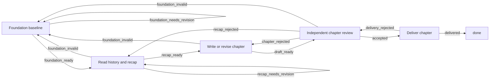

# Loop Runtime V1

## Purpose

DevWerk stores reusable project-delivery knowledge as version-controlled Loops. The Conversation Agent discovers a suitable Loop from human-readable metadata, binds confirmed Project facts, and applies it. Application creates an ordinary immutable OrchestrationPlan, initial Workflow revision, and Task portfolio. The Kanban Runtime remains a domain-neutral interpreter of the resulting declarative directed graph.

## Filesystem contract

Every bundled Loop owns one direct child directory under `loops/`:

```text
loops/
  <loop-directory>/
    loop.meta
    loop.json
```

`loop.meta` is a Skill Card-style Markdown document intended for discovery and human review. It declares the title, description, publisher, category, tags, use case, selection guide, input, output, semantic version, Loop key, and references. Listing and filtering read only this compact metadata.

`loop.json` is the executable declarative bundle. It contains `schema_version=devwerk.loop.bundle.v1`, a parameter schema, an OrchestrationPlan, a Workflow graph, and Task definitions. Inspecting or applying a Loop loads and validates this file. A digest over both files identifies the exact source used for materialization.

Loop discovery scans the filesystem on each request so edits become visible without copying definitions into SQLite or restarting the service. The directory is the sole source of bundled initial Workflow definitions.

## Selection and application

The Conversation Agent uses three generic capabilities:

- `loop.list`: search Loop metadata by category, tag, or text.
- `loop.inspect`: load one Loop card, parameter contract, and executable bundle.
- `loop.apply`: validate bindings and materialize the plan, initial Workflow revision, and Tasks.

The Agent selects by the documented use case and tags. If no Loop fits, it continues requirement discussion instead of inventing an initial Workflow.

A Project without a Workflow can create its first revision only through `loop.apply`. Once the Workflow exists, `workflow.publish` may publish validated immutable revisions against its OrchestrationPlan. Applying a second initial Loop to the same Project is rejected.

## Persistence

SQLite stores Project runtime instances: the materialized OrchestrationPlan, Workflow revisions, Tasks, Runs, Events, Artifacts, and a compact Loop-application record. The application record contains the Loop key, version, source digest, bindings, and created entity IDs. SQLite does not store or serve preset Loop definitions.

Each Workflow revision created by Loop application retains source Loop key, version, and digest as provenance. Later revisions remain ordinary Project data and do not modify the source files.

## Directed graph semantics

Workflow transitions are directed edges selected by declared outcomes. Cycles and backward edges are valid when every Column still has a declared route to a terminal. Review rejection is a business outcome and remains inside the graph; it is not a Task failure.

The bundled novel Loop uses the following lifecycle:



## Logical Agent sessions

An Agent Column may declare `metadata.agent_session_key`. The first visit creates one Task-scoped logical Agent session. Later visits with the same key restore its user-visible Agent history and receive current Task context, including Reviewer feedback. The provider process is released between visits; session identity and evidence remain durable. The novel Writer uses this mechanism, while each Reviewer run remains independent.

## Failure and recovery

Review rejection follows a declared graph edge, preserves the same Task and logical Writer session, and never enters `failed`.

Structured temporary provider failures move the same Task to `recovering`; after `next_retry_at`, Kanban reclaims the same Column. The failed Column Run remains immutable evidence and the new visit receives the same Task context and files.

A non-recoverable execution failure transitions the Task to `failed`. When correction is valid, `task.reopen` preserves the Task ID, artifacts, prior Column Runs, failure event, and logical Agent sessions, then creates a new pending Column Run at the Workflow entry or another declared Column. `done` remains immutable.

## Bundled Loops

`novel.production` creates ten strictly serialized chapter Tasks. The first Task authors and freezes the story foundation manuals. Each Recap Agent reads accepted history; Writer and Reviewer receive the manuals, recap, history, and Task contract. Reviewer feedback returns to the same logical Writer session.

`software.gitlab_devops` requires a confirmed requirement baseline. After that gate, its graph covers architecture, documentation, implementation, build and test, independent review with rework, GitLab delivery, CI feedback, and acceptance.
