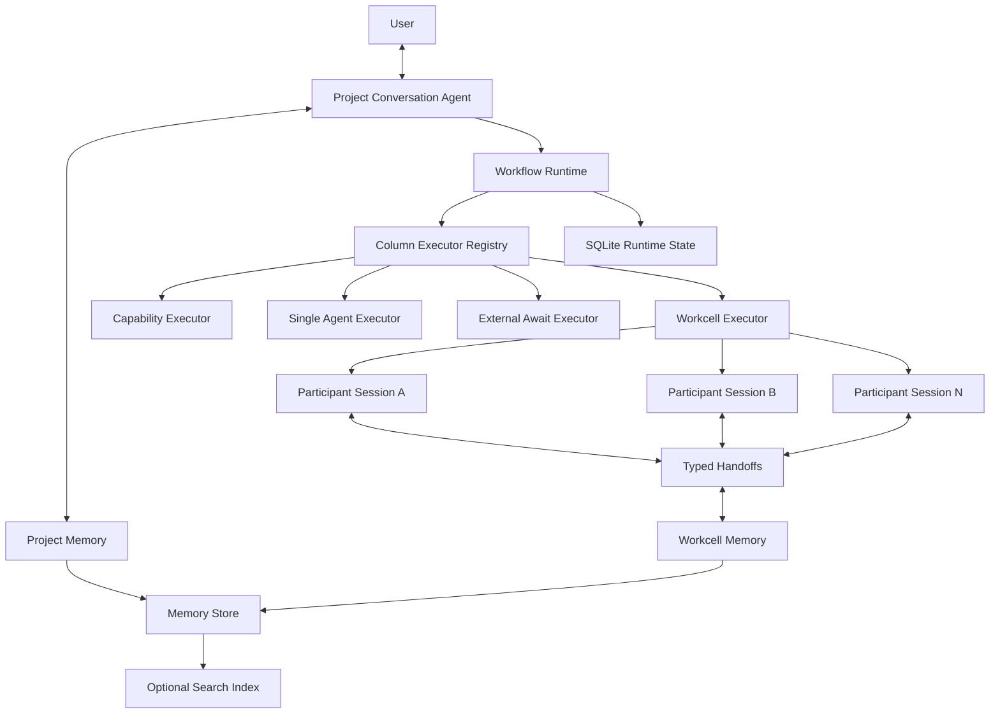

# DevWerk Memory and Workcell Runtime — v0.1.0 Design

Status: **Normative / Implemented Architecture**
Version: **0.1.0**
Date: **2026-08-27**

## 1. Authority

This document defines the v0.1.0 semantic-memory and collaborative Column execution model.
It supersedes earlier statements that memory is postponed, that every Agent Column is one
ephemeral Agent Attempt, or that collaboration is fixed to a producer/reviewer pair. The
Conversation Agent, Kanban state machine, Loop library, Project isolation, and SQLite runtime
contracts defined by the existing core documents remain authoritative where they do not conflict
with this document.

DevWerk remains domain-neutral. Runtime source code knows Projects, Tasks, Columns, Workcells,
Participants, Sessions, Signals, Handoffs, Artifacts, Memory, and transitions. Domain roles,
process stages, instructions, evidence, and acceptance rules belong to Loop data.

## 2. Target Architecture



The outer Workflow graph moves a Task between Columns. A Workcell Column owns an inner,
declarative collaboration graph. The outer Column remains running until its inner graph reaches
one declared terminal outcome.

## 3. Storage Boundaries

### 3.1 SQLite runtime state

SQLite remains authoritative for transactional facts:

- Project, Workflow revision, Task, dependency, lease, and scheduling state;
- Column Run and Attempt state;
- Workcell current node and terminal state;
- Participant identity and logical Session binding;
- ordered Signal/Handoff metadata;
- Conversation messages, Agent Runs, tool invocations, events, and artifact metadata.

These records require atomic transitions, indexed ordering, or concurrency control. They are not
semantic memory.

### 3.2 File-first semantic memory

The default semantic Memory Store is rooted inside the Project workspace:

```text
{project.base_dir}/.devwerk/memory/
  PROJECT.md
  CURRENT.md
  DECISIONS.md
  CONSTRAINTS.md
  OPEN_ISSUES.md
  knowledge/
  records/{scope}/{scope_id}/{memory_id}.md
  snapshots/{scope}/{scope_id}/{content_hash}.json
```

Markdown carries human-readable durable knowledge. YAML front matter carries stable metadata:

```yaml
id: mem_example
kind: decision
scope: project
authority: user_confirmed
source_type: conversation_message
source_id: msg_example
source_hash: sha256
revision: 1
status: active
updated_at: 2026-08-26T20:00:00+08:00
```

Large source files and deliverables remain ordinary Project Artifacts. Memory records reference
them by relative path, artifact ID, hash, and revision instead of duplicating their bodies.

### 3.3 Replaceable index

Search indexes are derived and rebuildable. The default implementation performs scoped text
search over Memory files. Optional providers may add FTS or vector retrieval without becoming
the source of truth. Deleting an index must not delete or change semantic memory.

## 4. Memory Provider Boundary

Runtime depends on two narrow interfaces:

```text
MemoryStore
  initialize_project
  read
  write
  append
  list
  supersede
  snapshot
  restore

MemoryIndex
  index
  remove
  search
  rebuild
```

The default `FileMemoryStore` is always available. Alternative stores and indexes are registered
through provider factories. Conversation Agent and Column Runtime never branch on a concrete
provider name.

## 5. Memory Scopes and Authority

Memory is isolated by Project. Cross-Project semantic recall is never implicit.

Supported scopes are:

- `project`: durable goals, facts, constraints, decisions, architecture, conventions;
- `conversation`: long-term user decisions and open questions;
- `workflow`: knowledge specific to the active working method and revision;
- `task`: objective, dependencies, accepted intermediate results, open issues;
- `workcell`: shared collaboration state and current artifact versions;
- `participant`: private working state for one logical participant Session.

Conflict resolution follows explicit authority:

```text
user-confirmed fact
  > approved Project decision
  > Project Loop binding
  > accepted Artifact
  > accepted Task or Column result
  > Agent-derived summary
```

Memory is append/version oriented. A replacement marks the previous record `superseded`.
Derived memory whose source hash changes becomes `stale`; stale records remain auditable but are
excluded from normal context assembly.

## 6. Memory Lifecycle

### 6.1 Capture

Deterministic runtime facts are recorded without an LLM. An Agent may return a structured
`memory_delta` together with its normal result. A separate memory-only model call is not required
for every tool invocation or turn.

### 6.2 Commit

Memory writes validate Project scope and record revision, retain source IDs and hashes, and use
atomic file replacement. Supersede and stale state remain explicit metadata rather than deleting
history. Index providers receive Memory references and can be rebuilt from files.

### 6.3 Retrieval

Context assembly uses, in order:

1. mandatory Project and Loop references;
2. Task and dependency references;
3. Column-declared memory selectors;
4. current Workcell and Participant working state;
5. optional search results;
6. on-demand Artifact reads performed by the Participant.

Complete storage never implies complete prompt injection.

### 6.4 Context manifest

Every Agent Run freezes a queryable context manifest containing selected Memory and Artifact
references, source hashes, selection reasons, index provider, and omitted candidates. Context
selectors use explicit Loop-declared limits; the Runtime does not introduce a hidden domain limit.
Larger semantic material stays as references or maintained snapshots and is read on demand.

### 6.5 Session boundary

Agents commit semantic Memory explicitly through Memory capabilities. Runtime also writes compact,
content-addressed Workcell snapshots after inner state transitions. Those snapshots contain node,
participant Session, Signal, and reference metadata rather than copying full artifacts or raw
transcripts. Raw tool traces and complete participant transcripts remain execution evidence and
are not automatically promoted into semantic memory.

## 7. Column Executor Model

Column executors form a discriminated registry:

- `capability_sequence`: deterministic tools and APIs;
- `agent`: one logical Agent Session;
- `workcell`: a declarative collaboration graph;
- future executor plugins such as external await or interaction may implement the same boundary.

Every executor accepts a frozen Column input and returns one declared business outcome plus
contract-valid output. Executor selection never depends on Column name, prompt text, or domain.

## 8. Generic Workcell

A Workcell is a persistent collaboration scope owned by one Column Run. It contains arbitrary
Participants, an inner directed graph, typed Signals and Handoffs, shared and participant-private
Memory, versioned Artifact references, and one explicit terminal mapping to a Column outcome.
Runtime does not define Writer, Reviewer, Developer, Coder, or any other domain role.

### 8.1 Participants

Participant kinds are extensible. v0.1.0 implements:

- `agent`: a logical Agent Session with instruction, capabilities, and context selectors;
- `capability_sequence`: deterministic capability steps.

Each participant has a stable key and lifecycle:

- `invocation`: one activation;
- `column_visit`: the complete Workcell lifetime;
- `task`: reusable for the Task lifetime;
- `project`: reserved for the Project Conversation Agent and future declared participants.

The default Workcell Agent lifecycle is `column_visit`. Revisions and reviews reactivate the same
logical Session. A process restart reconstructs the same logical Session from durable state; it
does not create an unrelated Agent.

### 8.2 Inner states

Each state activates exactly one declared Participant. The Participant emits one declared Signal
and a structured payload. A transition maps `(state, signal)` to another inner state or terminal.
The graph validator requires unique keys, a valid entry, reachable states, declared signals, and
a path from every state to a terminal. Runtime owns graph movement; no coordinator LLM is needed
for mechanical routing.

An Agent state requires successful capability evidence before its Signal is accepted by default.
A Loop may set `require_evidence: false` only when the state is explicitly a pure reasoning step
with no external effect.

### 8.3 Handoffs

Participant communication uses typed Handoffs:

```json
{
  "signal": "revision_requested",
  "sender": "participant_b",
  "receivers": ["participant_a"],
  "payload": {},
  "artifact_refs": [],
  "memory_refs": []
}
```

Payload contracts, recipients, and business meaning belong to the Loop. Participants do not
broadcast their raw transcript or private working state.

### 8.4 Persistence and recovery

Before activating a Participant, Runtime persists the Workcell node and activation. After a
Participant returns, Runtime atomically persists the Signal, Handoff metadata, output, and next
node. Provider interruption marks the Workcell recovering and resumes the same Participant
Session. A business revision signal is normal graph movement, not Task failure.

### 8.5 Completion

Only a Workcell terminal can finish its outer Column. Participant completion tools emit inner
Signals; they cannot independently mark the Task done or failed. Terminal mapping selects one
outcome already declared by the outer Column.

## 9. Domain-neutral Collaboration Patterns

The same Workcell model supports pair improvement, parallel research followed by aggregation,
multiple independent evaluations, Agent/compiler/test/repair loops, Agent plus asynchronous
external service, and diagnostic/operator/observer collaboration. These are Loop configurations,
not Runtime modes. v0.1.0 implements a sequential directed graph; parallel activation can be
added without changing stored definitions.

## 10. Loop and Architecture Boundary

Architecture owns Memory provider contracts, FileMemoryStore, provenance and context manifests,
executor and participant registries, Workcell persistence, Session identity, Signals, Handoffs,
recovery, terminal mapping, and generic observability.

Loop data owns domain Memory templates and selectors, Column topology, Participant count, roles,
instructions, tools, lifecycle, inner graph, Handoff contracts, Artifact requirements, acceptance
criteria, rework paths, and model-route preferences. Project bindings own the concrete product,
story, repository, target, constraints, and paths.

## 11. Context and Token Discipline

- stable system, Loop, and Project prefixes remain deterministic for provider caching;
- each Participant receives its own transcript and subscribed Handoffs only;
- Artifact references and diffs replace repeated full-body transfer where the Loop permits;
- deterministic validation and transitions do not call an LLM;
- reactivation uses current working Memory instead of rediscovering the Task;
- Memory indexing is local unless a configured provider requires an API;
- Conversation Agent observes semantic milestones rather than every inner edge.

The complete transcript remains auditable while active context is a scoped projection.

## 12. Observability

API and Web projections expose Workcell ID, current node, status, outer Column Run, Participants,
logical Session IDs, ordered Signals and Handoffs, Memory and context-manifest references,
Artifact versions, terminal mapping, and recovery cause. Raw JSON remains available as evidence
but is not the primary human view.

## 13. Compatibility and Migration

Existing `agent` and `capability_sequence` Columns remain valid. Existing `agent_session_key`
continues to identify a logical single-Agent Session. Loops opt into `workcell` explicitly.
Project creation initializes File Memory without moving deliverables. Existing SQLite conversation
and execution records remain valid. Historical model output is not silently promoted.

## 14. Acceptance Invariants

1. A Project has a readable File Memory root and provider-independent Memory API.
2. Memory is Project-isolated, versioned, source-linked, and searchable.
3. Agent Run context records selected Memory references and reasons.
4. Existing single-Agent and deterministic Columns execute unchanged.
5. An arbitrary valid Workcell graph activates multiple declared Participants.
6. Repeated activations reuse the same logical Participant Session for its lifecycle.
7. Typed feedback reaches its receiver without replaying another Participant's raw transcript.
8. Business revision stays inside the Workcell and does not falsely fail the Task.
9. Restart recovers the Workcell node, Participant identity, Handoffs, and Memory snapshot.
10. Only an inner terminal completes the outer Column.
11. Runtime source has no novel, source-code, GitLab, Writer, or Reviewer routing branch.
12. Tests cover provider substitution, graph validation, continuity, routing, recovery, and terminal mapping.
