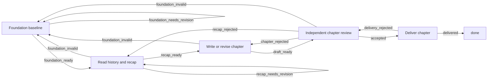

# Workflow Template Runtime V1

## Purpose

DevWerk persists reusable project-delivery knowledge as versioned Workflow Templates. The Conversation Agent selects a suitable template from metadata and applies it with project facts. The result is an ordinary immutable orchestration plan, Workflow revision, and Task portfolio; the Runtime remains a domain-neutral interpreter of a declarative directed graph.

## Persistence

`v1_workflow_templates` stores the template identity, version, category, tags, human selection guidance, parameter schema, and complete bundle. `v1_project_template_applications` records which exact template version and bindings produced a Project plan, Workflow revision, and Tasks.

Templates are bootstrapped from version-controlled JSON records and then read from SQLite. Application never dispatches through a source-code branch for novels, software, or any other domain.

## Selection and application

The Conversation Agent receives compact active-template summaries and three generic capabilities:

- `workflow.template.list`: search active templates by category, tag, or text.
- `workflow.template.inspect`: read one exact template version and its parameter contract.
- `workflow.template.apply`: validate bindings, materialize the bundle, publish its plan and Workflow, and create its Task portfolio.

The Conversation Agent must select from the stored descriptions and tags. It may continue normal conversation when no template fits.

## Directed graph semantics

Workflow transitions are directed edges selected by declared outcomes. Cycles and backward edges are valid when every Column still has a declared route to a terminal. Review rejection is a business outcome and remains inside the graph; it is not a Task failure.

The novel chapter graph is:

## Logical Agent sessions

An Agent Column may declare `metadata.agent_session_key`. The first visit creates one Task-scoped logical Agent session. Later visits with the same key restore its user-visible Agent history and receive the current Task context, including Reviewer feedback. The provider process is released between visits; session identity and evidence remain durable. The novel Writer uses this mechanism, while each Reviewer run remains independent.

## Failure and recovery

Review rejection is a business outcome: it follows a declared graph edge, preserves the same Task and logical Writer session, and never enters `failed`.

Structured temporary provider failures are Runtime concerns. They move the same Task to `recovering`; after `next_retry_at`, Kanban reclaims the same Column without Conversation Agent intervention. The failed Column Run remains immutable evidence and the new visit receives the same Task context and files.

A non-recoverable execution failure transitions the Task to `failed`. When correction is valid, `task.reopen` preserves the Task ID, artifacts, prior Column Runs, failure event, and logical Agent sessions, then creates a new pending Column Run at the Workflow entry or another declared Column. `done` remains immutable.

## Novel template

The novel template creates ten strictly serialized chapter Tasks. The first Task authors and freezes ten foundation manuals: story outline, scene writing, dialogue, symbol system, pacing, supporting characters, emotion, anti-AI-style review, body description, and era background. Later Tasks verify and reuse the same foundation revision.

Each Recap Agent reads all accepted historical chapters. Writer and Reviewer both receive all ten manuals, the recap, historical chapters, and the current Task contract. Reviewer feedback is persisted as an artifact and graph output and is delivered to the same logical Writer session. The chapter target is configurable and capped at 20,000 non-whitespace characters without imposing a narrow production band.

## DevOps template

The DevOps template can be applied only with an explicitly confirmed requirement baseline. Requirements discovery and confirmation remain a long-running Conversation Agent responsibility before Task materialization. The instantiated delivery graph covers architecture, documentation, implementation, build/test, independent review with rework, GitLab delivery, CI feedback, and acceptance.
