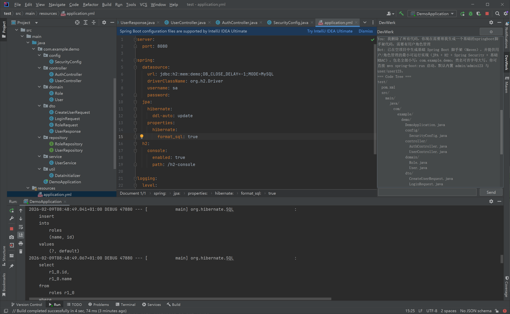

# DevWerk — AI‑Powered IDE CodeOps Agent

> An AI-assisted **Code Operations (CodeOps) backend** designed to safely generate, modify, and refactor code inside IDEs, integrating **OpenAI** and **Ollama** models with strict architectural constraints.

DevWerk is built to explore a practical question:

**How far can we push AI to automate real software development while preserving code invariants, architectural intent, and developer trust?**


---

## 🚀 Project Status

- **Current progress:** ~60% complete
- **Core capability:** AI-driven CRUD operations on source code (create / update / delete / refactor)
- **Supported LLMs:** OpenAI API, Ollama (local models)
- **Target milestone:** v1.0 — Spec-driven scaffold generation (POA)

This repository contains the **backend service** powering DevWerk.

---

## 🧠 Motivation

Modern AI coding tools often operate as black boxes:
- They generate code without understanding project structure
- They violate architectural boundaries
- They make changes that are hard to audit or revert

DevWerk takes a different approach:

- Treat codebases as **structured systems**, not text blobs
- Enforce **explicit invariants and schemas**
- Let AI operate **within clearly defined constraints**
- Make every AI action auditable and reversible

---

## 🏗 High‑Level Architecture

```
IDE Plugin (Client)
        │
        ▼
DevWerk Backend (FastAPI)
        │
        ├── Prompt Factory
        ├── Schema & Constraint Layer
        ├── CodeOps Engine
        │       ├── Read / Diff
        │       ├── Create / Update / Delete
        │       └── Validation
        │
        ├── OpenAI Adapter
        └── Ollama Adapter
```

---

## 📂 Repository Structure (Backend)

```
backend/
├── app/
│   ├── core/        # Prompt templates, schemas, invariants
│   ├── models/      # Domain models (IDE, workspace, ops)
│   ├── routes/      # FastAPI endpoints (IDE integration)
│   ├── services/    # LLM adapters, CodeOps logic
│   └── utils/       # Helpers and shared utilities
├── requirements.txt
├── startup.bat
└── .env.example
```

---

## 🔑 Core Capabilities

### 1. AI‑Driven Code Operations
- Create new files and directories
- Modify existing files
- Delete paths safely
- Generate unified diffs instead of raw overwrites

### 2. Constraint‑First Design
- Code changes must conform to predefined schemas
- Architectural boundaries are enforced before execution
- Prevents AI from breaking core project invariants

### 3. Multi‑Model Support
- **OpenAI** for cloud-based reasoning
- **Ollama** for local / privacy‑friendly inference
- Unified abstraction layer for future model expansion

### 4. IDE‑Oriented Workflow
- Designed to be driven by IDE plugins
- Supports workspace summaries instead of full source dumps
- Optimized for incremental, contextual changes

---

## 🧪 Current Functionality

✅ Implemented:
- FastAPI backend service
- Prompt factory and schema validation
- OpenAI & Ollama API integration
- Code CRUD via AI with validation
- Diff‑based patch application

🚧 In progress:
- Spec‑driven project generation
- Scaffold templates (e.g. Spring Boot, Vue, RuoYi)
- Enhanced invariant modeling
- Safety policies for large refactors

---

## 🎯 v1.0 Vision

The 1.0 milestone aims to support:

- **Spec‑driven code generation**
- Scaffold‑aware AI (framework‑specific knowledge)
- POA‑level project bootstrapping
- Significant reduction of manual boilerplate coding

Ultimate goal:
> **Free developers from repetitive scaffolding work, while keeping humans in control of architecture.**

---

## ⚠️ Non‑Goals

- Fully autonomous software development
- Replacing human engineers
- Unconstrained “AI writes everything” workflows

DevWerk intentionally prioritizes **control, safety, and trust** over raw automation.

---

## 🧑‍💻 Running Locally

### Requirements
- Python 3.10+
- OpenAI API key or Ollama installed

### Setup
```bash
cd backend
pip install -r requirements.txt
cp .env.example .env
```

### Start Service
```bash
uvicorn app.main:app --reload
```

---

## 🧠 Why This Project Matters

DevWerk demonstrates:

- Real‑world AI integration beyond demos
- Architectural thinking applied to AI tooling
- Practical handling of LLM limitations
- A senior‑level approach to developer productivity

This is not a toy chatbot — it is an exploration of **AI‑assisted software engineering as a discipline**.

---

## 👤 Author

**Hongtu Zang**  
Senior Software / Platform Engineer

Focus:
- Distributed systems
- Developer tooling
- AI‑assisted engineering workflows
- Platform architecture

---

## 📄 License

GNU V2.1 License
