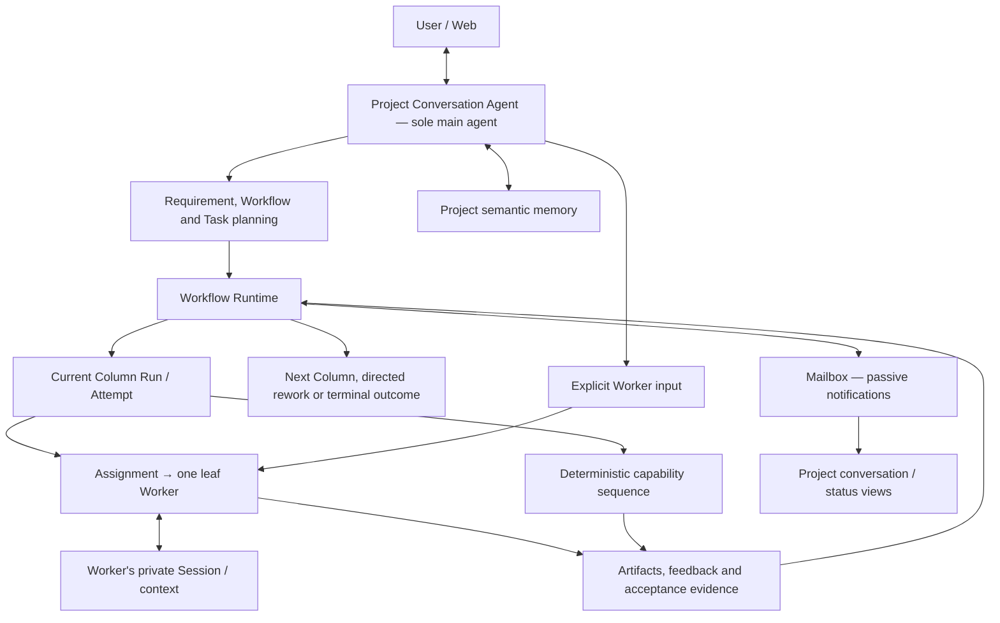

# DevWerk

**DevWerk is a conversation-led multi-agent framework for completing long-running tasks through explicit workflows and independently managed agent contexts.**

Each Project has one persistent Conversation Agent that works with the user to define requirements, organize tasks, and coordinate delivery. Workflow Columns assign bounded steps to lifecycle-managed sub-agents. Each agent Column has one agent; collaboration, review, and rework are visible in the Workflow.

The aim is more precise context and memory management: decide which agent needs which information, for which step, and for how long. DevWerk applies this approach to general tasks, including software development and long-form writing.

**Status: pre-1.0, under active development.** This README describes the current development tree. Published packages may contain an earlier implementation; see their [release notes](https://github.com/zanghongtu2006/DevWerk/releases) for the corresponding version.

## Why DevWerk

A long-running task can involve different responsibilities, changing requirements, repeated verification, and large amounts of tool output. Carrying all of that through one growing conversation makes it difficult to distinguish relevant knowledge, failed attempts, accepted results, and the next step.

DevWerk organizes this work around explicit boundaries:

- **Workflow and Task decomposition:** divide a larger objective into independently accepted work, with observable execution stages.
- **Independent agent context:** a Worker uses its own Session and the inputs selected for its current Assignment.
- **Controlled continuity:** preserve useful working context across related assignments and rework without sharing every agent's transcript.
- **Scoped memory and evidence:** keep durable knowledge, original execution records, and model-visible context distinct.
- **Explicit handoffs and validation:** move artifacts, feedback, and completion evidence through declared Workflow contracts.

A single agent still uses a model–tool loop inside its Column. DevWerk's additional structure is at the collaboration and lifecycle level: it controls how work is divided, which context crosses a boundary, and when results are accepted.

The goal is finer control than a single long agent loop or one shared harness. This is a design hypothesis, not a claim of demonstrated superiority. Reliability, context relevance, token consumption, and coordination overhead still need comparative evaluation.

## Architecture


```mermaid
flowchart TD
    U["User / Web"] <--> CA["Project Conversation Agent — sole main agent"]
    CA --> P["Requirement, Workflow and Task planning"]
    P --> RT["Workflow Runtime"]
    RT --> C["Current Column Run / Attempt"]
    C --> A["Assignment → one leaf Worker"]
    C --> D["Deterministic capability sequence"]
    A <--> S["Worker's private Session / context"]
    A --> E["Artifacts, feedback and acceptance evidence"]
    D --> E
    E --> RT
    RT --> N["Next Column, directed rework or terminal outcome"]
    CA --> I["Explicit Worker input"]
    I --> A
    RT --> MB["Mailbox — passive notifications"]
    MB --> V["Project conversation / status views"]
    CA <--> M["Project semantic memory"]
```

### One main agent per Project

The Conversation Agent is the Project's main agent. It discusses requirements, selects a Loop, plans formal work, observes results, and coordinates changes within the user's request.

Runtime is the scheduling and persistence mechanism. It manages dependencies, assignments, leases, state transitions, and verification; it is not another agent above the Conversation Agent.

### One agent per agent Column

A Column represents one execution responsibility and context boundary. It runs either:

- `agent`: one leaf Worker using the shared AgentCore and allowed capabilities; or
- `capability_sequence`: deterministic tool execution without a model.

An agent may inspect files, run commands, and revise its work over multiple model–tool iterations within that Column. Multi-agent collaboration belongs across Columns and in the Project Conversation Agent's coordination. Columns do not contain nested agent teams or internal Workcell graphs.

For example, implementation, independent review, and repair can be separate stages of one Task. A review outcome follows a declared rework edge; it does not require inventing a new collaboration loop inside the review Column.

### Tasks, Workers, and Sessions have different lifecycles

A **Task** is one independently accepted delivery unit that traverses its Workflow Columns. A **Worker** is a logical agent identity. An **Assignment** binds a Column visit to that Worker and its Session.

Workers are Task/Column-scoped by default. An explicit `worker_key` enables reuse within a Requirement. Finishing an Assignment releases execution ownership while retaining the logical Worker and its context for permitted later work. Persistence does not require a permanently running thread or process.

### Mailbox is a notification mechanism

Mailbox carries events, delivery feedback, and source references for observation. Its processing does not call a model, plan work, choose a Worker, or relay a conversation between agents.

Explicit Worker inputs use a separate durable input channel. Normal handoffs and repair feedback use Workflow artifact/context contracts and Task feedback. Receiving a notification does not prove that a defect was fixed or a task passed acceptance.

## Context, Memory, and Evidence

| Layer | Purpose |
| --- | --- |
| Active context | The bounded information presented to an agent for its current step |
| Worker Session | The agent's private work history and continuation state |
| Semantic memory | Project-local knowledge with scope, provenance, revision, and lifecycle |
| Execution evidence | Original messages, tool results, runs, artifacts, and verification records |

Semantic memory lives under `{project.base_dir}/.devwerk/memory/`. Its supported scopes are `project`, `conversation`, `workflow`, and `task`. Worker Session context is separate from these file-memory scopes.

The current development tree includes per-request context budgeting, bounded tool-result views, Assignment checkpoints, and a limited smaller-context retry for explicit provider overflow. Original evidence remains available for inspection. Summaries and model statements cannot substitute for successful verification.

Context projection and summarization are lossy. They aim to preserve useful continuity without making every historical token part of every request; they do not guarantee that every relevant fact will always be selected.

## Reusable Workflows

Process definitions live in versioned `loops/<name>/` bundles. The repository includes Loops for novel production, software delivery, GitLab delivery, and parameter optimization. Their presence is not a guarantee that every end-to-end scenario has passed validation.

A Loop supplies a reusable method. A Workflow Revision freezes the executable Columns and transitions. A Task Plan selects that revision and supplies concrete tasks, inputs, dependencies, and acceptance obligations. Publishing a new revision does not rewrite existing Tasks.

## Quick Start

From a source checkout, enter the service directory:

```sh
cd DevWerk
```

For a fresh installation, create the virtual environment and copy the LLM template.

Linux/macOS:

```sh
sh ./install.sh
cp config/llm.example.json config/llm.json
```

Windows PowerShell:

```powershell
.\install.bat
Copy-Item .\config\llm.example.json .\config\llm.json
```

Edit the provider, model, and `conversation` / `column` / `default` routes. Set the environment variable named by the selected provider's `api_key_env`. Configure the model's `context_window` when it is not one of the direct-provider defaults recognized by the runtime. See the [service configuration guide](DevWerk/README.md#llm-configuration).

Linux/macOS:

```sh
export DEVWERK_MINIMAX_API_KEY="your-key"
sh ./startup.sh
```

Windows PowerShell:

```powershell
$env:DEVWERK_MINIMAX_API_KEY = "your-key"
.\startup.bat
```

Use your configured provider's variable if it differs from the example. Open [the workbench](http://127.0.0.1:8000/workbench). Stop the local service with `shutdown.sh` or `shutdown.bat`.

Standalone downloads are listed under [GitHub Releases](https://github.com/zanghongtu2006/DevWerk/releases). For a container built from the current source, see [Docker](DevWerk/README.md#docker).

## Repository Layout

```text
README.md              Project introduction
DevWerk/
  README.md            Runtime, configuration and verification guide
  app/
    main.py            FastAPI application
    v1/                Agents, context, memory, planning and Workflow Runtime
    services/          Model provider adapters and usage/error handling
    core/              Configuration and logging
    web/               Browser workbench
  loops/               Reusable workflow bundles
  config/              LLM routing and startup settings
  docs/                Designs, revisions, audits and verification records
  tests/               Automated runtime and contract tests
  scripts/             Operational and isolated evaluation helpers
  Dockerfile
  install.*
  startup.*
  shutdown.*

idea-plugin/           Suspended; outside the standalone V1 release scope
```

## Current Boundaries and Verification

V1 prioritizes completing the user conversation → planning → execution → verification → delivery loop. It is a development system with detailed local debug traces; production security hardening remains future work.

The current runtime has one active Workflow per Project, immutable revisions, persistent logical agent identities, scoped context, and explicit execution budgets. Collaboration does not imply unrestricted parallel writes; dependency, resource, and ownership rules still apply.

Automated tests cover planning, single-agent Columns, persistent Workers, memory, passive notifications, recovery, context management, and evidence-based acceptance. Complete real-provider software delivery and subsequent user repair remain under validation. Passing local tests does not establish a general delivery guarantee or a measured token-saving ratio.

From `DevWerk/`:

```powershell
.\venv\Scripts\python.exe -m pytest tests -q
```

See the [runtime guide](DevWerk/README.md), [current implementation and validation record](DevWerk/docs/bugs/2026-09-22-context-overflow-implementation.md), and [README architecture review](DevWerk/docs/bugs/2026-09-27-readme-proposal-review.md).

## License

See [LICENSE](LICENSE).
